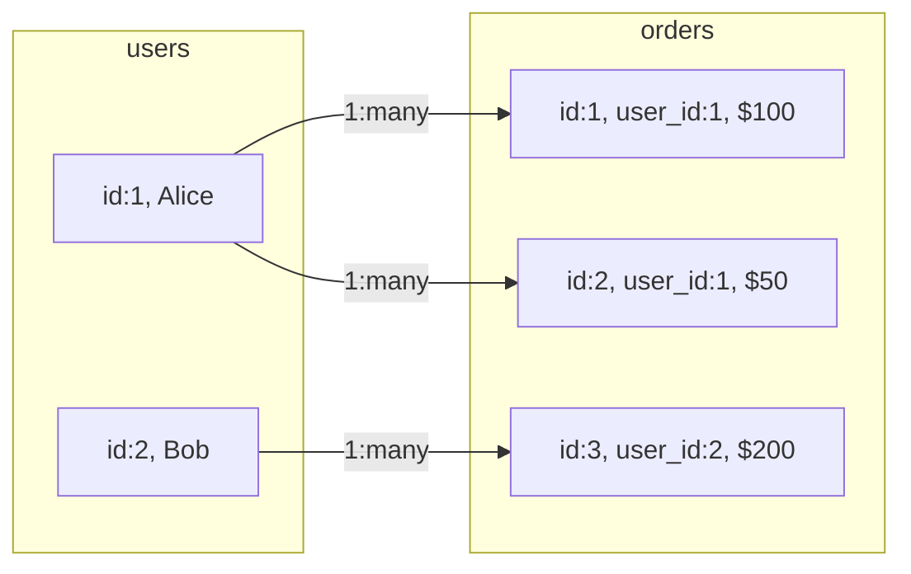
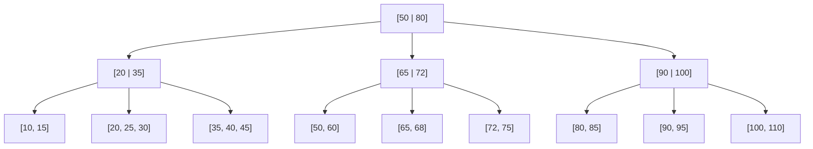

# SQL (MySQL) — Complete 20-Hour Mastery Course

> **Reading Guide:** This document is your entire course. Work through it top to bottom, session by session. Every concept builds on the previous one. Do not skip sections. Type every code example yourself — muscle memory matters in SQL.

---

# TABLE OF CONTENTS

```
SESSION 1  — SQL Foundations + Relational Thinking
SESSION 2  — CRUD Operations Mastery
SESSION 3  — Filtering + Aggregation
SESSION 4  — Joins Deep Dive
SESSION 5  — Subqueries + Nested Logic
SESSION 6  — Advanced SQL Patterns
SESSION 7  — Database Design + Constraints
SESSION 8  — Indexing + Query Optimization
SESSION 9  — Transactions + ACID + Concurrency
SESSION 10 — Interview SQL + Real-World SQL

FINAL SECTION — Complete Revision Sheet, Interview Q&A, Projects, Mastery Checklist
```

---

# ═══════════════════════════════════════════
# SESSION 1 — SQL Foundations + Relational Thinking
# ═══════════════════════════════════════════

---

## 1.1 — What Databases Solve

### Concept Explanation

**What it is:**
A database is an organized, persistent collection of structured data managed by software that allows you to store, retrieve, update, and delete data efficiently.

**Why it exists:**
Before databases, data was stored in flat files — CSV files, text files, binary files. The problems were catastrophic at scale:
- No way to query across multiple files efficiently
- No enforced relationships between data
- No concurrent access (two programs writing at once = corruption)
- No transactions (if your program crashes mid-write, data is lost)
- No access control (anyone can read/write anything)

**When to use it:**
Any time you need persistent, structured, queryable data that outlives a single process. That covers: user accounts, orders, inventory, messages, logs, financial records — essentially every real-world application.

**Real-world relevance:**
Every company you've heard of runs on databases. Netflix uses MySQL for billing. Uber uses MySQL for core data. GitHub uses MySQL. Your bank uses relational databases. SQL is not "old technology" — it is the language of data at scale.

### Deep Understanding

**Internal working:**
A database management system (DBMS) sits between your application and the raw disk. When you run a query, the DBMS:
1. Parses your SQL text into an abstract syntax tree
2. Plans the most efficient execution path (the query optimizer)
3. Reads data pages from disk into memory (buffer pool)
4. Executes the plan against in-memory data
5. Returns results to you
6. Writes changes back to disk, ensuring durability

**Mental model:**
Think of a database as a filing cabinet system that is:
- Organized into drawers (databases)
- Each drawer has folders (tables)
- Each folder has forms (rows)
- Each form field has a name and type (columns)
- The filing cabinet has a clerk (DBMS) who never lets you file things wrong

**Core terminology:**
- **Schema:** The structure definition — what tables exist, what columns each has, what types and constraints apply
- **Instance:** The actual data living inside that schema at a given point in time
- **Query:** A question you ask the database in SQL
- **Result set:** The rows returned in answer to your query
- **DDL (Data Definition Language):** SQL for defining structure — `CREATE`, `ALTER`, `DROP`
- **DML (Data Manipulation Language):** SQL for manipulating data — `INSERT`, `UPDATE`, `DELETE`, `SELECT`
- **DCL (Data Control Language):** SQL for access control — `GRANT`, `REVOKE`
- **TCL (Transaction Control Language):** SQL for transactions — `COMMIT`, `ROLLBACK`

**Common misconceptions:**
- *"SQL is just for reading data"* — SQL handles everything: schema creation, data manipulation, access control, transactions
- *"Databases are slow"* — Poorly written queries are slow. Properly indexed, well-designed databases serve millions of queries per second
- *"I can store everything as text"* — Wrong. Using wrong data types destroys performance, storage efficiency, and data integrity

---

## 1.2 — RDBMS vs NoSQL

### Concept Explanation

**What it is:**
RDBMS (Relational Database Management System) stores data in tables with defined relationships between them. NoSQL is an umbrella term for non-relational databases: document stores (MongoDB), key-value stores (Redis), column stores (Cassandra), graph databases (Neo4j).

**Why it exists:**
RDBMS was dominant for decades. NoSQL emerged around 2009–2012 when internet companies (Google, Amazon, Facebook) needed horizontal scalability that traditional RDBMS couldn't provide cheaply.

**When to use RDBMS:**
- Data has clear structure and relationships
- You need ACID guarantees (banking, orders, inventory)
- You need complex queries with joins and aggregations
- Data consistency is more important than write speed
- Your team knows SQL

**When to use NoSQL:**
- You need massive horizontal write scalability
- Data is unstructured or highly variable (user-generated content, logs)
- You're caching data (Redis)
- You're building a graph traversal use case (Neo4j)
- You need flexible schema (MongoDB for content with varying fields)

### Deep Understanding

**The relational model — core insight:**
Edgar Codd's 1970 paper "A Relational Model of Data for Large Shared Data Banks" is the foundation. The core idea: represent all data as relations (tables), eliminate redundancy through normalization, and use a declarative language (SQL) to query it.

**Why "relational" doesn't mean "related":**
The word "relational" comes from the mathematical concept of a relation — a set of tuples. It does NOT refer to relationships between tables (that's just a feature). It refers to the mathematical underpinning of the data model.

**RDBMS vs NoSQL comparison:**

```
Feature              RDBMS (MySQL)          NoSQL (MongoDB)
─────────────────────────────────────────────────────────────
Schema               Fixed, enforced        Flexible, document
Relationships        Native (JOINs)         Application-level
ACID                 Full                   Partial/optional
Scale direction      Vertical               Horizontal
Query language       SQL (standard)         Proprietary
Consistency          Strong                 Eventual (usually)
Use case             Transactions, reports  Flexibility, scale
```

---

## 1.3 — Tables, Rows, Columns

### Concept Explanation

**What it is:**
- **Table (Relation):** A named set of data organized into rows and columns. Equivalent to a spreadsheet tab conceptually, but with strict typing and constraints.
- **Row (Tuple/Record):** A single entity instance. One employee. One order. One product.
- **Column (Attribute/Field):** A named, typed property that every row in the table has.

**Why it exists:**
The table structure enforces uniformity. Every row has exactly the same columns. Every value in a column has the same type. This uniformity is what makes SQL queries possible — you can ask "give me all rows where salary > 50000" because salary is always a number.

**Mental model:**
A table is a contract. When you create a table, you're defining a contract: "Every record stored here will have exactly these fields, with exactly these types, obeying exactly these constraints." The DBMS enforces this contract on every insert and update.

### Practical Usage

```sql
-- A table is defined by its CREATE statement
-- The CREATE statement IS the schema
CREATE TABLE employees (
    id         INT,
    name       VARCHAR(100),
    department VARCHAR(50),
    salary     DECIMAL(10, 2),
    hire_date  DATE
);

-- Each row inserted must match this contract
INSERT INTO employees VALUES (1, 'Alice', 'Engineering', 95000.00, '2021-03-15');
INSERT INTO employees VALUES (2, 'Bob', 'Marketing', 72000.00, '2020-11-01');

-- A SELECT returns rows matching your filter
SELECT name, salary FROM employees WHERE department = 'Engineering';
```

---

## 1.4 — Primary Keys

### Concept Explanation

**What it is:**
A primary key (PK) is a column (or set of columns) whose value uniquely identifies every row in a table. No two rows can have the same PK value. No row can have a NULL PK value.

**Why it exists:**
Without a primary key, you have no reliable way to reference a specific row. If you have two employees both named "Bob Smith" with the same salary and department, you cannot update or delete just one of them without potentially affecting the other. The PK solves this: every row has a unique, stable identity.

**When to use it:**
Every table you ever create should have a primary key. No exceptions. This is a fundamental rule of relational database design.

**Real-world relevance:**
When your backend says `getUserById(42)`, the `42` is a primary key. When an order references a user, it stores the user's primary key. PKs are the connective tissue of relational databases.

### Deep Understanding

**Internal working:**
MySQL automatically creates a B-Tree index on the primary key column. This means lookups by primary key are O(log n) — extremely fast even with millions of rows. The primary key index is called the **clustered index** in InnoDB — the table data is physically stored in PK order on disk.

**Types of primary keys:**

**Surrogate key:** A system-generated value with no business meaning. Best practice.
```sql
id INT PRIMARY KEY AUTO_INCREMENT
-- or
id BIGINT PRIMARY KEY AUTO_INCREMENT  -- for large tables
```

**Natural key:** A value from the real world that happens to be unique. Risky.
```sql
email VARCHAR(255) PRIMARY KEY  -- Bad: emails change, they're long, they cause bloat
ssn CHAR(11) PRIMARY KEY        -- Bad: privacy concerns, SSNs can be reissued
```

**Composite key:** Multiple columns together form the PK. Used for junction tables.
```sql
PRIMARY KEY (student_id, course_id)  -- A student can enroll in a course only once
```

**Misconceptions:**
- *"Auto-increment means no gaps"* — Wrong. If an insert fails or a row is deleted, the auto-increment value is consumed. Gaps are normal. Never assume sequential PKs.
- *"I should use UUID as PK"* — UUIDs are valid but have performance implications in MySQL InnoDB because they destroy the physical ordering of the clustered index, causing page splits and fragmentation. Use `INT AUTO_INCREMENT` or `BIGINT AUTO_INCREMENT` for most cases.

### Practical Usage

```sql
CREATE TABLE users (
    id       INT          PRIMARY KEY AUTO_INCREMENT,
    email    VARCHAR(255) NOT NULL UNIQUE,
    username VARCHAR(50)  NOT NULL
);

-- AUTO_INCREMENT: MySQL assigns 1, 2, 3... automatically
-- You never insert the id manually:
INSERT INTO users (email, username) VALUES ('alice@example.com', 'alice');
INSERT INTO users (email, username) VALUES ('bob@example.com', 'bob');

-- MySQL assigns id=1 to alice, id=2 to bob
SELECT * FROM users;
-- Result:
-- id | email              | username
-- 1  | alice@example.com  | alice
-- 2  | bob@example.com    | bob
```

---

## 1.5 — Foreign Keys

### Concept Explanation

**What it is:**
A foreign key (FK) is a column in one table whose values must match a primary key value in another table. It enforces referential integrity — you cannot have an order referencing a user that doesn't exist.

**Why it exists:**
Without foreign keys, your database has no way to enforce relationships. You could insert an order with `user_id = 9999` even if user 9999 doesn't exist. Your application would then break when trying to load that order's user. The FK constraint prevents this at the database level.

**Real-world relevance:**
Every `orders.user_id`, every `comments.post_id`, every `payments.order_id` is a foreign key. Understanding FK relationships IS understanding a database schema.

### Deep Understanding

**What MySQL does with FKs:**

When you define `FOREIGN KEY (user_id) REFERENCES users(id)`:
1. On every INSERT/UPDATE into orders, MySQL checks that the `user_id` value exists in `users.id`
2. On DELETE/UPDATE of a users row, MySQL checks what to do (based on the ON DELETE clause)

**Referential actions:**
```sql
FOREIGN KEY (user_id) REFERENCES users(id)
    ON DELETE CASCADE    -- If user is deleted, delete all their orders too
    ON DELETE RESTRICT   -- Prevent deletion of user if they have orders (default)
    ON DELETE SET NULL   -- Set user_id to NULL if user is deleted
    ON UPDATE CASCADE    -- If user's id changes, update all order references
```

**The parent-child relationship:**
- **Parent table:** The table being referenced (users)
- **Child table:** The table holding the FK (orders)

You must insert the parent before the child. You must delete the child before the parent (unless using CASCADE).

### Practical Usage

```sql
CREATE TABLE users (
    id    INT PRIMARY KEY AUTO_INCREMENT,
    email VARCHAR(255) NOT NULL
);

CREATE TABLE orders (
    id         INT PRIMARY KEY AUTO_INCREMENT,
    user_id    INT          NOT NULL,
    total      DECIMAL(10,2) NOT NULL,
    created_at DATETIME     DEFAULT CURRENT_TIMESTAMP,
    
    -- FK definition: user_id must exist in users.id
    FOREIGN KEY (user_id) REFERENCES users(id) ON DELETE CASCADE
);

-- This works:
INSERT INTO users (email) VALUES ('alice@example.com');
INSERT INTO orders (user_id, total) VALUES (1, 149.99);

-- This FAILS with "Cannot add or update a child row: a foreign key constraint fails":
INSERT INTO orders (user_id, total) VALUES (999, 50.00);  -- user 999 doesn't exist

-- With CASCADE: deleting user 1 also deletes all their orders
DELETE FROM users WHERE id = 1;
```

---

## 1.6 — Normalization Basics

### Concept Explanation

**What it is:**
Normalization is the process of organizing table structure to reduce data redundancy and improve data integrity. It's a set of rules (normal forms) you apply to your schema design.

**Why it exists:**
Without normalization, you have **update anomalies:**
- **Insertion anomaly:** You can't add data without adding other unrelated data
- **Deletion anomaly:** Deleting a row loses unrelated data
- **Update anomaly:** Changing one fact requires updating multiple rows, and if you miss one, data is inconsistent

**The three normal forms you must know:**

**1NF (First Normal Form):**
- Every column holds atomic (indivisible) values
- No repeating groups or arrays in a single column
- Every row is unique

```sql
-- VIOLATION OF 1NF: storing multiple values in one column
-- Bad:
id | name   | phone_numbers
1  | Alice  | "555-1234, 555-5678"  -- Two phones in one cell

-- Correct 1NF:
-- users table: id, name
-- phones table: id, user_id, phone_number
```

**2NF (Second Normal Form):**
- Must be in 1NF
- Every non-key column must depend on the ENTIRE primary key (not just part of it)
- Only relevant for tables with composite PKs

```sql
-- VIOLATION OF 2NF: (student_id, course_id) is PK
-- student_name depends only on student_id, not on the full composite PK
-- Bad:
student_id | course_id | student_name | course_grade
1          | 101       | Alice        | A

-- Correct 2NF:
-- students table: student_id, student_name
-- enrollments table: student_id, course_id, course_grade
```

**3NF (Third Normal Form):**
- Must be in 2NF
- No transitive dependencies — non-key columns must not depend on other non-key columns

```sql
-- VIOLATION OF 3NF: zip_code → city (city depends on zip_code, not on id)
-- Bad:
id | name  | zip_code | city
1  | Alice | 10001    | New York
2  | Bob   | 10001    | New York  -- "New York" stored twice, can be inconsistent

-- Correct 3NF:
-- users table: id, name, zip_code
-- zip_codes table: zip_code, city
```

---

## 1.7 — MySQL Installation + Setup

### Practical Setup

**Install MySQL (Ubuntu/Debian):**
```bash
sudo apt update
sudo apt install mysql-server
sudo mysql_secure_installation
# Follow prompts: set root password, remove anonymous users, disable remote root

# Start MySQL
sudo systemctl start mysql
sudo systemctl enable mysql  # Start on boot

# Connect as root
sudo mysql -u root -p
```

**Install MySQL (macOS with Homebrew):**
```bash
brew install mysql
brew services start mysql
mysql_secure_installation
mysql -u root -p
```

**Install MySQL (Windows):**
Download MySQL Installer from dev.mysql.com/downloads/installer. Use MySQL Workbench as GUI client.

**Verify installation:**
```sql
-- After connecting:
SELECT VERSION();                    -- e.g., 8.0.32
SHOW DATABASES;                      -- Lists all databases
SHOW VARIABLES LIKE 'character_set%'; -- Check encoding settings

-- Set UTF-8 (important for international text):
-- Add to /etc/mysql/mysql.conf.d/mysqld.cnf:
-- character-set-server = utf8mb4
-- collation-server = utf8mb4_unicode_ci
```

**Create a development user (don't use root for app connections):**
```sql
CREATE USER 'devuser'@'localhost' IDENTIFIED BY 'securepassword';
GRANT ALL PRIVILEGES ON dev_db.* TO 'devuser'@'localhost';
FLUSH PRIVILEGES;
```

---

## 1.8 — SQL Syntax Basics

### Concept Explanation

**SQL is declarative:** You tell the database WHAT you want, not HOW to get it. The query optimizer figures out the how.

**SQL is case-insensitive** for keywords, but case-sensitive for string values and (depending on configuration) table/column names. Convention: UPPERCASE for SQL keywords, lowercase for table/column names.

**Statement terminator:** Every SQL statement ends with a semicolon (`;`). In MySQL CLI, this triggers execution.

**Comments:**
```sql
-- This is a single-line comment
# This is also a single-line comment (MySQL-specific)
/* This is a
   multi-line comment */
```

**SQL statement structure:**
```sql
SELECT   column_list          -- What columns to return
FROM     table_name           -- Which table
JOIN     other_table ON ...   -- How to connect tables
WHERE    condition            -- Which rows to include
GROUP BY column               -- How to group rows
HAVING   group_condition      -- Filter on groups
ORDER BY column [ASC|DESC]    -- How to sort results
LIMIT    n                    -- How many rows to return
OFFSET   m;                   -- How many rows to skip
```

This order is FIXED — you cannot put WHERE before FROM, or HAVING before GROUP BY. However, the logical execution order is different from the written order:

**Logical execution order (crucial for understanding query behavior):**
```
1. FROM + JOINs          — Determine the working dataset
2. WHERE                  — Filter rows before grouping
3. GROUP BY               — Group remaining rows
4. HAVING                 — Filter groups
5. SELECT                 — Select/compute output columns
6. DISTINCT               — Remove duplicates
7. ORDER BY               — Sort results
8. LIMIT / OFFSET         — Paginate
```

This explains why you CAN'T use a SELECT alias in a WHERE clause — WHERE executes before SELECT.

---

## 1.9 — Data Types

### Concept Explanation

Choosing the right data type is not optional. It directly impacts storage efficiency, query performance, and data integrity.

### INT and Integer Types

```sql
TINYINT    -- 1 byte:  -128 to 127 (UNSIGNED: 0 to 255)
SMALLINT   -- 2 bytes: -32,768 to 32,767
MEDIUMINT  -- 3 bytes: -8,388,608 to 8,388,607
INT        -- 4 bytes: -2,147,483,648 to 2,147,483,647
BIGINT     -- 8 bytes: very large numbers

-- UNSIGNED doubles the positive range:
INT UNSIGNED  -- 0 to 4,294,967,295

-- AUTO_INCREMENT uses INT or BIGINT typically
-- For user IDs at a startup: INT is fine (2 billion+ users)
-- For truly massive tables (logs, events): BIGINT
-- For status flags (0/1): TINYINT(1) (used as BOOLEAN)
```

### VARCHAR vs TEXT

```sql
VARCHAR(n)  -- Variable-length string, max n characters, stored inline with row
            -- Max n: 65,535 bytes (shared with all VARCHAR columns in the row)
            -- Best for: names, emails, usernames, short strings
            -- Can be indexed fully

TEXT        -- Variable-length string, stored separately from the row
            -- Max: 65,535 bytes
MEDIUMTEXT  -- Max: 16 MB
LONGTEXT    -- Max: 4 GB
            -- Best for: article bodies, descriptions, large content
            -- Can only be partially indexed (prefix index)

-- Decision rule:
-- < 255 chars, you'll filter/search/index it → VARCHAR(255)
-- Long content, rarely filtered on → TEXT
-- NEVER use TEXT for things you'll put in a WHERE clause without a full-text index
```

### DATE, DATETIME, TIMESTAMP

```sql
DATE      -- '2024-01-15' (no time component)
TIME      -- '14:30:00' (no date component)
DATETIME  -- '2024-01-15 14:30:00' (date + time, no timezone awareness)
TIMESTAMP -- '2024-01-15 14:30:00' (stored as UTC, converts to session timezone)
           -- Range: 1970-01-01 00:00:01 UTC to 2038-01-19 UTC (Y2038 problem)
           -- Use DATETIME for dates beyond 2038

-- Common usage:
created_at DATETIME    DEFAULT CURRENT_TIMESTAMP
updated_at TIMESTAMP   DEFAULT CURRENT_TIMESTAMP ON UPDATE CURRENT_TIMESTAMP
```

### BOOLEAN

```sql
BOOLEAN   -- Alias for TINYINT(1)
          -- TRUE = 1, FALSE = 0
          -- MySQL doesn't have a true boolean type

is_active BOOLEAN DEFAULT TRUE
-- Internally stored as: 1 or 0
-- Query: WHERE is_active = TRUE  or  WHERE is_active = 1
```

### DECIMAL

```sql
DECIMAL(precision, scale)
-- precision: total digits (both sides of decimal point)
-- scale: digits after decimal point

DECIMAL(10, 2)  -- Up to 8 digits before decimal, 2 after: 12345678.99
                -- Use for: prices, financial amounts, any exact decimal
                -- NEVER use FLOAT or DOUBLE for money (floating point errors)

price DECIMAL(10, 2) NOT NULL  -- Standard for prices
```

### Practical Data Type Examples

```sql
-- Real-world table with correct types:
CREATE TABLE products (
    id          INT          PRIMARY KEY AUTO_INCREMENT,
    name        VARCHAR(255) NOT NULL,
    description TEXT,
    price       DECIMAL(10,2) NOT NULL,
    stock_qty   INT          DEFAULT 0,
    is_active   BOOLEAN      DEFAULT TRUE,
    created_at  DATETIME     DEFAULT CURRENT_TIMESTAMP,
    weight_kg   DECIMAL(8,3)  -- 3 decimal places for weight
);
```

---

## 1.10 — CREATE DATABASE and CREATE TABLE

### Complete Syntax

```sql
-- Create and select a database
CREATE DATABASE company
    CHARACTER SET utf8mb4        -- Support all Unicode including emoji
    COLLATE utf8mb4_unicode_ci;  -- Case-insensitive collation (ci)

USE company;  -- All subsequent queries target this database

-- Show current database
SELECT DATABASE();

-- Create table with all the pieces we've learned:
CREATE TABLE employees (
    id          INT            PRIMARY KEY AUTO_INCREMENT,
    name        VARCHAR(100)   NOT NULL,
    email       VARCHAR(255)   NOT NULL UNIQUE,
    age         INT,
    salary      DECIMAL(10,2)  NOT NULL DEFAULT 0.00,
    department  VARCHAR(50),
    hire_date   DATE,
    is_active   BOOLEAN        DEFAULT TRUE,
    created_at  DATETIME       DEFAULT CURRENT_TIMESTAMP
);

-- Inspect the table structure:
DESCRIBE employees;
-- or:
SHOW COLUMNS FROM employees;
-- or (more detailed):
SHOW CREATE TABLE employees;
```

**Output of DESCRIBE:**
```
Field       | Type           | Null | Key | Default           | Extra
----------- | -------------- | ---- | --- | ----------------- | --------------
id          | int            | NO   | PRI | NULL              | auto_increment
name        | varchar(100)   | NO   |     | NULL              |
email       | varchar(255)   | NO   | UNI | NULL              |
age         | int            | YES  |     | NULL              |
salary      | decimal(10,2)  | NO   |     | 0.00              |
department  | varchar(50)    | YES  |     | NULL              |
hire_date   | date           | YES  |     | NULL              |
is_active   | tinyint(1)     | YES  |     | 1                 |
created_at  | datetime       | YES  |     | CURRENT_TIMESTAMP |
```

### Altering Tables

```sql
-- Add a column
ALTER TABLE employees ADD COLUMN phone VARCHAR(20);

-- Modify a column type
ALTER TABLE employees MODIFY COLUMN age TINYINT UNSIGNED;

-- Rename a column (MySQL 8+)
ALTER TABLE employees RENAME COLUMN age TO employee_age;

-- Drop a column
ALTER TABLE employees DROP COLUMN phone;

-- Add an index (covered in Session 8, but useful to know early)
ALTER TABLE employees ADD INDEX idx_department (department);

-- Drop a table entirely
DROP TABLE IF EXISTS employees;

-- Remove all rows but keep structure
TRUNCATE TABLE employees;
```

---

## 1.11 — Practical Exercises: Session 1

### Exercise 1: Create the students table

```sql
CREATE DATABASE school;
USE school;

CREATE TABLE students (
    id           INT          PRIMARY KEY AUTO_INCREMENT,
    first_name   VARCHAR(50)  NOT NULL,
    last_name    VARCHAR(50)  NOT NULL,
    email        VARCHAR(255) NOT NULL UNIQUE,
    date_of_birth DATE,
    enrollment_date DATE      DEFAULT (CURRENT_DATE),
    gpa          DECIMAL(3,2),  -- e.g., 3.85
    is_active    BOOLEAN      DEFAULT TRUE
);
```

### Exercise 2: Create the products table

```sql
CREATE TABLE products (
    id          INT           PRIMARY KEY AUTO_INCREMENT,
    name        VARCHAR(255)  NOT NULL,
    description TEXT,
    price       DECIMAL(10,2) NOT NULL,
    category    VARCHAR(100),
    stock_qty   INT           NOT NULL DEFAULT 0,
    sku         VARCHAR(50)   UNIQUE,  -- Stock Keeping Unit (unique product code)
    created_at  DATETIME      DEFAULT CURRENT_TIMESTAMP
);
```

### Exercise 3: Create the orders table

```sql
CREATE TABLE orders (
    id          INT           PRIMARY KEY AUTO_INCREMENT,
    student_id  INT           NOT NULL,
    total_amount DECIMAL(10,2) NOT NULL,
    status      VARCHAR(20)   DEFAULT 'pending',
    ordered_at  DATETIME      DEFAULT CURRENT_TIMESTAMP,
    
    FOREIGN KEY (student_id) REFERENCES students(id) ON DELETE CASCADE
);
```

### Exercise 4: Mini Project — Library Database

```sql
CREATE DATABASE library;
USE library;

-- Books table
CREATE TABLE books (
    id            INT          PRIMARY KEY AUTO_INCREMENT,
    title         VARCHAR(255) NOT NULL,
    author        VARCHAR(150) NOT NULL,
    isbn          CHAR(13)     UNIQUE,      -- ISBN is always 13 chars
    genre         VARCHAR(100),
    published_year YEAR,                    -- Special YEAR type: 1901 to 2155
    total_copies  INT          NOT NULL DEFAULT 1,
    available_copies INT       NOT NULL DEFAULT 1
);

-- Members table
CREATE TABLE members (
    id            INT          PRIMARY KEY AUTO_INCREMENT,
    name          VARCHAR(100) NOT NULL,
    email         VARCHAR(255) NOT NULL UNIQUE,
    phone         VARCHAR(20),
    address       TEXT,
    membership_date DATE       DEFAULT (CURRENT_DATE),
    is_active     BOOLEAN      DEFAULT TRUE
);

-- Borrow records table
CREATE TABLE borrow_records (
    id          INT      PRIMARY KEY AUTO_INCREMENT,
    book_id     INT      NOT NULL,
    member_id   INT      NOT NULL,
    borrow_date DATE     NOT NULL DEFAULT (CURRENT_DATE),
    due_date    DATE     NOT NULL,
    return_date DATE,    -- NULL means not yet returned
    is_returned BOOLEAN  DEFAULT FALSE,
    
    FOREIGN KEY (book_id)   REFERENCES books(id)   ON DELETE RESTRICT,
    FOREIGN KEY (member_id) REFERENCES members(id) ON DELETE RESTRICT
);

-- Insert sample data:
INSERT INTO books (title, author, isbn, genre, published_year, total_copies, available_copies)
VALUES
    ('The Pragmatic Programmer', 'David Thomas', '9780135957059', 'Technology', 2019, 3, 3),
    ('Clean Code', 'Robert C. Martin', '9780132350884', 'Technology', 2008, 2, 2),
    ('Design Patterns', 'Gang of Four', '9780201633610', 'Technology', 1994, 2, 2),
    ('Dune', 'Frank Herbert', '9780441013593', 'Science Fiction', 1965, 4, 4),
    ('1984', 'George Orwell', '9780451524935', 'Fiction', 1949, 5, 5);

INSERT INTO members (name, email, phone) VALUES
    ('Alice Johnson', 'alice@example.com', '555-0101'),
    ('Bob Smith', 'bob@example.com', '555-0102'),
    ('Carol White', 'carol@example.com', '555-0103');

INSERT INTO borrow_records (book_id, member_id, borrow_date, due_date)
VALUES
    (1, 1, '2024-01-10', '2024-01-24'),
    (2, 2, '2024-01-12', '2024-01-26');

-- Update available copies after borrowing
UPDATE books SET available_copies = available_copies - 1 WHERE id IN (1, 2);
```

---

## Session 1 — Quick Revision Summary

```
KEY CONCEPTS:
━━━━━━━━━━━━━━━━━━━━━━━━━━━━━━━━━━━━━━━━━━━━━━━━━━━━━━━
• Database = organized, persistent, queryable data storage
• RDBMS = tables + relationships + SQL + ACID guarantees
• Table = named relation (schema + data)
• Row = single record/entity
• Column = typed, named attribute
• Primary Key = unique row identifier (NOT NULL, unique)
• Foreign Key = enforces referential integrity between tables
• AUTO_INCREMENT = system-assigned sequential PK
• Data types: INT, BIGINT, VARCHAR(n), TEXT, DECIMAL(p,s),
  DATE, DATETIME, TIMESTAMP, BOOLEAN (TINYINT(1))
• Normalization: 1NF (atomic), 2NF (full PK dep), 3NF (no transitive dep)

KEY RULES:
━━━━━━━━━━━━━━━━━━━━━━━━━━━━━━━━━━━━━━━━━━━━━━━━━━━━━━━
• EVERY table needs a PRIMARY KEY
• Use INT AUTO_INCREMENT for PKs (not UUID, not natural keys)
• Use DECIMAL for money (never FLOAT/DOUBLE)
• Use VARCHAR for short strings, TEXT for long content
• Use DATETIME for timestamps beyond 2038
• Always USE database_name before running queries
• Logical query execution: FROM → WHERE → GROUP BY → HAVING → SELECT → ORDER BY → LIMIT
```

---

# ═══════════════════════════════════════════
# SESSION 2 — CRUD Operations Mastery
# ═══════════════════════════════════════════

CRUD = Create, Read, Update, Delete. These four operations are 90% of what any application does with a database. Master them deeply.

---

## 2.1 — INSERT (Create)

### Concept Explanation

**What it is:**
`INSERT` adds new rows to a table. There are several syntactic forms, each useful in different scenarios.

**Why it exists:**
Your application needs to persist new data. User registers → INSERT. User places order → INSERT. Log entry → INSERT.

### Deep Understanding

**How MySQL handles INSERT internally:**
1. Parses the statement
2. Validates data types (will it fit in the column?)
3. Checks constraints (NOT NULL, UNIQUE, FK)
4. Writes to the InnoDB buffer pool (in-memory)
5. Writes to the redo log (for crash recovery)
6. Eventually flushes dirty pages to disk

**AUTO_INCREMENT behavior:**
- MySQL maintains an internal counter per table
- Increments on every attempted INSERT (even if the INSERT fails)
- Never reuses deleted IDs within a session (may reuse after restart — implementation detail)
- Use `LAST_INSERT_ID()` to get the last auto-generated ID

### Practical Usage

```sql
-- Form 1: Specify column names (BEST PRACTICE — always use this)
INSERT INTO employees (name, email, salary, department, hire_date)
VALUES ('Alice Johnson', 'alice@company.com', 95000.00, 'Engineering', '2021-03-15');

-- WHY use column names: your INSERT won't break if someone adds a column later
-- This form is self-documenting and order-independent

-- Form 2: Without column names (FRAGILE — don't use in production)
-- You must provide ALL columns in exact table order
INSERT INTO employees VALUES (NULL, 'Bob Smith', 'bob@company.com', 30, 72000.00, 'Marketing', '2020-11-01', TRUE, NOW());
-- The NULL is for id (AUTO_INCREMENT handles it)

-- Form 3: Multiple rows in one statement (EFFICIENT — use for bulk inserts)
-- One INSERT with multiple rows is MUCH faster than multiple single-row INSERTs
INSERT INTO employees (name, email, salary, department, hire_date)
VALUES 
    ('Carol White',   'carol@company.com',  88000.00, 'Engineering',  '2022-01-10'),
    ('Dave Brown',    'dave@company.com',   65000.00, 'Marketing',    '2021-07-22'),
    ('Eve Davis',     'eve@company.com',    110000.00, 'Engineering', '2019-05-01'),
    ('Frank Miller',  'frank@company.com',  55000.00, 'HR',          '2023-02-14'),
    ('Grace Wilson',  'grace@company.com',  78000.00, 'Finance',     '2020-09-30');

-- Get the auto-generated ID from the last INSERT:
INSERT INTO employees (name, email, salary, department, hire_date)
VALUES ('Henry Taylor', 'henry@company.com', 90000.00, 'Engineering', '2022-06-01');
SELECT LAST_INSERT_ID();  -- Returns the id assigned to Henry

-- INSERT with ON DUPLICATE KEY UPDATE (upsert pattern — very common in production)
-- If email already exists (UNIQUE constraint), update the salary instead of error:
INSERT INTO employees (name, email, salary, department, hire_date)
VALUES ('Alice Johnson', 'alice@company.com', 100000.00, 'Engineering', '2021-03-15')
ON DUPLICATE KEY UPDATE salary = VALUES(salary);

-- INSERT IGNORE: silently skip rows that would violate constraints
INSERT IGNORE INTO employees (name, email, salary, department, hire_date)
VALUES ('Alice Johnson', 'alice@company.com', 95000.00, 'Engineering', '2021-03-15');
-- No error, just silently skipped

-- INSERT ... SELECT: insert results of a query into another table
CREATE TABLE senior_employees LIKE employees;  -- Creates identical empty table
INSERT INTO senior_employees
SELECT * FROM employees WHERE salary > 90000;
```

---

## 2.2 — SELECT (Read)

### Concept Explanation

**What it is:**
`SELECT` retrieves data from one or more tables. It is the most complex and important SQL statement.

**The basic structure:**
```sql
SELECT [DISTINCT] column_list
FROM   table_name
WHERE  condition
ORDER BY column [ASC|DESC]
LIMIT  n OFFSET m;
```

### Practical Usage

```sql
-- Select all columns (use sparingly — don't do this in production queries)
SELECT * FROM employees;

-- Select specific columns (ALWAYS do this in production)
SELECT name, department, salary FROM employees;

-- Column aliases: give columns readable names in results
SELECT 
    name          AS employee_name,
    salary        AS annual_salary,
    salary / 12   AS monthly_salary  -- Calculated column
FROM employees;

-- DISTINCT: remove duplicate values from results
SELECT DISTINCT department FROM employees;
-- Returns each department name only once

-- Selecting literal values (useful for testing)
SELECT 'Hello World' AS greeting;
SELECT 1 + 1 AS result;
SELECT NOW() AS current_time;

-- Arithmetic in SELECT
SELECT 
    name,
    salary,
    salary * 1.10 AS salary_with_raise,  -- 10% raise calculation
    salary * 12   AS annual_package
FROM employees;
```

---

## 2.3 — WHERE Clause

### Concept Explanation

**What it is:**
`WHERE` filters which rows are returned (or affected by UPDATE/DELETE). It's evaluated for every row in the table.

**Why it's critical:**
Every query without a WHERE clause processes EVERY row. On a table with 10 million rows, a missing WHERE clause is the difference between a 2ms query and a 30-second query.

### Operators and Syntax

```sql
-- Comparison operators
WHERE salary > 50000        -- Greater than
WHERE salary >= 50000       -- Greater than or equal
WHERE salary < 50000        -- Less than
WHERE salary <= 50000       -- Less than or equal
WHERE salary = 50000        -- Equal (single =, not ==)
WHERE salary != 50000       -- Not equal
WHERE salary <> 50000       -- Not equal (alternative syntax)

-- Logical operators
WHERE salary > 50000 AND department = 'Engineering'
WHERE salary > 80000 OR department = 'Engineering'
WHERE NOT is_active   -- same as WHERE is_active = FALSE

-- Combining with parentheses (crucial for correct logic)
WHERE (department = 'Engineering' OR department = 'Finance') AND salary > 60000
-- Without parentheses, AND binds tighter than OR — bugs ensue

-- BETWEEN: inclusive range
WHERE salary BETWEEN 50000 AND 90000
-- Equivalent to: WHERE salary >= 50000 AND salary <= 90000

-- IN: match any value in a list
WHERE department IN ('Engineering', 'Finance', 'HR')
-- Much cleaner than: WHERE department = 'Engineering' OR department = 'Finance' OR ...

-- NOT IN: exclude values
WHERE department NOT IN ('Intern', 'Contractor')

-- LIKE: pattern matching with wildcards
WHERE name LIKE 'A%'      -- Starts with 'A'
WHERE name LIKE '%son'    -- Ends with 'son'  
WHERE name LIKE '%ali%'   -- Contains 'ali' anywhere
WHERE name LIKE 'J_hn'    -- J + any single char + hn → matches "John", "Jahn"
-- % = zero or more characters
-- _ = exactly one character
-- LIKE is case-INSENSITIVE with default collation

-- IS NULL / IS NOT NULL
WHERE phone IS NULL           -- Phone not provided
WHERE hire_date IS NOT NULL   -- Has been hired
-- NEVER use: WHERE phone = NULL  ← this always returns empty (NULL ≠ NULL in SQL)

-- NULL comparison quirk — critical to understand:
SELECT NULL = NULL;    -- Returns NULL (not TRUE!)
SELECT NULL IS NULL;   -- Returns TRUE
```

### Advanced WHERE Patterns

```sql
-- Find employees hired in a specific year
WHERE YEAR(hire_date) = 2022

-- Find employees whose name starts with a vowel
WHERE name REGEXP '^[AEIOUaeiou]'

-- Case-sensitive LIKE
WHERE name LIKE BINARY 'Alice%'

-- Combining all operators — real query example:
SELECT name, salary, department, hire_date
FROM employees
WHERE 
    is_active = TRUE
    AND salary BETWEEN 60000 AND 100000
    AND department IN ('Engineering', 'Finance')
    AND name LIKE 'A%'
    AND hire_date >= '2020-01-01'
ORDER BY salary DESC;
```

---

## 2.4 — ORDER BY

### Concept Explanation

**What it is:**
`ORDER BY` sorts the result set. Without it, MySQL returns rows in an arbitrary order that may appear consistent but is NOT guaranteed.

**Critical rule:** Never rely on the order of results without an explicit ORDER BY.

```sql
-- Single column, ascending (default)
SELECT name, salary FROM employees ORDER BY salary;
SELECT name, salary FROM employees ORDER BY salary ASC;  -- Same as above

-- Single column, descending
SELECT name, salary FROM employees ORDER BY salary DESC;

-- Multiple columns: sort by department first, then salary within department
SELECT name, department, salary
FROM employees
ORDER BY department ASC, salary DESC;
-- Alice Engineering 95000
-- Carol Engineering 88000
-- Dave  Marketing   65000
-- etc.

-- Order by column position (fragile, don't use in production)
SELECT name, salary FROM employees ORDER BY 2 DESC;  -- Order by 2nd column

-- Order by an expression
SELECT name, salary FROM employees ORDER BY salary * 12 DESC;

-- Order by calculated alias
SELECT name, salary, salary * 12 AS annual_package
FROM employees
ORDER BY annual_package DESC;
-- This works because ORDER BY executes after SELECT
```

---

## 2.5 — LIMIT and OFFSET (Pagination)

### Concept Explanation

**What it is:**
`LIMIT n` returns at most n rows. `OFFSET m` skips the first m rows. Together they enable pagination.

**Real-world relevance:**
Every "Load More" button, every paginated list, every "Page 2 of 10" in a web app uses LIMIT/OFFSET.

```sql
-- Top 5 highest-paid employees
SELECT name, salary FROM employees ORDER BY salary DESC LIMIT 5;

-- Pagination: page 1 (rows 1-10)
SELECT name, salary FROM employees ORDER BY id LIMIT 10 OFFSET 0;

-- Page 2 (rows 11-20)
SELECT name, salary FROM employees ORDER BY id LIMIT 10 OFFSET 10;

-- Page 3 (rows 21-30)
SELECT name, salary FROM employees ORDER BY id LIMIT 10 OFFSET 20;

-- Formula: OFFSET = (page_number - 1) * page_size

-- Alternative LIMIT syntax: LIMIT offset, count
SELECT name, salary FROM employees ORDER BY id LIMIT 10, 10;  -- Skip 10, take 10

-- IMPORTANT PERFORMANCE NOTE:
-- LIMIT/OFFSET gets slow on large tables because MySQL still scans all rows up to OFFSET
-- For "infinite scroll" pagination on large tables, use cursor-based pagination:
-- WHERE id > last_seen_id ORDER BY id LIMIT 10
-- This is O(1) regardless of page number because id is indexed
```

---

## 2.6 — UPDATE

### Concept Explanation

**What it is:**
`UPDATE` modifies existing rows. The WHERE clause determines which rows are modified.

**The most dangerous SQL operation:** An UPDATE without WHERE modifies EVERY row in the table. This mistake has destroyed production databases and ended careers. Always verify your WHERE clause with a SELECT first.

### Practical Usage

```sql
-- Safe UPDATE workflow:
-- Step 1: Write your WHERE clause as a SELECT first
SELECT * FROM employees WHERE id = 1;
-- Step 2: Verify it returns only what you want to change
-- Step 3: Replace SELECT with UPDATE
UPDATE employees SET salary = 100000 WHERE id = 1;

-- Single column update
UPDATE employees SET salary = 100000 WHERE id = 1;

-- Multiple column update
UPDATE employees 
SET salary = 100000, department = 'Senior Engineering'
WHERE id = 1;

-- Update using current value (relative update)
UPDATE employees SET salary = salary * 1.10 WHERE department = 'Engineering';
-- Give all engineers a 10% raise

-- Update with expression
UPDATE products SET stock_qty = stock_qty - 1 WHERE id = 5;
-- Decrement stock after purchase

-- Update multiple conditions
UPDATE employees 
SET is_active = FALSE
WHERE department = 'Marketing' AND salary < 50000;

-- DANGEROUS — always avoided in production:
UPDATE employees SET salary = 0;  -- Wipes ALL salaries. No WHERE = disaster.

-- Protection: enable MySQL safe update mode
SET SQL_SAFE_UPDATES = 1;
-- Now UPDATE/DELETE without WHERE or KEY condition will FAIL

-- Update with LIMIT (update only N rows)
UPDATE employees SET salary = salary * 1.05 ORDER BY salary ASC LIMIT 10;
-- Give the 10 lowest-paid a raise

-- UPDATE JOIN (update based on data from another table):
UPDATE employees e
JOIN departments d ON e.department_id = d.id
SET e.salary = e.salary * 1.15
WHERE d.name = 'Engineering';
```

---

## 2.7 — DELETE

### Concept Explanation

**What it is:**
`DELETE` removes rows from a table permanently. Like UPDATE, a DELETE without WHERE removes ALL rows.

**DELETE vs TRUNCATE vs DROP:**
- `DELETE FROM table WHERE condition` — removes matching rows, logs each row, can be rolled back
- `DELETE FROM table` — removes ALL rows, logs each row, slow on large tables, can be rolled back
- `TRUNCATE TABLE table` — removes ALL rows, doesn't log individual rows, extremely fast, cannot be rolled back in MySQL (usually)
- `DROP TABLE table` — removes the table entirely (structure + data)

### Practical Usage

```sql
-- Safe DELETE workflow: SELECT first, then DELETE
SELECT * FROM employees WHERE id = 5;
DELETE FROM employees WHERE id = 5;

-- Delete multiple rows matching condition
DELETE FROM employees WHERE department = 'Contractor' AND hire_date < '2020-01-01';

-- Delete with JOIN (delete based on related table):
DELETE e FROM employees e
JOIN departments d ON e.department_id = d.id
WHERE d.name = 'Dissolved Department';

-- Soft delete pattern (PREFERRED in production):
-- Instead of actually deleting rows, mark them as deleted
ALTER TABLE employees ADD COLUMN deleted_at DATETIME DEFAULT NULL;
UPDATE employees SET deleted_at = NOW() WHERE id = 5;
-- Then all SELECT queries include: WHERE deleted_at IS NULL

-- WHY soft delete?
-- 1. Data auditing (you can see what was deleted and when)
-- 2. Undo capability (restore accidentally deleted records)
-- 3. Analytics (don't break historical reports)
-- 4. Regulatory compliance (GDPR requires "right to be forgotten" — soft delete + periodic hard purge)

-- Truncate (fast full wipe):
TRUNCATE TABLE temp_logs;
-- Resets AUTO_INCREMENT counter to 1
-- No WHERE clause possible
```

---

## 2.8 — DISTINCT

### Concept Explanation

**What it is:**
`DISTINCT` removes duplicate rows from the result set.

**Performance cost:** DISTINCT requires sorting or hashing the result to identify duplicates. On large result sets, this adds overhead.

```sql
-- Get unique departments
SELECT DISTINCT department FROM employees;

-- Get unique (department, hire_year) combinations
SELECT DISTINCT department, YEAR(hire_date) AS hire_year
FROM employees
ORDER BY department, hire_year;

-- DISTINCT vs GROUP BY:
-- These often produce identical results:
SELECT DISTINCT department FROM employees;
SELECT department FROM employees GROUP BY department;
-- GROUP BY is often faster because it uses the index for grouping
-- GROUP BY is more flexible (you can add aggregates)
```

---

## 2.9 — Professional Workflow: The Production Query Mindset

### Industry Best Practices

```sql
-- 1. ALWAYS specify column names in SELECT (not SELECT *)
-- Bad:
SELECT * FROM orders WHERE user_id = 1;
-- Good:
SELECT id, user_id, total, status, created_at FROM orders WHERE user_id = 1;
-- WHY: SELECT * fetches all columns even ones you don't need (wasted I/O)
--      SELECT * breaks if column order changes in some ORMs
--      SELECT * is ambiguous in JOINs (which table's id?)

-- 2. ALWAYS have WHERE on UPDATE and DELETE
-- Use safe updates mode in development:
SET SQL_SAFE_UPDATES = 1;

-- 3. Use transactions for multi-step operations (covered in Session 9)

-- 4. Use meaningful table and column aliases
SELECT 
    e.name     AS employee_name,
    e.salary   AS base_salary,
    d.name     AS department_name
FROM employees e
JOIN departments d ON e.department_id = d.id;

-- 5. Test with EXPLAIN before running heavy queries
EXPLAIN SELECT * FROM employees WHERE salary > 50000;

-- 6. Limit result sets in development
SELECT name, salary FROM employees LIMIT 100;
-- Never SELECT * FROM big_table in a loop

-- 7. Use parameterized queries (in application code) to prevent SQL injection:
-- BAD (Python example): f"SELECT * FROM users WHERE email = '{user_input}'"
-- GOOD: cursor.execute("SELECT * FROM users WHERE email = %s", (user_input,))
```

---

## 2.10 — Practical Exercises: Session 2

### Exercise Set

```sql
-- Setup: use the employees table from Session 1 (or re-create it)
CREATE DATABASE hr_system;
USE hr_system;

CREATE TABLE employees (
    id         INT           PRIMARY KEY AUTO_INCREMENT,
    name       VARCHAR(100)  NOT NULL,
    email      VARCHAR(255)  NOT NULL UNIQUE,
    department VARCHAR(50),
    salary     DECIMAL(10,2) NOT NULL,
    hire_date  DATE,
    is_active  BOOLEAN       DEFAULT TRUE
);

INSERT INTO employees (name, email, department, salary, hire_date) VALUES
    ('Alice Johnson',  'alice@co.com',  'Engineering', 95000, '2021-03-15'),
    ('Bob Smith',      'bob@co.com',    'Marketing',   72000, '2020-11-01'),
    ('Carol White',    'carol@co.com',  'Engineering', 88000, '2022-01-10'),
    ('Dave Brown',     'dave@co.com',   'Marketing',   65000, '2021-07-22'),
    ('Eve Davis',      'eve@co.com',    'Engineering', 110000, '2019-05-01'),
    ('Frank Miller',   'frank@co.com',  'HR',          55000, '2023-02-14'),
    ('Grace Wilson',   'grace@co.com',  'Finance',     78000, '2020-09-30'),
    ('Henry Taylor',   'henry@co.com',  'Engineering', 90000, '2022-06-01'),
    ('Iris Moore',     'iris@co.com',   'Finance',     82000, '2021-04-15'),
    ('Jack Anderson',  'jack@co.com',   'HR',          58000, '2022-08-20');

-- Exercise 1: Find the highest-paid employee
SELECT name, salary FROM employees ORDER BY salary DESC LIMIT 1;

-- Exercise 2: Find all Engineering employees with salary > 90000
SELECT name, salary FROM employees
WHERE department = 'Engineering' AND salary > 90000
ORDER BY salary DESC;

-- Exercise 3: Update all salaries by 10%
UPDATE employees SET salary = salary * 1.10;
SELECT name, salary FROM employees ORDER BY salary DESC;

-- Exercise 4: Find employees hired before 2021
SELECT name, hire_date, department
FROM employees
WHERE hire_date < '2021-01-01'
ORDER BY hire_date ASC;

-- Exercise 5: Find top 3 most expensive employees in Engineering
SELECT name, salary
FROM employees
WHERE department = 'Engineering'
ORDER BY salary DESC
LIMIT 3;

-- Exercise 6: Soft delete inactive employees (salary < 65000)
-- First see who they are:
SELECT name, salary FROM employees WHERE salary < 65000;
-- Then update:
UPDATE employees SET is_active = FALSE WHERE salary < 65000;

-- Exercise 7: Find all active employees in Finance or HR
SELECT name, department, salary
FROM employees
WHERE department IN ('Finance', 'HR') AND is_active = TRUE
ORDER BY department, salary DESC;

-- Exercise 8: Find employees whose name contains 'on'
SELECT name FROM employees WHERE name LIKE '%on%';

-- Mini Project: Employee Management System
-- Bring it all together
-- Q: Get a paginated list (page 2, 3 per page) of active employees ordered by hire_date
SELECT name, department, hire_date
FROM employees
WHERE is_active = TRUE
ORDER BY hire_date DESC
LIMIT 3 OFFSET 3;

-- Q: Update Frank Miller's department to 'Engineering'
UPDATE employees SET department = 'Engineering' WHERE name = 'Frank Miller';
-- Better using ID to avoid ambiguity:
UPDATE employees SET department = 'Engineering' WHERE id = 6;
```

---

## Session 2 — Quick Revision Summary

```
CRUD OPERATIONS:
━━━━━━━━━━━━━━━━━━━━━━━━━━━━━━━━━━━━━━━━━━━━━━━━━━━━━━━
• INSERT INTO table (cols) VALUES (vals)  → always specify column names
• SELECT cols FROM table WHERE condition ORDER BY col LIMIT n
• UPDATE table SET col=val WHERE condition → ALWAYS use WHERE
• DELETE FROM table WHERE condition        → ALWAYS use WHERE

KEY PATTERNS:
• INSERT multiple rows in one statement (bulk insert performance)
• ON DUPLICATE KEY UPDATE (upsert)
• INSERT IGNORE (skip constraint violations)
• Soft delete: add deleted_at DATETIME, never hard delete
• Pagination: LIMIT 10 OFFSET 20 (page 3 of 10-per-page)
• Cursor pagination for large tables: WHERE id > last_id

OPERATORS:
• =  !=  >  <  >=  <=  (comparisons)
• AND  OR  NOT  (logical)
• BETWEEN x AND y  (inclusive range)
• IN (list)   NOT IN (list)
• LIKE 'pattern%'  (% = any chars, _ = one char)
• IS NULL   IS NOT NULL  (never use = NULL)

DANGEROUS ANTI-PATTERNS:
• UPDATE/DELETE without WHERE = wipes entire table
• SELECT * in production = wastes I/O, ambiguous in JOINs
• = NULL comparison always returns NULL (use IS NULL)
```

---

# ═══════════════════════════════════════════
# SESSION 3 — Filtering + Aggregation
# ═══════════════════════════════════════════

---

## 3.1 — Aggregate Functions

### Concept Explanation

**What they are:**
Aggregate functions collapse multiple rows into a single summary value. They are the foundation of analytics queries.

**Why they exist:**
You never want to pull 1 million rows to your application just to count them. Push the computation to the database.

**The 5 core aggregates:**
```
COUNT() — How many rows?
SUM()   — What's the total?
AVG()   — What's the average?
MIN()   — What's the smallest value?
MAX()   — What's the largest value?
```

### Deep Understanding

**How aggregate functions handle NULL:**
- `COUNT(*)` counts all rows including NULLs
- `COUNT(column)` counts only non-NULL values in that column
- `SUM()`, `AVG()`, `MIN()`, `MAX()` ignore NULLs entirely

This is a source of subtle bugs:
```sql
-- Employees table: 10 employees, but 3 have NULL phone
SELECT COUNT(*)     FROM employees;  -- 10
SELECT COUNT(phone) FROM employees;  -- 7 (ignores NULLs)
SELECT AVG(salary)  FROM employees;  -- average of non-NULL salaries only
```

### Practical Usage

```sql
-- COUNT: different forms
SELECT COUNT(*)           AS total_employees  FROM employees;       -- All rows
SELECT COUNT(id)          AS total_by_id      FROM employees;       -- Non-null ids
SELECT COUNT(DISTINCT department) AS dept_count FROM employees;    -- Unique departments
SELECT COUNT(*) FROM employees WHERE department = 'Engineering';   -- Filtered count

-- SUM
SELECT SUM(salary) AS total_payroll FROM employees;
SELECT SUM(salary) AS engineering_payroll FROM employees WHERE department = 'Engineering';

-- AVG
SELECT AVG(salary) AS avg_salary FROM employees;
SELECT AVG(salary) AS avg_engineering_salary FROM employees WHERE department = 'Engineering';
-- AVG returns NULL if no rows match (not 0!)

-- MIN / MAX
SELECT MIN(salary) AS lowest_salary,  MAX(salary) AS highest_salary FROM employees;
SELECT MIN(hire_date) AS oldest_hire,  MAX(hire_date) AS newest_hire FROM employees;

-- Multiple aggregates in one query
SELECT 
    COUNT(*)        AS headcount,
    SUM(salary)     AS total_payroll,
    AVG(salary)     AS avg_salary,
    MIN(salary)     AS min_salary,
    MAX(salary)     AS max_salary,
    MAX(salary) - MIN(salary) AS salary_range  -- Calculated from aggregates
FROM employees
WHERE is_active = TRUE;
```

---

## 3.2 — GROUP BY

### Concept Explanation

**What it is:**
`GROUP BY` partitions rows into groups based on one or more columns, then applies aggregate functions to each group separately.

**Mental model:**
Imagine physically sorting all your rows into piles by the GROUP BY column, then running an aggregate function over each pile.

**The golden rule of GROUP BY:**
Every column in your SELECT must either:
1. Be in the GROUP BY clause, OR
2. Be inside an aggregate function

If you violate this rule, the results are undefined (MySQL may pick an arbitrary value from the group for that column).

```sql
-- Group employees by department, get stats per department
SELECT 
    department,
    COUNT(*)    AS headcount,
    AVG(salary) AS avg_salary,
    MAX(salary) AS max_salary,
    SUM(salary) AS total_payroll
FROM employees
GROUP BY department;

-- Output:
-- department   | headcount | avg_salary | max_salary | total_payroll
-- Engineering  | 5         | 95600      | 110000     | 478000
-- Finance      | 2         | 80000      | 82000      | 160000
-- HR           | 2         | 56500      | 58000      | 113000
-- Marketing    | 2         | 68500      | 72000      | 137000

-- GROUP BY multiple columns
SELECT 
    department,
    YEAR(hire_date) AS hire_year,
    COUNT(*)        AS hired_count
FROM employees
GROUP BY department, YEAR(hire_date)
ORDER BY department, hire_year;

-- GROUP BY with WHERE (filter BEFORE grouping)
-- Only count active employees per department:
SELECT 
    department,
    COUNT(*) AS active_count
FROM employees
WHERE is_active = TRUE     -- Filters rows BEFORE grouping
GROUP BY department;

-- GROUP BY with expression
SELECT 
    YEAR(hire_date) AS cohort_year,
    COUNT(*)        AS new_hires,
    AVG(salary)     AS avg_starting_salary
FROM employees
GROUP BY YEAR(hire_date)
ORDER BY cohort_year;
```

---

## 3.3 — HAVING

### Concept Explanation

**What it is:**
`HAVING` filters groups AFTER aggregation. It's the WHERE clause for GROUP BY results.

**The critical distinction:**

```
WHERE  → filters individual ROWS    → executes BEFORE GROUP BY
HAVING → filters GROUPS             → executes AFTER GROUP BY
```

**Common mistake:** Using WHERE to filter on an aggregate (SUM, AVG, COUNT) — this is impossible. You MUST use HAVING for aggregate filters.

```sql
-- WRONG: Cannot use WHERE with aggregate
SELECT department, AVG(salary) FROM employees
WHERE AVG(salary) > 70000           -- ERROR: Invalid use of group function
GROUP BY department;

-- CORRECT: Use HAVING for aggregate filter
SELECT department, AVG(salary) AS avg_salary
FROM employees
GROUP BY department
HAVING AVG(salary) > 70000;        -- HAVING filters groups
-- or:
HAVING avg_salary > 70000;         -- Can use alias in HAVING (MySQL extension)

-- Combined WHERE + HAVING (very common pattern):
-- Find departments where active employees' average salary > 75000
SELECT 
    department,
    COUNT(*)    AS active_headcount,
    AVG(salary) AS avg_salary
FROM employees
WHERE is_active = TRUE               -- Step 1: Filter rows (only active)
GROUP BY department                  -- Step 2: Group filtered rows
HAVING AVG(salary) > 75000          -- Step 3: Filter groups
ORDER BY avg_salary DESC;           -- Step 4: Sort results

-- Departments with more than 2 employees:
SELECT department, COUNT(*) AS headcount
FROM employees
GROUP BY department
HAVING COUNT(*) > 2;

-- Departments with highest and lowest combined payroll difference > 50000:
SELECT 
    department,
    MAX(salary) - MIN(salary) AS salary_spread
FROM employees
GROUP BY department
HAVING salary_spread > 30000
ORDER BY salary_spread DESC;
```

---

## 3.4 — Aliases

### Concept Explanation

**What they are:**
Aliases give temporary names to columns or tables in a query. They don't change the database — only how results are labeled.

```sql
-- Column alias with AS
SELECT 
    name                   AS employee_name,
    salary                 AS base_salary,
    salary * 0.20          AS tax_amount,
    salary - salary * 0.20 AS net_salary,
    salary * 12            AS annual_package
FROM employees;

-- Column alias without AS (works but less readable)
SELECT name employee_name, salary base_salary FROM employees;

-- Table alias (essential for joins and self-joins)
SELECT e.name, e.salary  -- Use 'e' to reference employees table
FROM employees e         -- 'e' is the alias for employees
WHERE e.salary > 80000;

-- Alias scope: alias is only available in ORDER BY and HAVING (not WHERE)
SELECT salary * 12 AS annual_salary
FROM employees
WHERE annual_salary > 900000;  -- ERROR: unknown column 'annual_salary'
-- Because WHERE executes before SELECT

-- Correct:
SELECT salary * 12 AS annual_salary
FROM employees
WHERE salary * 12 > 900000;   -- Repeat the expression in WHERE
-- or use a subquery (Session 5)
```

---

## 3.5 — Useful String + Date Functions

These are commonly used alongside aggregates in real queries.

### String Functions

```sql
-- String manipulation
SELECT CONCAT(first_name, ' ', last_name) AS full_name FROM employees;
SELECT UPPER(name) AS name_upper FROM employees;
SELECT LOWER(email) AS email_lower FROM employees;
SELECT LENGTH(name) AS name_length FROM employees;
SELECT SUBSTR(name, 1, 5) AS name_prefix FROM employees;  -- First 5 chars
SELECT TRIM('  hello  ');  -- 'hello' (removes spaces)
SELECT REPLACE(name, 'son', 'sen') FROM employees;
SELECT INSTR(name, 'ali') AS position FROM employees;  -- Position of substring

-- Pattern: clean messy imported data
UPDATE employees SET email = LOWER(TRIM(email));  -- Normalize emails
```

### Date Functions

```sql
-- Current date/time
SELECT NOW();          -- '2024-01-15 14:30:00' (datetime)
SELECT CURDATE();      -- '2024-01-15' (date only)
SELECT CURTIME();      -- '14:30:00' (time only)

-- Extract parts of dates
SELECT YEAR(hire_date), MONTH(hire_date), DAY(hire_date) FROM employees;
SELECT DAYOFWEEK(hire_date)  FROM employees;  -- 1=Sunday, 7=Saturday
SELECT DAYNAME(hire_date)    FROM employees;  -- 'Monday', 'Tuesday'...
SELECT MONTHNAME(hire_date)  FROM employees;  -- 'January', 'February'...

-- Date arithmetic
SELECT 
    name,
    hire_date,
    DATEDIFF(CURDATE(), hire_date) AS days_employed,    -- Days since hire
    DATEDIFF(CURDATE(), hire_date) / 365 AS years_employed
FROM employees;

SELECT DATE_ADD(hire_date, INTERVAL 1 YEAR)  AS anniversary FROM employees;
SELECT DATE_ADD(NOW(), INTERVAL 30 DAY)      AS expiry_date;
SELECT DATE_SUB(NOW(), INTERVAL 6 MONTH)     AS six_months_ago;

-- Format dates
SELECT DATE_FORMAT(hire_date, '%M %d, %Y') FROM employees;  -- 'March 15, 2021'
SELECT DATE_FORMAT(hire_date, '%Y-%m')     FROM employees;  -- '2021-03'

-- Filter by date ranges
SELECT name FROM employees 
WHERE hire_date BETWEEN '2021-01-01' AND '2021-12-31';

SELECT name FROM employees
WHERE YEAR(hire_date) = 2021;  -- Same effect, slightly slower (can't use index efficiently)
```

---

## 3.6 — Practical Exercises: Session 3

```sql
-- Setup: Use the employees table with departments
-- Add a sales table for richer analytics:

CREATE TABLE sales (
    id          INT           PRIMARY KEY AUTO_INCREMENT,
    employee_id INT           NOT NULL,
    amount      DECIMAL(10,2) NOT NULL,
    product_id  INT,
    sale_date   DATE          NOT NULL,
    FOREIGN KEY (employee_id) REFERENCES employees(id)
);

INSERT INTO sales (employee_id, amount, sale_date) VALUES
    (2, 15000, '2024-01-05'), (2, 8500,  '2024-01-12'),
    (4, 12000, '2024-01-08'), (4, 9500,  '2024-01-15'),
    (2, 11000, '2024-02-03'), (4, 7500,  '2024-02-10'),
    (3, 25000, '2024-01-20'), (5, 5000,  '2024-01-25'),
    (2, 18000, '2024-02-18'), (3, 31000, '2024-02-22');

-- Exercise 1: Total sales per employee
SELECT 
    e.name,
    COUNT(s.id)    AS sale_count,
    SUM(s.amount)  AS total_sales,
    AVG(s.amount)  AS avg_sale
FROM employees e
JOIN sales s ON e.id = s.employee_id
GROUP BY e.id, e.name
ORDER BY total_sales DESC;

-- Exercise 2: Find departments with avg salary > 75000
SELECT department, AVG(salary) AS avg_salary
FROM employees
GROUP BY department
HAVING AVG(salary) > 75000
ORDER BY avg_salary DESC;

-- Exercise 3: Count employees per department, only active ones
SELECT 
    department,
    COUNT(*) AS active_employees
FROM employees
WHERE is_active = TRUE
GROUP BY department
ORDER BY active_employees DESC;

-- Exercise 4: Monthly sales totals
SELECT 
    YEAR(sale_date)  AS sale_year,
    MONTH(sale_date) AS sale_month,
    COUNT(*)         AS sale_count,
    SUM(amount)      AS monthly_revenue
FROM sales
GROUP BY YEAR(sale_date), MONTH(sale_date)
ORDER BY sale_year, sale_month;

-- Exercise 5: Find employees hired per year
SELECT 
    YEAR(hire_date) AS year,
    COUNT(*)        AS new_hires
FROM employees
GROUP BY YEAR(hire_date)
ORDER BY year;

-- Mini Project: Sales Analytics Dashboard
-- Q1: Which employees have total sales > 20000?
SELECT 
    e.name,
    SUM(s.amount) AS total_sales
FROM employees e
JOIN sales s ON e.id = s.employee_id
GROUP BY e.id, e.name
HAVING total_sales > 20000;

-- Q2: Highest revenue month
SELECT 
    DATE_FORMAT(sale_date, '%Y-%m') AS month,
    SUM(amount) AS revenue
FROM sales
GROUP BY month
ORDER BY revenue DESC
LIMIT 1;

-- Q3: Employees with no sales (important pattern — preview of LEFT JOIN)
SELECT e.name
FROM employees e
LEFT JOIN sales s ON e.id = s.employee_id
WHERE s.id IS NULL;
```

---

## Session 3 — Quick Revision Summary

```
AGGREGATION:
━━━━━━━━━━━━━━━━━━━━━━━━━━━━━━━━━━━━━━━━━━━━━━━━━━━━━━━
• COUNT(*) = all rows | COUNT(col) = non-null values | COUNT(DISTINCT col)
• SUM(), AVG(), MIN(), MAX() ignore NULLs
• AVG() returns NULL (not 0) if no rows match

GROUP BY:
• Splits rows into groups, applies aggregates per group
• Every SELECT column must be in GROUP BY OR inside aggregate
• GROUP BY executes AFTER WHERE, BEFORE HAVING

WHERE vs HAVING:
• WHERE   → filters rows    → before GROUP BY → cannot use aggregates
• HAVING  → filters groups  → after GROUP BY  → can use aggregates

Logical execution:
FROM → WHERE → GROUP BY → HAVING → SELECT → ORDER BY → LIMIT

KEY PATTERNS:
SELECT department, COUNT(*), AVG(salary)   ← always group by non-aggregate cols
FROM employees
WHERE condition                             ← row filter
GROUP BY department
HAVING COUNT(*) > 2                        ← group filter
ORDER BY AVG(salary) DESC;
```

---

# ═══════════════════════════════════════════
# SESSION 4 — Joins Deep Dive (MOST IMPORTANT)
# ═══════════════════════════════════════════

Joins are the defining feature of relational databases. If you master joins, you can query any relational schema. This is the most important session in the entire course.

---

## 4.1 — Why Joins Exist

### Concept Explanation

**The core problem:**
In a normalized database, related data lives in different tables. An order is in the orders table, but the customer's name is in the users table, and the product details are in the products table. To answer "What did Alice order?", you need to connect these tables.

**The relational insight:**
Instead of storing "Alice's name" in every order row (redundant, causes update anomalies), you store Alice's ID. The join reconstructs the full picture at query time.

**Mental model:**
A JOIN is like a lookup operation. For each row in Table A, find the matching row(s) in Table B according to the ON condition, and combine them into a single wider row.

### The visual model



---

## 4.2 — INNER JOIN

### Concept Explanation

**What it is:**
Returns only the rows where the join condition is TRUE in BOTH tables. If a row in Table A has no match in Table B, it's excluded from results. If a row in Table B has no match in Table A, it's also excluded.

**When to use:**
When you only want records that have matching data on both sides. Most common join type.

### Practical Usage

```sql
-- Setup: we need employees and departments tables
CREATE TABLE departments (
    id   INT          PRIMARY KEY AUTO_INCREMENT,
    name VARCHAR(100) NOT NULL
);

INSERT INTO departments (name) VALUES ('Engineering'), ('Marketing'), ('Finance'), ('HR');

-- Add department_id to employees
ALTER TABLE employees ADD COLUMN department_id INT;
ALTER TABLE employees ADD FOREIGN KEY (department_id) REFERENCES departments(id);

-- Update some employees with department IDs
UPDATE employees SET department_id = 1 WHERE department = 'Engineering';
UPDATE employees SET department_id = 2 WHERE department = 'Marketing';
UPDATE employees SET department_id = 3 WHERE department = 'Finance';
UPDATE employees SET department_id = 4 WHERE department = 'HR';

-- INNER JOIN: employees who have a department
SELECT 
    e.name         AS employee_name,
    e.salary,
    d.name         AS department_name
FROM employees e
INNER JOIN departments d ON e.department_id = d.id;

-- INNER JOIN is the default JOIN — both mean the same:
FROM employees e
JOIN departments d ON e.department_id = d.id;

-- Multiple JOINs (three-way join)
SELECT 
    e.name         AS employee,
    d.name         AS department,
    s.amount       AS sale_amount,
    s.sale_date
FROM employees e
INNER JOIN departments  d ON e.department_id = d.id
INNER JOIN sales        s ON e.id = s.employee_id
WHERE s.sale_date >= '2024-01-01'
ORDER BY s.amount DESC;

-- JOIN with aggregation
SELECT 
    d.name         AS department,
    COUNT(e.id)    AS employee_count,
    AVG(e.salary)  AS avg_salary,
    SUM(e.salary)  AS total_payroll
FROM departments d
INNER JOIN employees e ON d.id = e.department_id
GROUP BY d.id, d.name
ORDER BY total_payroll DESC;
```

---

## 4.3 — LEFT JOIN

### Concept Explanation

**What it is:**
Returns ALL rows from the LEFT table, plus matching rows from the RIGHT table. Where there's no match, the right table's columns are NULL.

**Critical use case:**
Finding records in one table that have NO match in another table — e.g., customers who have never placed an order.

**The "left" means:** The table mentioned before the LEFT JOIN keyword.

```sql
-- LEFT JOIN: ALL departments, even those with no employees
SELECT 
    d.name         AS department,
    e.name         AS employee,
    e.salary
FROM departments d
LEFT JOIN employees e ON d.id = e.department_id;

-- If a department has no employees, employee columns will be NULL:
-- Engineering | Alice  | 95000
-- Engineering | Carol  | 88000
-- Intern Dept | NULL   | NULL   ← Intern Dept has no employees

-- CRITICAL PATTERN: Find unmatched records
-- "Which departments have NO employees?"
SELECT d.name AS empty_department
FROM departments d
LEFT JOIN employees e ON d.id = e.department_id
WHERE e.id IS NULL;       -- NULL in right table = no match found

-- "Which employees have no sales?"
SELECT e.name AS employee_with_no_sales
FROM employees e
LEFT JOIN sales s ON e.id = s.employee_id
WHERE s.id IS NULL;

-- "Which customers have never placed an order?"
SELECT u.name, u.email
FROM users u
LEFT JOIN orders o ON u.id = o.user_id
WHERE o.id IS NULL;

-- LEFT JOIN + aggregation (include departments with 0 employees)
SELECT 
    d.name,
    COUNT(e.id) AS employee_count    -- COUNT(e.id) returns 0 for NULLs, not COUNT(*)
FROM departments d
LEFT JOIN employees e ON d.id = e.department_id
GROUP BY d.id, d.name;

-- WHY COUNT(e.id) not COUNT(*)?
-- COUNT(*) counts the row even when all right-table columns are NULL
-- COUNT(e.id) counts only rows where e.id is not NULL (actual matches)
```

---

## 4.4 — RIGHT JOIN

### Concept Explanation

**What it is:**
The mirror of LEFT JOIN — returns ALL rows from the RIGHT table, plus matching rows from the LEFT table.

**Professional note:** In practice, RIGHT JOIN is almost never used. Any RIGHT JOIN can be rewritten as a LEFT JOIN by swapping the table order. Prefer LEFT JOIN for consistency and readability.

```sql
-- RIGHT JOIN: ALL employees, even those without a department
SELECT 
    d.name    AS department,
    e.name    AS employee
FROM departments d
RIGHT JOIN employees e ON d.id = e.department_id;
-- Employees without department_id will show: NULL | EmployeeName

-- Equivalent LEFT JOIN (preferred):
SELECT 
    d.name    AS department,
    e.name    AS employee
FROM employees e
LEFT JOIN departments d ON e.department_id = d.id;
```

---

## 4.5 — SELF JOIN

### Concept Explanation

**What it is:**
Joining a table to itself. Used when a table has a hierarchical relationship within itself — the most common example is an employees table where each employee has a `manager_id` that references another employee's `id`.

**Mental model:**
Think of it as making two copies of the same table with different aliases, then joining those copies.

```sql
-- Add manager_id to employees
ALTER TABLE employees ADD COLUMN manager_id INT;
ALTER TABLE employees ADD FOREIGN KEY (manager_id) REFERENCES employees(id);

-- Alice (id=1) is the manager of Carol and Henry
UPDATE employees SET manager_id = 1 WHERE name IN ('Carol White', 'Henry Taylor');
UPDATE employees SET manager_id = 2 WHERE name IN ('Dave Brown');

-- SELF JOIN: Find each employee and their manager's name
SELECT 
    e.name     AS employee,
    m.name     AS manager_name
FROM employees e
LEFT JOIN employees m ON e.manager_id = m.id;
-- LEFT JOIN because some employees (Alice, Eve) have no manager → show NULL

-- Find all employees managed by Alice:
SELECT e.name AS reports_to_alice
FROM employees e
JOIN employees m ON e.manager_id = m.id
WHERE m.name = 'Alice Johnson';

-- Three-level hierarchy: employee → manager → manager's manager
SELECT 
    e.name  AS employee,
    m.name  AS manager,
    gm.name AS grand_manager
FROM employees e
LEFT JOIN employees m  ON e.manager_id = m.id
LEFT JOIN employees gm ON m.manager_id = gm.id;
```

---

## 4.6 — CROSS JOIN

### Concept Explanation

**What it is:**
Returns the Cartesian product — every combination of every row in Table A with every row in Table B. If A has 5 rows and B has 6 rows, CROSS JOIN returns 30 rows.

**When to use:**
- Generating all possible combinations (e.g., all possible product-size-color combinations)
- Creating test datasets
- Almost never used in business logic queries (accidental CROSS JOIN = performance disaster)

```sql
-- CROSS JOIN example: all department-role combinations for a job matrix
SELECT 
    d.name AS department,
    r.role_name
FROM departments d
CROSS JOIN (SELECT 'Junior' AS role_name 
            UNION SELECT 'Senior' 
            UNION SELECT 'Lead') r;
-- Result: every department × every seniority level

-- ACCIDENTAL CROSS JOIN (common bug): missing ON condition
SELECT * FROM employees, departments;  -- Old syntax without WHERE = CROSS JOIN
-- Or:
SELECT * FROM employees CROSS JOIN departments;  -- 10 × 4 = 40 rows

-- How to detect: check row count in EXPLAIN output
EXPLAIN SELECT * FROM employees, departments;
-- If rows = product of both table sizes, you have a Cartesian product
```

---

## 4.7 — Join Performance and Indexing

### Deep Understanding

**How MySQL executes a JOIN:**
MySQL uses a Nested Loop Join by default:
1. Scan the outer table (driving table)
2. For each row in the outer table, scan the inner table to find matches

If the inner table's join column is indexed, step 2 is an O(log n) index lookup. Without an index, it's a full table scan per outer row → O(n × m) — catastrophically slow.

**Rule:** Always index foreign key columns. Always have an index on the columns used in ON conditions.

```sql
-- Add index on foreign key columns (MySQL creates FK indexes automatically in InnoDB)
CREATE INDEX idx_employee_department ON employees(department_id);
CREATE INDEX idx_orders_user ON orders(user_id);

-- EXPLAIN reveals which indexes are being used:
EXPLAIN SELECT e.name, d.name
FROM employees e
JOIN departments d ON e.department_id = d.id;

-- Check the "type" column in EXPLAIN output:
-- ALL   = full table scan (bad for large tables)
-- ref   = index lookup (good)
-- eq_ref = unique index lookup (best)
-- const = single row by PK (best possible)
```

---

## 4.8 — Relationship Modeling

### The Three Relationship Types

**One-to-Many (most common):**
One user → many orders. FK on the "many" side.
```sql
-- users (1) ←→ (many) orders
CREATE TABLE orders (
    id      INT PRIMARY KEY AUTO_INCREMENT,
    user_id INT NOT NULL,
    FOREIGN KEY (user_id) REFERENCES users(id)
);
```

**Many-to-Many:**
One student → many courses. One course → many students.
Requires a junction table.
```sql
-- students (many) ←→ (many) courses
-- Junction table:
CREATE TABLE enrollments (
    student_id INT NOT NULL,
    course_id  INT NOT NULL,
    enrolled_at DATETIME DEFAULT CURRENT_TIMESTAMP,
    grade      CHAR(2),
    PRIMARY KEY (student_id, course_id),   -- Composite PK prevents duplicates
    FOREIGN KEY (student_id) REFERENCES students(id) ON DELETE CASCADE,
    FOREIGN KEY (course_id)  REFERENCES courses(id)  ON DELETE CASCADE
);
```

**One-to-One:**
Rare. User → UserProfile. Often better merged into one table, but used for:
- Splitting large tables
- Optional data (not every user has a profile)
- Security separation
```sql
CREATE TABLE user_profiles (
    user_id    INT PRIMARY KEY,  -- Same PK as users table
    bio        TEXT,
    avatar_url VARCHAR(500),
    FOREIGN KEY (user_id) REFERENCES users(id) ON DELETE CASCADE
);
```

---

## 4.9 — E-Commerce Schema: Mini Project

```sql
CREATE DATABASE ecommerce;
USE ecommerce;

-- Users
CREATE TABLE users (
    id         INT          PRIMARY KEY AUTO_INCREMENT,
    name       VARCHAR(100) NOT NULL,
    email      VARCHAR(255) NOT NULL UNIQUE,
    created_at DATETIME     DEFAULT CURRENT_TIMESTAMP
);

-- Products
CREATE TABLE products (
    id          INT           PRIMARY KEY AUTO_INCREMENT,
    name        VARCHAR(255)  NOT NULL,
    price       DECIMAL(10,2) NOT NULL,
    category_id INT,
    stock_qty   INT           DEFAULT 0
);

-- Categories
CREATE TABLE categories (
    id   INT          PRIMARY KEY AUTO_INCREMENT,
    name VARCHAR(100) NOT NULL
);

ALTER TABLE products ADD FOREIGN KEY (category_id) REFERENCES categories(id);

-- Orders
CREATE TABLE orders (
    id         INT           PRIMARY KEY AUTO_INCREMENT,
    user_id    INT           NOT NULL,
    status     VARCHAR(20)   DEFAULT 'pending',
    total      DECIMAL(10,2) DEFAULT 0,
    created_at DATETIME      DEFAULT CURRENT_TIMESTAMP,
    FOREIGN KEY (user_id) REFERENCES users(id)
);

-- Order Items (many-to-many between orders and products)
CREATE TABLE order_items (
    id         INT           PRIMARY KEY AUTO_INCREMENT,
    order_id   INT           NOT NULL,
    product_id INT           NOT NULL,
    quantity   INT           NOT NULL DEFAULT 1,
    unit_price DECIMAL(10,2) NOT NULL,  -- Snapshot price at time of purchase
    FOREIGN KEY (order_id)   REFERENCES orders(id)   ON DELETE CASCADE,
    FOREIGN KEY (product_id) REFERENCES products(id) ON DELETE RESTRICT
);

-- Payments
CREATE TABLE payments (
    id         INT           PRIMARY KEY AUTO_INCREMENT,
    order_id   INT           NOT NULL UNIQUE,  -- One payment per order
    amount     DECIMAL(10,2) NOT NULL,
    method     VARCHAR(50),
    status     VARCHAR(20)   DEFAULT 'pending',
    paid_at    DATETIME,
    FOREIGN KEY (order_id) REFERENCES orders(id)
);

-- Insert sample data
INSERT INTO categories (name) VALUES ('Electronics'), ('Clothing'), ('Books');
INSERT INTO users (name, email) VALUES ('Alice', 'alice@shop.com'), ('Bob', 'bob@shop.com');
INSERT INTO products (name, price, category_id, stock_qty) VALUES
    ('Laptop', 999.99, 1, 50),
    ('T-Shirt', 29.99, 2, 200),
    ('Clean Code', 39.99, 3, 100);
INSERT INTO orders (user_id, status, total) VALUES (1, 'completed', 1039.98);
INSERT INTO order_items (order_id, product_id, quantity, unit_price) VALUES
    (1, 1, 1, 999.99),
    (1, 2, 1, 39.99);     -- Wait, that's the book price, not the shirt — testing awareness
INSERT INTO payments (order_id, amount, method, status, paid_at) VALUES
    (1, 1039.98, 'credit_card', 'completed', NOW());

-- Complex join queries:

-- Q1: Full order details for a user
SELECT 
    o.id            AS order_id,
    u.name          AS customer,
    p.name          AS product,
    oi.quantity,
    oi.unit_price,
    oi.quantity * oi.unit_price AS line_total,
    o.status
FROM orders o
JOIN users       u  ON o.user_id    = u.id
JOIN order_items oi ON o.id         = oi.order_id
JOIN products    p  ON oi.product_id = p.id
WHERE u.email = 'alice@shop.com';

-- Q2: Revenue by category
SELECT 
    c.name         AS category,
    COUNT(oi.id)   AS items_sold,
    SUM(oi.quantity * oi.unit_price) AS revenue
FROM categories c
LEFT JOIN products    p   ON c.id       = p.category_id
LEFT JOIN order_items oi  ON p.id       = oi.product_id
LEFT JOIN orders      o   ON oi.order_id = o.id AND o.status = 'completed'
GROUP BY c.id, c.name
ORDER BY revenue DESC;

-- Q3: Users who have never placed an order
SELECT u.name, u.email
FROM users u
LEFT JOIN orders o ON u.id = o.user_id
WHERE o.id IS NULL;

-- Q4: Top 3 best-selling products
SELECT 
    p.name,
    SUM(oi.quantity) AS units_sold,
    SUM(oi.quantity * oi.unit_price) AS revenue
FROM products p
JOIN order_items oi ON p.id = oi.product_id
JOIN orders      o  ON oi.order_id = o.id
WHERE o.status = 'completed'
GROUP BY p.id, p.name
ORDER BY units_sold DESC
LIMIT 3;
```

---

## Session 4 — Quick Revision Summary

```
JOIN TYPES:
━━━━━━━━━━━━━━━━━━━━━━━━━━━━━━━━━━━━━━━━━━━━━━━━━━━━━━━
• INNER JOIN  → Only matching rows from BOTH tables
• LEFT JOIN   → ALL rows from LEFT + matches from RIGHT (NULL if no match)
• RIGHT JOIN  → ALL rows from RIGHT + matches from LEFT (avoid — use LEFT JOIN)
• SELF JOIN   → Join table to itself (hierarchies, manager relationships)
• CROSS JOIN  → Cartesian product (every combination, rarely intended)

KEY PATTERNS:
• "Find unmatched records" = LEFT JOIN + WHERE right.id IS NULL
• "Many-to-many" = two FK tables + junction table
• Always alias tables (e, d, o) for readability in multi-table queries
• Always index FK columns for join performance

JOIN SYNTAX:
SELECT a.col, b.col
FROM   table_a a
JOIN   table_b b ON a.foreign_key = b.primary_key
WHERE  condition;

COMMON MISTAKES:
• Missing ON condition → accidental CROSS JOIN
• Wrong join direction for LEFT JOIN (swap tables if needed)
• COUNT(*) vs COUNT(col) in LEFT JOINs with grouping
• Not aliasing when joining table to itself
```

---

# ═══════════════════════════════════════════
# SESSION 5 — Subqueries + Nested Logic
# ═══════════════════════════════════════════

---

## 5.1 — What is a Subquery?

### Concept Explanation

**What it is:**
A subquery (inner query, nested query) is a SELECT statement embedded inside another SQL statement. The outer query uses the result of the inner query.

**Why it exists:**
Some questions are naturally hierarchical: "Find employees who earn more than the average salary." You must first compute the average, then use it to filter. Subqueries let you express this naturally.

**When to use:**
- When you need to compute a value first, then use it in a filter
- When JOIN syntax becomes awkward
- When you need to check for existence of related records
- For readable, decomposed query logic

**When NOT to use:**
- When a JOIN would be clearer and faster
- Correlated subqueries running once per row (often replaceable with JOINs + HAVING)

### Subquery Positions

```
SELECT (col, subquery)    ← Scalar subquery in column list
FROM   (subquery) alias   ← Derived table / inline view
WHERE  col = (subquery)   ← Scalar subquery in comparison
WHERE  col IN (subquery)  ← Multi-row subquery
WHERE  EXISTS (subquery)  ← Existence check subquery
```

---

## 5.2 — Scalar Subqueries

### Concept Explanation

**What it is:**
A subquery that returns exactly ONE row with ONE column — a single value. Used wherever you'd use a literal value.

```sql
-- Find employees earning above the company average
SELECT name, salary
FROM employees
WHERE salary > (SELECT AVG(salary) FROM employees);
-- The subquery returns one number (e.g., 78000)
-- The outer query runs: WHERE salary > 78000

-- Find the most expensive product and its details
SELECT name, price
FROM products
WHERE price = (SELECT MAX(price) FROM products);

-- Scalar subquery in SELECT clause:
SELECT 
    name,
    salary,
    (SELECT AVG(salary) FROM employees) AS company_avg,
    salary - (SELECT AVG(salary) FROM employees) AS above_avg_by
FROM employees
ORDER BY salary DESC;

-- Scalar subquery in HAVING:
SELECT 
    department,
    AVG(salary) AS dept_avg
FROM employees
GROUP BY department
HAVING AVG(salary) > (SELECT AVG(salary) FROM employees);
-- Departments where avg salary is above company average
```

---

## 5.3 — Multi-Row Subqueries with IN

```sql
-- IN with subquery: employees in departments with avg salary > 75000
SELECT name, department, salary
FROM employees
WHERE department IN (
    SELECT department
    FROM employees
    GROUP BY department
    HAVING AVG(salary) > 75000
);

-- NOT IN: employees NOT in high-salary departments
SELECT name, department, salary
FROM employees
WHERE department NOT IN (
    SELECT department
    FROM employees
    GROUP BY department
    HAVING AVG(salary) > 75000
);

-- IMPORTANT GOTCHA: NOT IN with NULLs
-- If the subquery returns any NULL value, NOT IN returns EMPTY RESULT
-- This is one of SQL's most dangerous traps

-- Example of the NULL trap:
SELECT * FROM employees WHERE id NOT IN (1, 2, NULL);
-- Returns EMPTY SET — because:
-- id = 3 NOT IN (1, 2, NULL) evaluates to: 3 ≠ 1 AND 3 ≠ 2 AND 3 ≠ NULL
-- 3 ≠ NULL → NULL (not FALSE, not TRUE)
-- AND NULL → NULL
-- NOT NULL → NULL → row not included

-- Safe pattern: use NOT EXISTS instead of NOT IN when nulls possible
```

---

## 5.4 — Correlated Subqueries

### Concept Explanation

**What it is:**
A subquery that references a column from the outer query. It executes ONCE PER ROW of the outer query.

**Why it matters:**
Correlated subqueries are often slow because they run n times (once per row). But they express certain logic very naturally.

```sql
-- Find employees earning above their department's average
SELECT 
    e.name,
    e.department,
    e.salary,
    (SELECT AVG(salary) FROM employees WHERE department = e.department) AS dept_avg
FROM employees e
WHERE salary > (
    SELECT AVG(salary) 
    FROM employees 
    WHERE department = e.department  -- References outer query's e.department
);

-- HOW IT WORKS:
-- For each row in outer employees (aliased e):
--   The subquery runs: AVG(salary) WHERE department = 'Engineering' (for Alice)
--   Returns 95000 (avg of Engineering)
--   WHERE 95000 > 95000 → FALSE for Alice
--   Then runs again for Bob: AVG WHERE department = 'Marketing' = 68500
--   WHERE 72000 > 68500 → TRUE → Bob is included

-- Better approach with JOIN (avoids correlated subquery):
SELECT 
    e.name,
    e.department,
    e.salary,
    dept.avg_salary
FROM employees e
JOIN (
    SELECT department, AVG(salary) AS avg_salary
    FROM employees
    GROUP BY department
) dept ON e.department = dept.department
WHERE e.salary > dept.avg_salary;
-- This computes department averages ONCE, not once per row
```

---

## 5.5 — EXISTS and NOT EXISTS

### Concept Explanation

**What it is:**
`EXISTS` checks whether a subquery returns any rows. It returns TRUE as soon as it finds the first matching row (short-circuit evaluation). Much faster than `IN` for large datasets.

**EXISTS vs IN:**
- `EXISTS` stops at first match → more efficient for large subqueries
- `IN` collects all values first → better for small, static lists
- `NOT EXISTS` is ALWAYS safer than `NOT IN` (handles NULLs correctly)

```sql
-- EXISTS: find users who have placed at least one order
SELECT u.name, u.email
FROM users u
WHERE EXISTS (
    SELECT 1                    -- SELECT 1: conventional for EXISTS (returns nothing, just checks)
    FROM orders o
    WHERE o.user_id = u.id
);

-- NOT EXISTS: find users with NO orders (safer than NOT IN)
SELECT u.name, u.email
FROM users u
WHERE NOT EXISTS (
    SELECT 1
    FROM orders o
    WHERE o.user_id = u.id
);

-- EXISTS with condition: find customers who ordered a specific product
SELECT u.name
FROM users u
WHERE EXISTS (
    SELECT 1
    FROM orders o
    JOIN order_items oi ON o.id = oi.order_id
    WHERE o.user_id = u.id
    AND oi.product_id = 1
);

-- Performance: EXISTS vs IN comparison:
-- IN:     SELECT name FROM users WHERE id IN (SELECT user_id FROM orders)
-- EXISTS: SELECT name FROM users u WHERE EXISTS (SELECT 1 FROM orders WHERE user_id = u.id)
-- On large datasets, EXISTS is typically 3-10x faster
```

---

## 5.6 — ANY and ALL

```sql
-- ANY: condition must be true for AT LEAST ONE value in the subquery
-- Find employees earning more than ANY marketing employee
SELECT name, salary
FROM employees
WHERE salary > ANY (
    SELECT salary FROM employees WHERE department = 'Marketing'
);
-- Equivalent to: WHERE salary > MIN(salary of Marketing employees)

-- ALL: condition must be true for ALL values in the subquery
-- Find employees earning more than ALL marketing employees
SELECT name, salary
FROM employees
WHERE salary > ALL (
    SELECT salary FROM employees WHERE department = 'Marketing'
);
-- Equivalent to: WHERE salary > MAX(salary of Marketing employees)

-- In practice, ANY/ALL are rarely used — MIN/MAX expressions are cleaner
```

---

## 5.7 — Derived Tables (Inline Views)

### Concept Explanation

**What it is:**
A subquery in the FROM clause. MySQL executes it first, materializes the result into a temporary table, then the outer query operates on that temporary table.

**Why it's powerful:**
Lets you use aggregates in WHERE (which normally can't reference aggregates), build complex multi-step queries, and improve readability.

```sql
-- Derived table: wrap GROUP BY result, then filter on it
SELECT dept_stats.department, dept_stats.avg_salary
FROM (
    SELECT 
        department,
        AVG(salary) AS avg_salary,
        COUNT(*)    AS headcount
    FROM employees
    GROUP BY department
) AS dept_stats                     -- MUST give derived table an alias
WHERE dept_stats.headcount >= 2     -- Now can filter on aggregate result
ORDER BY dept_stats.avg_salary DESC;

-- More complex: find the "second highest salary"
SELECT MAX(salary) AS second_highest
FROM employees
WHERE salary < (SELECT MAX(salary) FROM employees);

-- Alternative using derived table:
SELECT DISTINCT salary
FROM employees
ORDER BY salary DESC
LIMIT 1 OFFSET 1;  -- Skip the highest, take next

-- Using derived table for pagination with aggregates:
SELECT * FROM (
    SELECT 
        user_id,
        COUNT(*) AS order_count,
        SUM(total) AS lifetime_value
    FROM orders
    WHERE status = 'completed'
    GROUP BY user_id
) AS customer_stats
ORDER BY lifetime_value DESC
LIMIT 10;
```

---

## 5.8 — CTEs (Common Table Expressions) — MySQL 8+

### Concept Explanation

**What it is:**
A CTE (WITH clause) gives a name to a subquery, making complex queries more readable. Functionally similar to a derived table but defined at the top.

**Why it's preferred over nested subqueries:**
- Named, so you can reference it multiple times
- Defined at the top (reads like code)
- Recursive CTEs enable hierarchical queries

```sql
-- Basic CTE syntax:
WITH dept_averages AS (
    SELECT 
        department,
        AVG(salary) AS avg_salary
    FROM employees
    GROUP BY department
)
SELECT 
    e.name,
    e.salary,
    da.avg_salary    AS dept_avg,
    e.salary - da.avg_salary AS diff_from_avg
FROM employees e
JOIN dept_averages da ON e.department = da.department
ORDER BY diff_from_avg DESC;

-- Multiple CTEs:
WITH 
    high_value_customers AS (
        SELECT user_id, SUM(total) AS lifetime_value
        FROM orders
        WHERE status = 'completed'
        GROUP BY user_id
        HAVING lifetime_value > 500
    ),
    customer_order_counts AS (
        SELECT user_id, COUNT(*) AS order_count
        FROM orders
        GROUP BY user_id
    )
SELECT 
    u.name,
    hvc.lifetime_value,
    coc.order_count
FROM users u
JOIN high_value_customers   hvc ON u.id = hvc.user_id
JOIN customer_order_counts  coc ON u.id = coc.user_id
ORDER BY hvc.lifetime_value DESC;
```

---

## 5.9 — Classic Subquery Problems

```sql
-- PROBLEM 1: Second highest salary
-- Method 1: Subquery
SELECT MAX(salary) AS second_highest
FROM employees
WHERE salary < (SELECT MAX(salary) FROM employees);

-- Method 2: DISTINCT + OFFSET
SELECT DISTINCT salary FROM employees ORDER BY salary DESC LIMIT 1 OFFSET 1;

-- Method 3: Dense rank (window function, Session 6)
-- Best for Nth highest in general:
SELECT salary FROM (
    SELECT DISTINCT salary, DENSE_RANK() OVER (ORDER BY salary DESC) AS rnk
    FROM employees
) ranked
WHERE rnk = 2;

-- PROBLEM 2: Employees above their department average
SELECT e.name, e.department, e.salary
FROM employees e
WHERE e.salary > (
    SELECT AVG(salary) 
    FROM employees 
    WHERE department = e.department
);

-- PROBLEM 3: Find duplicate email addresses
SELECT email, COUNT(*) AS count
FROM users
GROUP BY email
HAVING COUNT(*) > 1;

-- PROBLEM 4: Customers with no orders (classic NOT EXISTS pattern)
SELECT u.name, u.email
FROM users u
WHERE NOT EXISTS (
    SELECT 1 FROM orders o WHERE o.user_id = u.id
);

-- PROBLEM 5: Department with the highest average salary
SELECT department, AVG(salary) AS avg_salary
FROM employees
GROUP BY department
ORDER BY avg_salary DESC
LIMIT 1;
-- Or using subquery:
SELECT department, AVG(salary) AS avg_salary
FROM employees
GROUP BY department
HAVING AVG(salary) = (
    SELECT MAX(dept_avg) FROM (
        SELECT AVG(salary) AS dept_avg 
        FROM employees 
        GROUP BY department
    ) sub
);
```

---

## Session 5 — Quick Revision Summary

```
SUBQUERY TYPES:
━━━━━━━━━━━━━━━━━━━━━━━━━━━━━━━━━━━━━━━━━━━━━━━━━━━━━━━
• Scalar    → returns 1 value → use in WHERE col = (subquery)
• Multi-row → returns column → use in WHERE col IN (subquery)
• Correlated → references outer query → runs once per row (slow)
• Derived table → in FROM clause → materialized as temp table
• CTE (WITH) → named subquery at top → clean, reusable

EXISTS vs IN:
• EXISTS   → stops at first match → fast for large datasets
• IN       → collects all values first → good for small lists
• NOT EXISTS → ALWAYS prefer over NOT IN (safe with NULLs)
• NOT IN with NULLs in subquery = empty result set (dangerous!)

KEY PATTERNS:
• "Above average": WHERE val > (SELECT AVG(val) FROM table)
• "Nth highest": SELECT DISTINCT val ORDER BY val DESC LIMIT 1 OFFSET (n-1)
• "No match": LEFT JOIN WHERE right.id IS NULL  or  NOT EXISTS
• "Department average comparison": JOIN to derived table (not correlated)

PERFORMANCE RULE:
• Replace correlated subqueries with JOINs to derived tables when possible
• EXISTS > IN for large subquery result sets
```

---

# ═══════════════════════════════════════════
# SESSION 6 — Advanced SQL Patterns
# ═══════════════════════════════════════════

---

## 6.1 — CASE Statements

### Concept Explanation

**What it is:**
`CASE` is SQL's conditional expression — the equivalent of if/else. It evaluates conditions and returns a value based on the first matching condition.

**Why it exists:**
You often need to categorize, label, or transform data inline within a query — without modifying the actual table data.

**Two forms:**

```sql
-- Form 1: Searched CASE (most flexible — any condition)
CASE
    WHEN condition1 THEN result1
    WHEN condition2 THEN result2
    ELSE default_result
END

-- Form 2: Simple CASE (equality comparison only)
CASE expression
    WHEN value1 THEN result1
    WHEN value2 THEN result2
    ELSE default_result
END
```

### Practical Usage

```sql
-- Salary bands
SELECT 
    name,
    salary,
    CASE
        WHEN salary < 60000  THEN 'Junior'
        WHEN salary < 85000  THEN 'Mid-Level'
        WHEN salary < 110000 THEN 'Senior'
        ELSE 'Principal'
    END AS level
FROM employees;

-- Simple CASE: department code mapping
SELECT 
    name,
    department,
    CASE department
        WHEN 'Engineering' THEN 'ENG'
        WHEN 'Marketing'   THEN 'MKT'
        WHEN 'Finance'     THEN 'FIN'
        WHEN 'HR'          THEN 'HR'
        ELSE 'OTHER'
    END AS dept_code
FROM employees;

-- CASE in WHERE (conditional filtering)
SELECT name, department, salary
FROM employees
WHERE 
    CASE 
        WHEN department = 'Engineering' THEN salary > 90000
        WHEN department = 'Marketing'   THEN salary > 70000
        ELSE salary > 60000
    END;

-- CASE in ORDER BY (custom sort order)
SELECT name, department
FROM employees
ORDER BY 
    CASE department
        WHEN 'Engineering' THEN 1
        WHEN 'Finance'     THEN 2
        WHEN 'Marketing'   THEN 3
        ELSE 4
    END;

-- CASE in aggregate (conditional counting)
-- Count employees in each salary band in one query:
SELECT 
    COUNT(CASE WHEN salary < 60000  THEN 1 END) AS junior_count,
    COUNT(CASE WHEN salary BETWEEN 60000 AND 85000 THEN 1 END) AS mid_count,
    COUNT(CASE WHEN salary > 85000  THEN 1 END) AS senior_count
FROM employees;

-- Pivot table pattern using CASE:
-- Turn rows into columns
SELECT 
    YEAR(sale_date) AS year,
    SUM(CASE WHEN MONTH(sale_date) = 1  THEN amount ELSE 0 END) AS jan,
    SUM(CASE WHEN MONTH(sale_date) = 2  THEN amount ELSE 0 END) AS feb,
    SUM(CASE WHEN MONTH(sale_date) = 3  THEN amount ELSE 0 END) AS mar
FROM sales
GROUP BY YEAR(sale_date);
```

---

## 6.2 — IFNULL and COALESCE

### Concept Explanation

**NULL handling functions** — crucial for clean output.

```sql
-- IFNULL(expr, fallback): Returns fallback if expr is NULL
SELECT IFNULL(phone, 'No Phone') FROM users;
SELECT IFNULL(manager_id, 'CEO') FROM employees;

-- COALESCE(val1, val2, ..., valN): Returns first non-NULL value
-- More flexible than IFNULL — handles multiple options
SELECT COALESCE(phone, mobile, email, 'No Contact') AS contact_info FROM users;
-- Returns phone if not NULL, else mobile if not NULL, else email, else 'No Contact'

-- NULLIF(expr1, expr2): Returns NULL if expr1 = expr2, else returns expr1
-- Useful to prevent division by zero:
SELECT total_sales / NULLIF(transaction_count, 0) AS avg_transaction
FROM sales_summary;
-- If transaction_count is 0, NULLIF returns NULL, and NULL/anything = NULL (not error)

-- Practical: Clean report with no NULLs shown to users
SELECT 
    name,
    COALESCE(department, 'Unassigned')      AS department,
    COALESCE(phone, 'N/A')                  AS phone,
    COALESCE(salary, 0)                     AS salary,
    IFNULL(hire_date, 'Not Yet Hired')      AS hire_date
FROM employees;
```

---

## 6.3 — UNION and UNION ALL

### Concept Explanation

**What it is:**
`UNION` combines the result sets of two or more SELECT queries vertically (stacking rows).

**Rules:**
- Both queries must have the same number of columns
- Corresponding columns must be compatible types
- Column names in the result come from the FIRST query

**UNION vs UNION ALL:**
- `UNION` removes duplicates (requires sorting/hashing — slower)
- `UNION ALL` keeps all rows including duplicates (faster — just appends)

```sql
-- UNION: active and archived employees combined (de-duplicated)
SELECT id, name, email, 'active' AS source FROM employees WHERE is_active = TRUE
UNION
SELECT id, name, email, 'archived' AS source FROM archived_employees;

-- UNION ALL: all sales from multiple regional tables
SELECT sale_date, amount, 'North' AS region FROM north_sales
UNION ALL
SELECT sale_date, amount, 'South' AS region FROM south_sales
UNION ALL
SELECT sale_date, amount, 'East'  AS region FROM east_sales;

-- ORDER BY and LIMIT apply to the ENTIRE UNION result:
SELECT name, salary FROM employees WHERE department = 'Engineering'
UNION ALL
SELECT name, salary FROM employees WHERE department = 'Finance'
ORDER BY salary DESC
LIMIT 5;

-- Practical: Find all email addresses from both users and admins
SELECT email, 'user'  AS account_type FROM users
UNION
SELECT email, 'admin' AS account_type FROM admins;

-- Performance rule: Always use UNION ALL unless you explicitly need deduplication
```

---

## 6.4 — Window Functions (Most Important Advanced Concept)

### Concept Explanation

**What they are:**
Window functions perform calculations across a "window" of rows related to the current row — without collapsing those rows into groups. Unlike GROUP BY aggregates, the original rows are preserved.

**Why they're revolutionary:**
Before window functions, questions like "What is each employee's salary relative to their department's total?" required complex subqueries or self-joins. Window functions make these trivially expressible.

**The mental model:**
```
GROUP BY: 3 rows of Engineering → 1 row result (collapsed)
Window:   3 rows of Engineering → 3 rows result (preserved, but each row knows about its group)
```

**The OVER clause:**
Every window function uses `OVER()`. The OVER clause defines the window:
- `PARTITION BY` — defines the grouping (like GROUP BY but doesn't collapse)
- `ORDER BY` — defines the ordering within each partition
- Frame clause — defines which rows are "in the window" (ROWS BETWEEN...)

```sql
-- Syntax:
function_name() OVER (
    PARTITION BY partition_column   -- Optional: one window per group
    ORDER BY sort_column            -- Optional: order within window
    ROWS BETWEEN ...                -- Optional: frame
)
```

---

## 6.5 — ROW_NUMBER, RANK, DENSE_RANK

### These three are the most interview-tested window functions.

```sql
-- Setup: use employees table

-- ROW_NUMBER(): assigns unique sequential numbers, no ties
-- If two employees have the same salary, they get different numbers (arbitrary tiebreak)
SELECT 
    name,
    department,
    salary,
    ROW_NUMBER() OVER (ORDER BY salary DESC) AS row_num
FROM employees;

-- RANK(): assigns same rank to ties, then SKIPS numbers
-- Salaries: 110000(1), 95000(2), 90000(3), 88000(4), 88000(4), 78000(6)
-- Rank 5 is SKIPPED because two employees share rank 4
SELECT 
    name,
    salary,
    RANK() OVER (ORDER BY salary DESC) AS salary_rank
FROM employees;

-- DENSE_RANK(): assigns same rank to ties, does NOT skip
-- Salaries: 110000(1), 95000(2), 90000(3), 88000(4), 88000(4), 78000(5)
-- No gaps in rank numbers
SELECT 
    name,
    salary,
    DENSE_RANK() OVER (ORDER BY salary DESC) AS salary_dense_rank
FROM employees;

-- PARTITION BY: separate rankings per department
SELECT 
    name,
    department,
    salary,
    RANK() OVER (
        PARTITION BY department    -- Reset ranking for each department
        ORDER BY salary DESC
    ) AS dept_salary_rank
FROM employees;
-- Result:
-- Alice | Engineering | 95000 | 2
-- Carol | Engineering | 88000 | 3
-- Eve   | Engineering | 110000| 1
-- Bob   | Marketing   | 72000 | 1
-- Dave  | Marketing   | 65000 | 2

-- CRITICAL INTERVIEW QUESTION: Top N employees per department
-- "Find the top 2 highest-paid employee in each department"
SELECT name, department, salary, dept_rank
FROM (
    SELECT 
        name,
        department,
        salary,
        DENSE_RANK() OVER (
            PARTITION BY department 
            ORDER BY salary DESC
        ) AS dept_rank
    FROM employees
) ranked
WHERE dept_rank <= 2;
-- Can't use HAVING or WHERE on window functions directly — must use subquery/CTE

-- Using CTE (cleaner):
WITH ranked_employees AS (
    SELECT 
        name, department, salary,
        DENSE_RANK() OVER (
            PARTITION BY department 
            ORDER BY salary DESC
        ) AS dept_rank
    FROM employees
)
SELECT name, department, salary
FROM ranked_employees
WHERE dept_rank <= 2;
```

---

## 6.6 — Aggregate Window Functions

```sql
-- Running total (cumulative sum)
SELECT 
    name,
    salary,
    hire_date,
    SUM(salary) OVER (
        ORDER BY hire_date
        ROWS BETWEEN UNBOUNDED PRECEDING AND CURRENT ROW
    ) AS running_payroll
FROM employees
ORDER BY hire_date;

-- Running total simplified (default frame for ordered window):
SELECT 
    name,
    hire_date,
    salary,
    SUM(salary) OVER (ORDER BY hire_date) AS running_payroll
FROM employees;

-- Salary as percentage of total company salary
SELECT 
    name,
    salary,
    SUM(salary) OVER ()                    AS total_salary,  -- OVER() with no args = whole table
    ROUND(salary / SUM(salary) OVER () * 100, 2) AS pct_of_total
FROM employees;

-- Salary as percentage of department salary
SELECT 
    name,
    department,
    salary,
    SUM(salary) OVER (PARTITION BY department)                       AS dept_total,
    ROUND(salary / SUM(salary) OVER (PARTITION BY department) * 100, 2) AS pct_of_dept
FROM employees;

-- Moving average (3-month rolling average of sales):
SELECT 
    sale_date,
    amount,
    AVG(amount) OVER (
        ORDER BY sale_date
        ROWS BETWEEN 2 PRECEDING AND CURRENT ROW  -- Current + 2 previous rows
    ) AS three_day_moving_avg
FROM sales;
```

---

## 6.7 — LAG and LEAD

```sql
-- LAG: access the previous row's value
-- LEAD: access the next row's value

-- Month-over-month comparison:
WITH monthly_sales AS (
    SELECT 
        DATE_FORMAT(sale_date, '%Y-%m') AS month,
        SUM(amount)                     AS revenue
    FROM sales
    GROUP BY month
    ORDER BY month
)
SELECT 
    month,
    revenue,
    LAG(revenue, 1) OVER (ORDER BY month)  AS prev_month_revenue,
    revenue - LAG(revenue, 1) OVER (ORDER BY month) AS revenue_change,
    ROUND(
        (revenue - LAG(revenue, 1) OVER (ORDER BY month)) / 
        LAG(revenue, 1) OVER (ORDER BY month) * 100, 
        1
    ) AS pct_change
FROM monthly_sales;

-- Find employees hired right before each employee:
SELECT 
    name,
    hire_date,
    LAG(name)      OVER (ORDER BY hire_date) AS hired_before,
    LEAD(name)     OVER (ORDER BY hire_date) AS hired_after
FROM employees;
```

---

## 6.8 — NTILE, PERCENT_RANK, FIRST_VALUE, LAST_VALUE

```sql
-- NTILE(n): divide rows into n buckets
SELECT 
    name,
    salary,
    NTILE(4) OVER (ORDER BY salary) AS salary_quartile
FROM employees;
-- Quartile 1 = bottom 25%, Quartile 4 = top 25%

-- PERCENT_RANK: relative rank as percentage (0 to 1)
SELECT 
    name,
    salary,
    ROUND(PERCENT_RANK() OVER (ORDER BY salary) * 100, 1) AS percentile
FROM employees;
-- Bottom earner = 0%, top earner = 100%

-- FIRST_VALUE and LAST_VALUE: access boundary values in the window
SELECT 
    name,
    department,
    salary,
    FIRST_VALUE(name) OVER (
        PARTITION BY department 
        ORDER BY salary DESC
    ) AS top_earner_in_dept
FROM employees;
```

---

## 6.9 — Practical Exercises: Session 6

```sql
-- Exercise 1: Categorize employees by salary band
SELECT 
    name,
    salary,
    CASE
        WHEN salary < 65000 THEN 'Band 1: Entry'
        WHEN salary < 80000 THEN 'Band 2: Mid'
        WHEN salary < 95000 THEN 'Band 3: Senior'
        ELSE                     'Band 4: Principal'
    END AS salary_band
FROM employees
ORDER BY salary;

-- Exercise 2: Rank employees by salary within department
SELECT 
    name,
    department,
    salary,
    RANK()       OVER (PARTITION BY department ORDER BY salary DESC) AS rank_in_dept,
    DENSE_RANK() OVER (PARTITION BY department ORDER BY salary DESC) AS dense_rank_in_dept,
    ROW_NUMBER() OVER (PARTITION BY department ORDER BY salary DESC) AS row_num_in_dept
FROM employees;

-- Exercise 3: Running total of salaries by hire date
SELECT 
    name,
    hire_date,
    salary,
    SUM(salary) OVER (ORDER BY hire_date ROWS UNBOUNDED PRECEDING) AS cumulative_payroll
FROM employees
ORDER BY hire_date;

-- Exercise 4: Each employee's salary vs department average
SELECT 
    name,
    department,
    salary,
    ROUND(AVG(salary) OVER (PARTITION BY department), 2) AS dept_avg,
    salary - AVG(salary) OVER (PARTITION BY department)  AS diff_from_dept_avg
FROM employees
ORDER BY department, salary DESC;

-- Mini Project: Leaderboard System
WITH sales_ranked AS (
    SELECT 
        e.name,
        e.department,
        SUM(s.amount)  AS total_sales,
        COUNT(s.id)    AS deals_closed,
        AVG(s.amount)  AS avg_deal_size,
        RANK()         OVER (ORDER BY SUM(s.amount) DESC)                   AS company_rank,
        RANK()         OVER (PARTITION BY e.department ORDER BY SUM(s.amount) DESC) AS dept_rank
    FROM employees e
    JOIN sales s ON e.id = s.employee_id
    GROUP BY e.id, e.name, e.department
)
SELECT 
    company_rank,
    name,
    department,
    dept_rank,
    total_sales,
    deals_closed,
    ROUND(avg_deal_size, 0) AS avg_deal_size
FROM sales_ranked
ORDER BY company_rank;
```

---

## Session 6 — Quick Revision Summary

```
CASE STATEMENT:
━━━━━━━━━━━━━━━━━━━━━━━━━━━━━━━━━━━━━━━━━━━━━━━━━━━━━━━
CASE WHEN cond THEN val ... ELSE default END
• Use in SELECT, WHERE, ORDER BY, GROUP BY
• Conditional aggregation: COUNT(CASE WHEN ... THEN 1 END)
• Pivot tables: SUM(CASE WHEN month = 1 THEN amount ELSE 0 END)

NULL HANDLING:
• IFNULL(expr, fallback)
• COALESCE(v1, v2, ...) → first non-NULL
• NULLIF(v1, v2) → NULL if equal (prevents division by zero)

WINDOW FUNCTIONS:
• ROW_NUMBER() → unique sequential (no ties)
• RANK()       → ties get same rank, gaps follow
• DENSE_RANK() → ties get same rank, NO gaps
• LAG(col, n)  → n rows before current row
• LEAD(col, n) → n rows after current row
• SUM/AVG/COUNT/MIN/MAX OVER (PARTITION BY... ORDER BY...)

PARTITION BY = "do this separately for each group"
ORDER BY     = "order rows within the partition"
OVER()       = apply to whole table as one window

KEY INTERVIEW PATTERN:
"Top N per group" = DENSE_RANK() OVER (PARTITION BY group ORDER BY val DESC)
then filter WHERE rank <= N in outer query
```

---

# ═══════════════════════════════════════════
# SESSION 7 — Database Design + Constraints
# ═══════════════════════════════════════════

---

## 7.1 — Normalization in Depth

### Concept Explanation

We touched on normalization in Session 1. Now we go deep with real examples.

**The problem normalization solves:**
Redundant data creates anomalies. Every time you store the same fact in multiple places, those copies can diverge, creating inconsistency.

### First Normal Form (1NF) — Detailed

**Violations and fixes:**

```sql
-- VIOLATION 1: Multi-value cell
-- Bad table (not relational — storing CSV in a cell):
id | name  | skills
1  | Alice | 'Python, Java, SQL'
2  | Bob   | 'JavaScript, CSS'

-- Fix: Separate table for multi-value attribute
CREATE TABLE skills (
    id         INT PRIMARY KEY AUTO_INCREMENT,
    employee_id INT NOT NULL,
    skill_name VARCHAR(100) NOT NULL,
    FOREIGN KEY (employee_id) REFERENCES employees(id)
);

-- VIOLATION 2: Repeating groups (multiple columns for same attribute)
-- Bad:
id | name  | phone1    | phone2    | phone3
1  | Alice | 555-1234  | 555-5678  | NULL

-- Fix: Separate phones table
CREATE TABLE phones (
    id         INT PRIMARY KEY AUTO_INCREMENT,
    employee_id INT NOT NULL,
    phone      VARCHAR(20) NOT NULL,
    type       VARCHAR(20)  -- 'mobile', 'home', 'work'
);
```

### Second Normal Form (2NF) — Detailed

```sql
-- VIOLATION: Partial dependency (only relevant when composite PK exists)
-- Bad table: PK is (student_id, course_id)
student_id | course_id | student_name | course_name | grade
1          | 101       | Alice        | SQL 101     | A
1          | 102       | Alice        | Python 101  | B
2          | 101       | Bob          | SQL 101     | C

-- student_name depends only on student_id (partial dependency)
-- course_name depends only on course_id (partial dependency)
-- grade depends on BOTH (correct — full dependency on composite PK)

-- Fix: Three tables
CREATE TABLE students (
    id   INT PRIMARY KEY AUTO_INCREMENT,
    name VARCHAR(100) NOT NULL
);
CREATE TABLE courses (
    id   INT PRIMARY KEY AUTO_INCREMENT,
    name VARCHAR(100) NOT NULL
);
CREATE TABLE enrollments (
    student_id INT NOT NULL,
    course_id  INT NOT NULL,
    grade      CHAR(2),
    PRIMARY KEY (student_id, course_id),
    FOREIGN KEY (student_id) REFERENCES students(id),
    FOREIGN KEY (course_id)  REFERENCES courses(id)
);
```

### Third Normal Form (3NF) — Detailed

```sql
-- VIOLATION: Transitive dependency (non-key column depends on another non-key column)
-- Bad: zip_code → city (city depends on zip_code, not on employee id)
id | name  | zip_code | city       | state
1  | Alice | 10001    | New York   | NY
2  | Bob   | 94105    | San Francisco | CA
3  | Carol | 10001    | New York   | NY  ← city stored twice, could be wrong

-- Fix: Separate zip_codes table
CREATE TABLE zip_codes (
    zip_code CHAR(5)     PRIMARY KEY,
    city     VARCHAR(100) NOT NULL,
    state    CHAR(2)      NOT NULL
);
CREATE TABLE employees_address (
    employee_id INT     PRIMARY KEY,
    zip_code    CHAR(5) NOT NULL,
    FOREIGN KEY (employee_id) REFERENCES employees(id),
    FOREIGN KEY (zip_code)    REFERENCES zip_codes(zip_code)
);
```

---

## 7.2 — Denormalization

### Concept Explanation

**What it is:**
Intentionally introducing redundancy to improve read performance. This is NOT "bad design" — it's a deliberate trade-off made for performance reasons.

**When to denormalize:**
- Read-heavy workloads where JOIN overhead matters
- Reports that aggregate across many tables (better to precompute)
- Caching frequently accessed join results
- Data warehouses (analytical workloads)

```sql
-- Example: Order with pre-calculated total
-- Instead of: SELECT SUM(qty * price) FROM order_items WHERE order_id = ?
-- Store the total directly on the order:
ALTER TABLE orders ADD COLUMN total DECIMAL(10,2);

-- Example: User's last activity timestamp
-- Instead of: SELECT MAX(created_at) FROM orders WHERE user_id = ?
ALTER TABLE users ADD COLUMN last_order_at DATETIME;
-- Update when each new order is placed via application logic or trigger

-- Example: Denormalized product category name in order_items
ALTER TABLE order_items ADD COLUMN category_name VARCHAR(100);
-- Even though category can change, the category at time of order is snapshot data
-- This avoids a JOIN to categories on every order history query
```

---

## 7.3 — Constraints

### ALL MySQL Constraints

```sql
-- 1. PRIMARY KEY: unique, not null, one per table
CREATE TABLE t (id INT PRIMARY KEY AUTO_INCREMENT);

-- 2. UNIQUE: value must be unique, can be NULL (multiple NULLs allowed)
email VARCHAR(255) UNIQUE
-- Multiple columns unique together:
UNIQUE KEY uq_dept_name (department_id, name)

-- 3. NOT NULL: prevents NULL values
name VARCHAR(100) NOT NULL

-- 4. DEFAULT: provides value when none is given on INSERT
status VARCHAR(20) DEFAULT 'active'
created_at DATETIME DEFAULT CURRENT_TIMESTAMP

-- 5. CHECK: validates data against a condition (MySQL 8.0.16+)
age INT CHECK (age >= 18 AND age <= 120)
salary DECIMAL(10,2) CHECK (salary >= 0)
status VARCHAR(20) CHECK (status IN ('active', 'inactive', 'suspended'))

-- 6. FOREIGN KEY: enforces referential integrity
user_id INT,
FOREIGN KEY (user_id) REFERENCES users(id)
    ON DELETE CASCADE
    ON UPDATE RESTRICT

-- All constraints in one table:
CREATE TABLE accounts (
    id           INT           PRIMARY KEY AUTO_INCREMENT,
    username     VARCHAR(50)   NOT NULL UNIQUE,
    email        VARCHAR(255)  NOT NULL UNIQUE,
    balance      DECIMAL(15,2) NOT NULL DEFAULT 0.00 CHECK (balance >= 0),
    account_type VARCHAR(20)   NOT NULL DEFAULT 'basic' 
                                CHECK (account_type IN ('basic', 'premium', 'enterprise')),
    user_id      INT           NOT NULL,
    created_at   DATETIME      DEFAULT CURRENT_TIMESTAMP,
    FOREIGN KEY (user_id) REFERENCES users(id) ON DELETE CASCADE
);
```

### Adding Constraints After Table Creation

```sql
-- Add UNIQUE constraint
ALTER TABLE employees ADD CONSTRAINT uq_employee_email UNIQUE (email);

-- Add CHECK constraint  
ALTER TABLE employees ADD CONSTRAINT chk_salary CHECK (salary >= 0);

-- Add FOREIGN KEY
ALTER TABLE orders ADD CONSTRAINT fk_orders_user 
    FOREIGN KEY (user_id) REFERENCES users(id);

-- Drop a constraint
ALTER TABLE employees DROP INDEX uq_employee_email;
ALTER TABLE employees DROP FOREIGN KEY fk_employee_dept;

-- View constraints on a table
SELECT CONSTRAINT_NAME, CONSTRAINT_TYPE
FROM INFORMATION_SCHEMA.TABLE_CONSTRAINTS
WHERE TABLE_NAME = 'employees';
```

---

## 7.4 — Database Schema Design: Instagram Clone

```sql
CREATE DATABASE instagram_clone;
USE instagram_clone;

-- Users
CREATE TABLE users (
    id            INT          PRIMARY KEY AUTO_INCREMENT,
    username      VARCHAR(50)  NOT NULL UNIQUE,
    email         VARCHAR(255) NOT NULL UNIQUE,
    password_hash VARCHAR(255) NOT NULL,
    bio           TEXT,
    avatar_url    VARCHAR(500),
    follower_count INT         DEFAULT 0,   -- Denormalized for speed
    following_count INT        DEFAULT 0,   -- Denormalized for speed
    post_count    INT          DEFAULT 0,   -- Denormalized for speed
    is_verified   BOOLEAN      DEFAULT FALSE,
    created_at    DATETIME     DEFAULT CURRENT_TIMESTAMP,
    updated_at    TIMESTAMP    DEFAULT CURRENT_TIMESTAMP ON UPDATE CURRENT_TIMESTAMP
);

-- Posts
CREATE TABLE posts (
    id           INT           PRIMARY KEY AUTO_INCREMENT,
    user_id      INT           NOT NULL,
    caption      TEXT,
    like_count   INT           DEFAULT 0,   -- Denormalized counter
    comment_count INT          DEFAULT 0,   -- Denormalized counter
    created_at   DATETIME      DEFAULT CURRENT_TIMESTAMP,
    FOREIGN KEY (user_id) REFERENCES users(id) ON DELETE CASCADE
);

-- Post Images (a post can have multiple images)
CREATE TABLE post_images (
    id         INT          PRIMARY KEY AUTO_INCREMENT,
    post_id    INT          NOT NULL,
    image_url  VARCHAR(500) NOT NULL,
    order_num  TINYINT      DEFAULT 1,  -- Position in carousel (1, 2, 3...)
    FOREIGN KEY (post_id) REFERENCES posts(id) ON DELETE CASCADE
);

-- Follows (many-to-many: user follows user)
CREATE TABLE follows (
    follower_id  INT      NOT NULL,
    followed_id  INT      NOT NULL,
    created_at   DATETIME DEFAULT CURRENT_TIMESTAMP,
    PRIMARY KEY (follower_id, followed_id),   -- Composite PK prevents duplicate follows
    FOREIGN KEY (follower_id)  REFERENCES users(id) ON DELETE CASCADE,
    FOREIGN KEY (followed_id)  REFERENCES users(id) ON DELETE CASCADE,
    CHECK (follower_id != followed_id)        -- Can't follow yourself
);

-- Likes (many-to-many: user likes post)
CREATE TABLE likes (
    user_id    INT      NOT NULL,
    post_id    INT      NOT NULL,
    created_at DATETIME DEFAULT CURRENT_TIMESTAMP,
    PRIMARY KEY (user_id, post_id),   -- Prevents duplicate likes
    FOREIGN KEY (user_id) REFERENCES users(id) ON DELETE CASCADE,
    FOREIGN KEY (post_id) REFERENCES posts(id) ON DELETE CASCADE
);

-- Comments
CREATE TABLE comments (
    id         INT      PRIMARY KEY AUTO_INCREMENT,
    post_id    INT      NOT NULL,
    user_id    INT      NOT NULL,
    parent_id  INT      DEFAULT NULL,  -- NULL = top-level, else = reply to comment_id
    body       TEXT     NOT NULL,
    like_count INT      DEFAULT 0,
    created_at DATETIME DEFAULT CURRENT_TIMESTAMP,
    FOREIGN KEY (post_id)  REFERENCES posts(id)    ON DELETE CASCADE,
    FOREIGN KEY (user_id)  REFERENCES users(id)    ON DELETE CASCADE,
    FOREIGN KEY (parent_id) REFERENCES comments(id) ON DELETE CASCADE
);

-- Hashtags
CREATE TABLE hashtags (
    id   INT         PRIMARY KEY AUTO_INCREMENT,
    name VARCHAR(100) NOT NULL UNIQUE   -- 'photography', 'travel' (no #)
);

-- Post Hashtags (many-to-many)
CREATE TABLE post_hashtags (
    post_id    INT NOT NULL,
    hashtag_id INT NOT NULL,
    PRIMARY KEY (post_id, hashtag_id),
    FOREIGN KEY (post_id)    REFERENCES posts(id)    ON DELETE CASCADE,
    FOREIGN KEY (hashtag_id) REFERENCES hashtags(id) ON DELETE CASCADE
);

-- Direct Messages (simplified)
CREATE TABLE messages (
    id          INT      PRIMARY KEY AUTO_INCREMENT,
    sender_id   INT      NOT NULL,
    receiver_id INT      NOT NULL,
    body        TEXT     NOT NULL,
    is_read     BOOLEAN  DEFAULT FALSE,
    sent_at     DATETIME DEFAULT CURRENT_TIMESTAMP,
    FOREIGN KEY (sender_id)   REFERENCES users(id) ON DELETE CASCADE,
    FOREIGN KEY (receiver_id) REFERENCES users(id) ON DELETE CASCADE
);

-- Useful queries on this schema:
-- Q1: Get user's feed (posts from people they follow)
SELECT 
    p.id, p.caption, p.like_count, p.created_at,
    u.username, u.avatar_url
FROM posts p
JOIN users u ON p.user_id = u.id
WHERE p.user_id IN (
    SELECT followed_id FROM follows WHERE follower_id = 1  -- logged-in user id = 1
)
ORDER BY p.created_at DESC
LIMIT 20;

-- Q2: Mutual followers (users who follow each other)
SELECT 
    u1.username AS user1,
    u2.username AS user2
FROM follows f1
JOIN follows f2 ON f1.follower_id = f2.followed_id 
              AND f1.followed_id  = f2.follower_id
JOIN users u1 ON f1.follower_id = u1.id
JOIN users u2 ON f1.followed_id = u2.id
WHERE f1.follower_id < f1.followed_id;  -- Prevent duplicates (A,B and B,A)

-- Q3: Top 10 most liked posts this week
SELECT 
    p.id, p.caption, p.like_count,
    u.username
FROM posts p
JOIN users u ON p.user_id = u.id
WHERE p.created_at >= DATE_SUB(NOW(), INTERVAL 7 DAY)
ORDER BY p.like_count DESC
LIMIT 10;
```

---

## Session 7 — Quick Revision Summary

```
NORMALIZATION FORMS:
━━━━━━━━━━━━━━━━━━━━━━━━━━━━━━━━━━━━━━━━━━━━━━━━━━━━━━━
1NF: Atomic values, no repeating groups, each row unique
2NF: 1NF + no partial dependencies on composite PK
3NF: 2NF + no transitive dependencies (non-key → non-key)

CONSTRAINTS:
• PRIMARY KEY — unique, not null, B-Tree index
• UNIQUE       — unique, allows one NULL
• NOT NULL     — forbids NULL
• DEFAULT      — fallback value if none provided
• CHECK        — validates value (MySQL 8.0.16+)
• FOREIGN KEY  — referential integrity
  ON DELETE: CASCADE | RESTRICT | SET NULL | NO ACTION
  ON UPDATE: CASCADE | RESTRICT

DESIGN PRINCIPLES:
• Separate multi-value attributes into their own table (1NF)
• Separate repeating attribute groups into own tables
• Every non-key column must depend on the whole key (2NF)
• No column should depend on another non-key column (3NF)
• Denormalize deliberately for performance where reads dominate
• Use denormalized counters (like_count, follower_count) for frequently read counts
```

---

# ═══════════════════════════════════════════
# SESSION 8 — Indexing + Query Optimization
# ═══════════════════════════════════════════

This session makes the difference between a database that serves 1,000 queries/second and one that crashes under load.

---

## 8.1 — What Indexes Are

### Concept Explanation

**What it is:**
An index is a separate data structure that the DBMS maintains alongside a table to speed up data lookups. It's a copy of selected column data, organized for fast search.

**The book analogy:**
A book without an index requires reading every page to find "Norman". A book with an index goes directly to the right page. Database indexes work the same way.

**The cost of indexes:**
Indexes are NOT free:
- **Storage:** Each index uses additional disk space
- **Write slowdown:** Every INSERT, UPDATE, DELETE must also update all indexes on the table
- **Maintenance:** Indexes can become fragmented over time

**The rule:** Add an index when the benefit to read performance outweighs the cost to write performance. For read-heavy tables (most tables), index the columns you filter and join on. For write-heavy tables (logs, events), minimize indexes.

---

## 8.2 — B-Tree Index Internals

### Deep Understanding

MySQL InnoDB uses B-Tree (Balanced Tree) indexes for most index types.

**What a B-Tree is:**
A self-balancing tree structure where:
- Every node contains multiple keys and pointers
- Data is always in the leaf nodes
- All leaf nodes are at the same level (balanced)
- Search, insert, delete are all O(log n)



**Clustered vs Non-Clustered Index:**

**Clustered index (Primary Key in InnoDB):**
- The table data itself is physically sorted by the PK
- There is exactly ONE clustered index per table
- Looking up a row by PK = reading the leaf node = the data row itself
- This is why PK lookups are fastest

**Secondary (non-clustered) index:**
- A separate structure that stores the indexed column values + the PK of each matching row
- Finding data via secondary index = two lookups: index lookup → then PK lookup for full row
- This is why covering indexes (where the index contains all columns you need) are faster

**Index scan types (fast to slow):**
```
const     → PK lookup for single row         O(1) after tree traversal
eq_ref    → Unique index, one row per key    O(log n)
ref       → Non-unique index, multiple rows  O(log n) + scan matches
range     → Index range scan                 O(log n) + range width
index     → Full index scan (no table read)  O(n) but faster than ALL
ALL       → Full table scan                  O(n) — avoid on large tables
```

---

## 8.3 — Creating and Managing Indexes

```sql
-- Primary key (automatically indexed):
CREATE TABLE t (id INT PRIMARY KEY AUTO_INCREMENT);

-- Create index at table creation:
CREATE TABLE employees (
    id         INT          PRIMARY KEY AUTO_INCREMENT,
    email      VARCHAR(255) UNIQUE,         -- Creates unique index automatically
    department VARCHAR(50),
    salary     DECIMAL(10,2),
    hire_date  DATE,
    INDEX idx_department (department),      -- Non-unique index
    INDEX idx_hire_date  (hire_date)
);

-- Add index to existing table:
CREATE INDEX idx_salary ON employees(salary);
ALTER TABLE employees ADD INDEX idx_salary (salary);  -- Same effect

-- Unique index:
CREATE UNIQUE INDEX idx_email ON employees(email);

-- Composite index (multiple columns):
CREATE INDEX idx_dept_salary ON employees(department, salary);
-- This index serves queries on:
-- WHERE department = 'Engineering'
-- WHERE department = 'Engineering' AND salary > 80000
-- But NOT efficiently: WHERE salary > 80000 (missing leading column)

-- Full-text index (for text search):
CREATE FULLTEXT INDEX idx_ft_description ON products(description);
SELECT * FROM products WHERE MATCH(description) AGAINST('laptop wireless');

-- View indexes on a table:
SHOW INDEX FROM employees;

-- Drop an index:
DROP INDEX idx_salary ON employees;
ALTER TABLE employees DROP INDEX idx_salary;
```

---

## 8.4 — Composite Index Column Order — Critical

### Deep Understanding

**The left-prefix rule:**
A composite index `(col_a, col_b, col_c)` can serve queries that filter on:
- `col_a` alone
- `col_a, col_b`
- `col_a, col_b, col_c`

But NOT queries on `col_b` alone, `col_c` alone, or `col_b, col_c`.

**Think of a phone book:** It's sorted by (last_name, first_name). You can quickly find all "Smiths", or all "John Smiths". But you cannot quickly find all "Johns" — you'd have to scan every entry.

```sql
-- Index: (department, salary)
-- These queries CAN use the index:
WHERE department = 'Engineering'                        -- Uses department prefix
WHERE department = 'Engineering' AND salary > 80000    -- Uses both columns
WHERE department = 'Engineering' ORDER BY salary       -- Index covers ORDER BY too

-- These queries CANNOT use the index efficiently:
WHERE salary > 80000                                   -- No leading column match
ORDER BY salary                                        -- No leading column

-- Column order rule of thumb:
-- 1. Equality columns first (WHERE dept = 'X')
-- 2. Range columns last (WHERE salary > 80000)
-- 3. ORDER BY columns at end

-- Best composite index for this query:
-- WHERE department = ? AND salary > ? ORDER BY salary
CREATE INDEX idx_dept_salary ON employees(department, salary);
-- department = equality (first), salary = range + order (second)
```

---

## 8.5 — EXPLAIN

### Concept Explanation

**What it is:**
`EXPLAIN` shows MySQL's query execution plan — how it intends to execute your query, which indexes it will use, and how many rows it estimates it will scan.

**You should run EXPLAIN on every non-trivial query before deploying.**

```sql
EXPLAIN SELECT name, salary
FROM employees
WHERE department = 'Engineering' AND salary > 80000;
```

**EXPLAIN output columns:**

```
id | select_type | table     | type  | possible_keys   | key             | key_len | ref   | rows | Extra
1  | SIMPLE      | employees | ref   | idx_dept_salary | idx_dept_salary | 203     | const | 5    | Using where
```

**Key columns to read:**

| Column | What it means |
|--------|--------------|
| `type` | How the table is accessed (see list below) |
| `possible_keys` | Indexes MySQL could use |
| `key` | Indexes MySQL actually chose |
| `rows` | Estimated rows MySQL will scan |
| `Extra` | Additional info — "Using filesort", "Using temporary" are bad signs |

**`type` values from best to worst:**
```
system   → One row in table (best possible)
const    → Single row by PK or unique index
eq_ref   → One row per combination from previous table
ref      → Multiple rows via non-unique index
range    → Range scan through index
index    → Full index scan (no table read needed)
ALL      → Full table scan (worst — investigate this)
```

```sql
-- EXPLAIN ANALYZE (MySQL 8.0.18+) — actually runs the query and shows real stats:
EXPLAIN ANALYZE SELECT name FROM employees WHERE salary > 80000;
-- Shows actual vs estimated rows, actual time per operation

-- Optimizing slow queries step by step:
-- Step 1: Identify slow query (use slow query log)
-- Step 2: Run EXPLAIN
-- Step 3: Look for type=ALL on large tables
-- Step 4: Check if possible_keys is empty (no index available)
-- Step 5: Add appropriate index
-- Step 6: Run EXPLAIN again to confirm index is used
-- Step 7: Benchmark actual query time

-- Enable slow query log:
SET GLOBAL slow_query_log = 'ON';
SET GLOBAL long_query_time = 1;  -- Log queries taking > 1 second
```

---

## 8.6 — Query Optimization Techniques

### When Indexes Are NOT Used (important to know)

```sql
-- 1. Function on indexed column (breaks index use)
WHERE YEAR(hire_date) = 2021          -- BAD: function on column
WHERE hire_date BETWEEN '2021-01-01' AND '2021-12-31'  -- GOOD: range on column

-- 2. Leading wildcard in LIKE
WHERE name LIKE '%alice%'             -- BAD: leading wildcard, can't use B-tree index
WHERE name LIKE 'alice%'              -- GOOD: can use index for prefix search

-- 3. NOT IN, NOT LIKE, !=, <>
WHERE department != 'Engineering'    -- Usually full scan (must check everything)
-- Rewrite: WHERE department IN ('Marketing', 'Finance', 'HR') if possible

-- 4. OR across different columns
WHERE salary > 80000 OR department = 'Engineering'  -- Hard to optimize
-- Use UNION instead:
SELECT * FROM employees WHERE salary > 80000
UNION
SELECT * FROM employees WHERE department = 'Engineering';

-- 5. Implicit type conversion
WHERE employee_id = '42'             -- employee_id is INT, '42' is VARCHAR
-- MySQL converts, but may not use index efficiently

-- 6. Low-selectivity index
-- Indexing a boolean column (only 2 values) provides minimal benefit
-- MySQL may choose full table scan instead
```

### Covering Indexes

```sql
-- A covering index contains ALL columns needed by the query
-- MySQL can answer the query from the index alone (no need to read the table row)
-- This is the fastest possible secondary index query

-- Query:
SELECT department, salary FROM employees WHERE department = 'Engineering';

-- Covering index for this query:
CREATE INDEX idx_covering ON employees(department, salary);
-- Both WHERE column (department) and SELECT columns (department, salary) are in the index
-- EXPLAIN will show: "Using index" in Extra column

-- Covering index for a more complex query:
SELECT name, email FROM users WHERE status = 'active' ORDER BY created_at;
CREATE INDEX idx_status_date_covering ON users(status, created_at, name, email);
-- status for WHERE, created_at for ORDER BY, name+email for SELECT
-- This query never touches the main table rows
```

---

## 8.7 — Benchmarking Indexed vs Non-Indexed Queries

```sql
-- Create a large test table
CREATE TABLE perf_test (
    id         INT           PRIMARY KEY AUTO_INCREMENT,
    category   VARCHAR(50),
    amount     DECIMAL(10,2),
    created_at DATETIME
);

-- Insert 100,000 rows (simple procedure)
DELIMITER $$
CREATE PROCEDURE fill_perf_test()
BEGIN
    DECLARE i INT DEFAULT 1;
    WHILE i <= 100000 DO
        INSERT INTO perf_test (category, amount, created_at)
        VALUES (
            ELT(1 + FLOOR(RAND() * 4), 'A', 'B', 'C', 'D'),
            ROUND(RAND() * 1000, 2),
            DATE_ADD('2020-01-01', INTERVAL FLOOR(RAND() * 1460) DAY)
        );
        SET i = i + 1;
    END WHILE;
END$$
DELIMITER ;

CALL fill_perf_test();

-- BENCHMARK: Query WITHOUT index
SET profiling = 1;
SELECT * FROM perf_test WHERE category = 'A' AND amount > 500;
SHOW PROFILES;  -- See query duration

-- ADD INDEX:
CREATE INDEX idx_cat_amount ON perf_test(category, amount);

-- BENCHMARK: Same query WITH index
SELECT * FROM perf_test WHERE category = 'A' AND amount > 500;
SHOW PROFILES;  -- Compare duration

-- Typical result: 0.15s without index → 0.002s with index (75x improvement)
```

---

## Session 8 — Quick Revision Summary

```
INDEXING FUNDAMENTALS:
━━━━━━━━━━━━━━━━━━━━━━━━━━━━━━━━━━━━━━━━━━━━━━━━━━━━━━━
• B-Tree index: O(log n) lookup, handles =, <, >, BETWEEN, LIKE 'prefix%'
• Clustered index = PK = table data sorted by PK
• Secondary index = separate structure, points to PK

WHEN TO ADD INDEX:
• Foreign key columns (always)
• Columns in WHERE clauses (frequently filtered)
• Columns in JOIN ON conditions
• Columns in ORDER BY (when data is large)
• Low-cardinality columns (gender, boolean) = NOT worth indexing alone

WHEN INDEXES ARE NOT USED:
• Function on indexed column: YEAR(date_col) vs date_col BETWEEN
• Leading wildcard LIKE: '%term' 
• Type mismatch in comparison

COMPOSITE INDEX RULE:
• (col_a, col_b) serves: col_a alone, col_a+col_b together
• Does NOT serve: col_b alone
• Put equality columns first, range columns last

EXPLAIN KEY METRICS:
• type=ALL on large table → needs index
• rows estimate → lower is better
• Extra="Using filesort" → ORDER BY not covered by index
• Extra="Using index" → covering index (best)

QUERY OPTIMIZATION:
• Rewrite function-on-column to range condition
• Replace OR across columns with UNION
• Use covering indexes for hot queries
• Always EXPLAIN before deploying slow queries
```

---

# ═══════════════════════════════════════════
# SESSION 9 — Transactions + ACID + Concurrency
# ═══════════════════════════════════════════

---

## 9.1 — What Transactions Are

### Concept Explanation

**What it is:**
A transaction is a sequence of SQL statements that execute as a single, atomic unit. Either ALL statements succeed and their effects are permanently saved, or ALL statements fail and the database is returned to its prior state.

**The classic example — bank transfer:**
```
Transfer $500 from Account A to Account B:
  Step 1: Debit $500 from Account A
  Step 2: Credit $500 to Account B
```

Without transactions: if the system crashes between Step 1 and Step 2, $500 is gone — debited from A but never credited to B. The data is corrupted.

With transactions: if Step 2 fails for any reason, Step 1 is automatically undone. The database remains consistent.

**Why it exists:**
Real-world operations are multi-step. Transactions ensure that these multi-step operations behave atomically — like a single, indivisible action.

---

## 9.2 — ACID Properties

### Deep Understanding

ACID is a set of properties that guarantee database reliability in the presence of errors, crashes, and concurrent access.

**A — Atomicity:**
A transaction is all-or-nothing. If any statement in the transaction fails, the entire transaction is rolled back. There is no partial completion.

```sql
-- Without atomicity: half-executed transfer leaves data corrupt
-- With atomicity: either both statements execute, or neither does
```

**C — Consistency:**
A transaction brings the database from one valid state to another valid state. It must not violate any defined rules: constraints, foreign keys, check conditions.

If Alice starts with $1000 and Bob with $500, a transfer of $200 should leave total = $1500. Consistency ensures no money is created or destroyed.

**I — Isolation:**
Concurrent transactions should not interfere with each other. Each transaction should appear to execute as if it were the only transaction running.

Without isolation, Transaction A could read data that Transaction B is in the middle of modifying — seeing an inconsistent intermediate state.

**D — Durability:**
Once a transaction is committed, it remains committed even if the system crashes immediately after. The effects are permanently written to non-volatile storage.

MySQL InnoDB achieves this via the redo log — committed transactions are written to the redo log on disk before the commit is acknowledged.

---

## 9.3 — Transaction Syntax

```sql
-- Starting a transaction:
START TRANSACTION;    -- Explicit start
-- or:
BEGIN;                -- Alias for START TRANSACTION

-- Committing (permanently save all changes):
COMMIT;

-- Rolling back (undo all changes since START TRANSACTION):
ROLLBACK;

-- The bank transfer example:
START TRANSACTION;

    UPDATE accounts SET balance = balance - 500 WHERE id = 1;
    UPDATE accounts SET balance = balance + 500 WHERE id = 2;
    
    -- Check for error: if Account A would go negative, rollback:
    -- (This check is usually in application code, but can use MySQL IF)

COMMIT;  -- Save both changes permanently
-- If anything goes wrong between START and COMMIT, use ROLLBACK

-- Using transactions in application code (Python example):
-- try:
--     cursor.execute("START TRANSACTION")
--     cursor.execute("UPDATE accounts SET balance = balance - 500 WHERE id = 1")
--     cursor.execute("UPDATE accounts SET balance = balance + 500 WHERE id = 2")
--     conn.commit()
-- except Exception as e:
--     conn.rollback()
--     raise e

-- SAVEPOINT: create a named checkpoint within a transaction
START TRANSACTION;
    INSERT INTO orders (user_id, total) VALUES (1, 100);
    
    SAVEPOINT after_order;    -- Named checkpoint
    
    INSERT INTO order_items (order_id, product_id, quantity, price) VALUES (LAST_INSERT_ID(), 1, 2, 50);
    
    -- If this next insert fails, we can roll back to just after the order was created
    ROLLBACK TO after_order;  -- Undo everything after SAVEPOINT, keep order creation
    
COMMIT;

-- RELEASE SAVEPOINT
RELEASE SAVEPOINT after_order;

-- AUTO-COMMIT mode:
-- By default, MySQL runs each statement in its own auto-committed transaction
SHOW VARIABLES LIKE 'autocommit';  -- Shows ON by default

SET autocommit = 0;  -- Disable auto-commit: must explicitly COMMIT everything
SET autocommit = 1;  -- Re-enable
```

---

## 9.4 — Isolation Levels

### Concept Explanation

**What they are:**
Isolation levels define how transaction changes are visible to other concurrent transactions. Higher isolation = more consistency but more contention (locking). Lower isolation = more concurrency but potential for anomalies.

**The four problems that isolation levels prevent:**

**Dirty Read:** Transaction A reads data that Transaction B has modified but not yet committed. If B rolls back, A has read data that never existed.

**Non-Repeatable Read:** Transaction A reads a row. Transaction B modifies and commits that row. A reads it again and gets different data within the same transaction.

**Phantom Read:** Transaction A reads a set of rows matching a condition. Transaction B inserts new rows matching that condition and commits. A re-reads and sees "phantom" rows that weren't there before.

**Lost Update:** Two transactions read the same value and both update it. The second update overwrites the first's changes.

```sql
-- The four isolation levels (increasing strictness):

-- 1. READ UNCOMMITTED (lowest):
-- Can see uncommitted changes from other transactions (dirty reads)
-- Almost never used in practice
SET TRANSACTION ISOLATION LEVEL READ UNCOMMITTED;

-- 2. READ COMMITTED (default in PostgreSQL, SQL Server):
-- Only sees committed data (no dirty reads)
-- But non-repeatable reads possible
SET TRANSACTION ISOLATION LEVEL READ COMMITTED;

-- 3. REPEATABLE READ (default in MySQL InnoDB):
-- Rows read in a transaction won't change when re-read (no dirty reads, no non-repeatable reads)
-- Phantom reads prevented by MySQL using gap locks
SET TRANSACTION ISOLATION LEVEL REPEATABLE READ;

-- 4. SERIALIZABLE (highest):
-- Transactions execute as if serially (one at a time)
-- Complete isolation but lowest concurrency
SET TRANSACTION ISOLATION LEVEL SERIALIZABLE;

-- Check current isolation level:
SELECT @@TRANSACTION_ISOLATION;  -- MySQL 8.0+
-- or:
SHOW VARIABLES LIKE 'transaction_isolation';
```

**Isolation level comparison:**

```
Level               | Dirty Read | Non-Repeatable | Phantom
────────────────────────────────────────────────────────────
READ UNCOMMITTED    | Possible   | Possible       | Possible
READ COMMITTED      | Prevented  | Possible       | Possible
REPEATABLE READ     | Prevented  | Prevented      | Prevented (in MySQL)
SERIALIZABLE        | Prevented  | Prevented      | Prevented
```

---

## 9.5 — Locks

### Deep Understanding

**How MySQL enforces isolation:**
Through locking. When a transaction modifies data, it acquires locks to prevent other transactions from interfering.

**Types of locks:**

**Shared lock (S lock, read lock):**
- Acquired when reading data with `SELECT ... LOCK IN SHARE MODE`
- Multiple transactions can hold shared locks on the same row simultaneously
- No exclusive lock can be acquired while a shared lock is held

**Exclusive lock (X lock, write lock):**
- Acquired automatically on rows modified by UPDATE, DELETE, INSERT
- Only one transaction can hold an exclusive lock on a row
- No other lock (shared or exclusive) can be acquired while X lock is held

**Row-level locking (InnoDB default):**
InnoDB locks individual rows, not entire tables. This allows high concurrency.

**Table-level locking (MyISAM):**
Locks the entire table. Prevents any concurrent access. Low concurrency — one of the main reasons to use InnoDB over MyISAM.

```sql
-- Explicit locking:

-- Shared lock (other transactions can read but not write):
SELECT balance FROM accounts WHERE id = 1 LOCK IN SHARE MODE;

-- Exclusive lock (other transactions cannot read or write):
SELECT balance FROM accounts WHERE id = 1 FOR UPDATE;
-- This is the "pessimistic locking" pattern — lock before reading if you plan to update

-- Example: safe balance check + update
START TRANSACTION;
    SELECT balance FROM accounts WHERE id = 1 FOR UPDATE;  -- Lock the row
    -- Now no other transaction can modify this account
    -- Application checks if balance >= transfer amount
    UPDATE accounts SET balance = balance - 500 WHERE id = 1;
COMMIT;  -- Lock released on commit
```

---

## 9.6 — Deadlocks

### Concept Explanation

**What it is:**
A deadlock occurs when two or more transactions are each waiting for the other to release a lock, creating a circular dependency that can never resolve.

```
Transaction A:
  1. LOCKS row 1
  2. Waiting for row 2 (held by B)

Transaction B:
  1. LOCKS row 2
  2. Waiting for row 1 (held by A)

→ Both wait forever = deadlock
```

**How MySQL handles deadlocks:**
MySQL's deadlock detector identifies the circular dependency and automatically kills the transaction that has done the least work (the "victim"), rolling it back. The other transaction can then proceed.

```sql
-- Deadlock scenario:
-- Session 1:
START TRANSACTION;
UPDATE accounts SET balance = balance - 100 WHERE id = 1;  -- Locks row 1
-- (pause)
UPDATE accounts SET balance = balance + 100 WHERE id = 2;  -- Waits for row 2

-- Session 2:
START TRANSACTION;
UPDATE accounts SET balance = balance - 200 WHERE id = 2;  -- Locks row 2
-- (pause)
UPDATE accounts SET balance = balance + 200 WHERE id = 1;  -- Waits for row 1 → DEADLOCK

-- MySQL detects this and kills one transaction with:
-- ERROR 1213 (40001): Deadlock found when trying to get lock; try restarting transaction

-- How to prevent deadlocks:
-- 1. Always acquire locks in the SAME ORDER across all transactions
--    Both transactions should lock id=1 first, then id=2

-- 2. Keep transactions short (minimize lock hold time)

-- 3. Use lower isolation level if business logic allows

-- 4. Application should retry on deadlock (error 1213)

-- View recent deadlock info:
SHOW ENGINE INNODB STATUS;  -- Contains "LATEST DETECTED DEADLOCK" section
```

---

## 9.7 — Optimistic vs Pessimistic Locking

```sql
-- PESSIMISTIC LOCKING: Lock before reading, assume conflicts will happen
-- Use when conflicts are frequent
START TRANSACTION;
SELECT balance FROM accounts WHERE id = 1 FOR UPDATE;  -- Lock acquired
-- ... do work ...
UPDATE accounts SET balance = new_balance WHERE id = 1;
COMMIT;

-- OPTIMISTIC LOCKING: No lock on read, detect conflict on write
-- Use when conflicts are rare (most web applications)
-- Pattern: add a version column to the table

ALTER TABLE accounts ADD COLUMN version INT DEFAULT 0;

-- Read without lock:
SELECT id, balance, version FROM accounts WHERE id = 1;
-- Returns: id=1, balance=1000, version=5

-- Update with version check:
UPDATE accounts 
SET balance = 900, version = version + 1
WHERE id = 1 AND version = 5;   -- Only update if version hasn't changed

-- Check rows affected:
-- If rowcount = 1: update succeeded (no concurrent modification)
-- If rowcount = 0: conflict detected, retry or show error to user
```

---

## 9.8 — Mini Project: Wallet Transfer System

```sql
CREATE DATABASE wallet_system;
USE wallet_system;

CREATE TABLE wallets (
    id         INT           PRIMARY KEY AUTO_INCREMENT,
    user_id    INT           NOT NULL UNIQUE,
    balance    DECIMAL(15,2) NOT NULL DEFAULT 0.00 CHECK (balance >= 0),
    version    INT           NOT NULL DEFAULT 0,
    updated_at TIMESTAMP     DEFAULT CURRENT_TIMESTAMP ON UPDATE CURRENT_TIMESTAMP
);

CREATE TABLE transactions (
    id          INT           PRIMARY KEY AUTO_INCREMENT,
    from_wallet INT,          -- NULL for deposits
    to_wallet   INT,          -- NULL for withdrawals
    amount      DECIMAL(15,2) NOT NULL CHECK (amount > 0),
    type        VARCHAR(20)   NOT NULL,  -- 'deposit', 'withdrawal', 'transfer'
    status      VARCHAR(20)   NOT NULL DEFAULT 'completed',
    created_at  DATETIME      DEFAULT CURRENT_TIMESTAMP,
    FOREIGN KEY (from_wallet) REFERENCES wallets(id),
    FOREIGN KEY (to_wallet)   REFERENCES wallets(id)
);

-- Insert test wallets
INSERT INTO wallets (user_id, balance) VALUES (1, 1000.00), (2, 500.00);

-- TRANSFER PROCEDURE (production-grade with all safety checks):
DELIMITER $$

CREATE PROCEDURE transfer_funds(
    IN p_from_wallet INT,
    IN p_to_wallet   INT,
    IN p_amount      DECIMAL(15,2)
)
BEGIN
    DECLARE v_from_balance DECIMAL(15,2);
    DECLARE EXIT HANDLER FOR SQLEXCEPTION
    BEGIN
        ROLLBACK;
        RESIGNAL;  -- Re-throw the error to caller
    END;
    
    -- Validate amount
    IF p_amount <= 0 THEN
        SIGNAL SQLSTATE '45000' SET MESSAGE_TEXT = 'Transfer amount must be positive';
    END IF;
    
    START TRANSACTION;
    
        -- Lock both wallets in consistent order (lower id first to prevent deadlocks)
        IF p_from_wallet < p_to_wallet THEN
            SELECT balance INTO v_from_balance 
            FROM wallets WHERE id = p_from_wallet FOR UPDATE;
            SELECT 1 FROM wallets WHERE id = p_to_wallet FOR UPDATE;
        ELSE
            SELECT 1 FROM wallets WHERE id = p_to_wallet FOR UPDATE;
            SELECT balance INTO v_from_balance 
            FROM wallets WHERE id = p_from_wallet FOR UPDATE;
        END IF;
        
        -- Check sufficient balance
        IF v_from_balance < p_amount THEN
            SIGNAL SQLSTATE '45000' SET MESSAGE_TEXT = 'Insufficient balance';
        END IF;
        
        -- Execute transfer
        UPDATE wallets SET balance = balance - p_amount WHERE id = p_from_wallet;
        UPDATE wallets SET balance = balance + p_amount WHERE id = p_to_wallet;
        
        -- Record transaction
        INSERT INTO transactions (from_wallet, to_wallet, amount, type)
        VALUES (p_from_wallet, p_to_wallet, p_amount, 'transfer');
    
    COMMIT;
    
    SELECT 'Transfer successful' AS message;
END$$

DELIMITER ;

-- Test:
CALL transfer_funds(1, 2, 250.00);
SELECT * FROM wallets;
SELECT * FROM transactions;

-- Test: insufficient funds
CALL transfer_funds(2, 1, 1000.00);  -- wallet 2 only has 750.00
```

---

## Session 9 — Quick Revision Summary

```
TRANSACTIONS:
━━━━━━━━━━━━━━━━━━━━━━━━━━━━━━━━━━━━━━━━━━━━━━━━━━━━━━━
START TRANSACTION; ... COMMIT;    → Save all changes
START TRANSACTION; ... ROLLBACK;  → Undo all changes
SAVEPOINT name;                   → Create checkpoint
ROLLBACK TO name;                 → Undo to checkpoint

ACID:
A = Atomicity  → All or nothing
C = Consistency → Valid state → valid state
I = Isolation   → Transactions don't interfere
D = Durability  → Committed = permanent (survives crash)

ISOLATION LEVELS (MySQL default = REPEATABLE READ):
READ UNCOMMITTED → dirty reads possible (avoid)
READ COMMITTED   → no dirty reads, phantom reads possible
REPEATABLE READ  → no dirty/non-repeatable reads (MySQL default)
SERIALIZABLE     → full isolation, lowest concurrency

LOCKS:
• Shared (S): multiple readers OK, blocks writers
• Exclusive (X): blocks all other readers and writers
• SELECT ... FOR UPDATE = acquire X lock before reading
• InnoDB uses row-level locking (high concurrency)

DEADLOCK PREVENTION:
• Always acquire locks in same order
• Keep transactions short
• Application should retry on error 1213
```

---

# ═══════════════════════════════════════════
# SESSION 10 — Interview SQL + Real-World SQL
# ═══════════════════════════════════════════

---

## 10.1 — The Most-Asked Interview Problems

### Problem 1: Second Highest Salary

```sql
-- Method 1: Subquery (clearest)
SELECT MAX(salary) AS second_highest
FROM employees
WHERE salary < (SELECT MAX(salary) FROM employees);

-- Method 2: OFFSET
SELECT DISTINCT salary AS second_highest
FROM employees
ORDER BY salary DESC
LIMIT 1 OFFSET 1;

-- Method 3: Dense Rank (generalizable to Nth)
SELECT salary AS second_highest FROM (
    SELECT DISTINCT salary, DENSE_RANK() OVER (ORDER BY salary DESC) AS rnk
    FROM employees
) t
WHERE rnk = 2;

-- Edge case: what if there's no second salary (only 1 unique salary)?
-- Methods 1 and 3 return NULL
-- Method 2 returns empty set
-- Interviewer may want NULL in that case — use Method 1 or wrap in IFNULL
SELECT IFNULL(
    (SELECT DISTINCT salary FROM employees ORDER BY salary DESC LIMIT 1 OFFSET 1),
    NULL
) AS second_highest_salary;
```

### Problem 2: Find Duplicate Rows

```sql
-- Find emails that appear more than once:
SELECT email, COUNT(*) AS count
FROM users
GROUP BY email
HAVING COUNT(*) > 1;

-- Get all rows that have duplicates (including both/all occurrences):
SELECT *
FROM users
WHERE email IN (
    SELECT email
    FROM users
    GROUP BY email
    HAVING COUNT(*) > 1
)
ORDER BY email;

-- Delete duplicates, keeping the one with the lowest id:
DELETE FROM users
WHERE id NOT IN (
    SELECT min_id FROM (
        SELECT MIN(id) AS min_id
        FROM users
        GROUP BY email
    ) AS keep
);

-- Better: using CTE (MySQL 8+)
WITH duplicates AS (
    SELECT MIN(id) AS keep_id
    FROM users
    GROUP BY email
)
DELETE FROM users WHERE id NOT IN (SELECT keep_id FROM duplicates);
```

### Problem 3: Consecutive Dates (Gaps and Islands)

```sql
-- Find users with 3 or more consecutive login days:
-- Assume: logins table (user_id, login_date)

-- Technique: if dates are consecutive, (login_date - ROW_NUMBER()) is constant
WITH date_groups AS (
    SELECT 
        user_id,
        login_date,
        DATE_SUB(login_date, INTERVAL ROW_NUMBER() OVER (
            PARTITION BY user_id ORDER BY login_date
        ) DAY) AS grp  -- Constant for consecutive dates
    FROM (
        SELECT DISTINCT user_id, login_date FROM logins
    ) unique_logins
),
streaks AS (
    SELECT 
        user_id,
        grp,
        MIN(login_date) AS streak_start,
        MAX(login_date) AS streak_end,
        COUNT(*)        AS streak_length
    FROM date_groups
    GROUP BY user_id, grp
)
SELECT user_id, streak_start, streak_end, streak_length
FROM streaks
WHERE streak_length >= 3
ORDER BY streak_length DESC;
```

### Problem 4: Running Totals

```sql
-- Cumulative sales per day:
SELECT 
    sale_date,
    SUM(amount) AS daily_total,
    SUM(SUM(amount)) OVER (ORDER BY sale_date) AS running_total
FROM sales
GROUP BY sale_date
ORDER BY sale_date;
-- Note: SUM(SUM(amount)) — inner SUM groups by date, outer SUM is window function
```

### Problem 5: Top Customers by Revenue

```sql
-- Top 5 customers by total spend:
SELECT 
    u.id,
    u.name,
    u.email,
    COUNT(o.id)    AS total_orders,
    SUM(o.total)   AS lifetime_value
FROM users u
JOIN orders o ON u.id = o.user_id
WHERE o.status = 'completed'
GROUP BY u.id, u.name, u.email
ORDER BY lifetime_value DESC
LIMIT 5;
```

### Problem 6: Median Salary

```sql
-- MySQL doesn't have MEDIAN() function. Classic manual approach:
-- The median is the middle value when sorted

-- Method: use ROW_NUMBER and COUNT
WITH ranked AS (
    SELECT 
        salary,
        ROW_NUMBER() OVER (ORDER BY salary) AS rn,
        COUNT(*) OVER ()                    AS total
    FROM employees
)
SELECT AVG(salary) AS median_salary
FROM ranked
WHERE rn IN (FLOOR((total + 1) / 2), CEIL((total + 1) / 2));
-- For odd count: both FLOOR and CEIL point to same row
-- For even count: average the two middle rows
```

### Problem 7: Department with Max Employees

```sql
SELECT department, COUNT(*) AS headcount
FROM employees
GROUP BY department
ORDER BY headcount DESC
LIMIT 1;

-- What if multiple departments tie for max?
SELECT department, COUNT(*) AS headcount
FROM employees
GROUP BY department
HAVING COUNT(*) = (
    SELECT MAX(dept_count) FROM (
        SELECT COUNT(*) AS dept_count
        FROM employees
        GROUP BY department
    ) counts
);
```

### Problem 8: Employees Who Are Also Managers

```sql
-- Using the manager_id self-reference:
SELECT DISTINCT e.name, e.id
FROM employees e
WHERE e.id IN (
    SELECT manager_id FROM employees WHERE manager_id IS NOT NULL
);

-- Or with INNER JOIN:
SELECT DISTINCT m.name AS manager
FROM employees e
JOIN employees m ON e.manager_id = m.id;
```

### Problem 9: Swap Salary (common MySQL trick question)

```sql
-- Swap 'm' and 'f' values in the sex column without using UPDATE ... SET IF
-- Only one UPDATE statement allowed
UPDATE salary SET sex = CHAR(ASCII('m') + ASCII('f') - ASCII(sex));
-- If sex = 'm': ASCII('m') + ASCII('f') - ASCII('m') = ASCII('f')
-- If sex = 'f': ASCII('m') + ASCII('f') - ASCII('f') = ASCII('m')
-- Elegant math trick!

-- Easier to read alternative:
UPDATE salary SET sex = CASE sex WHEN 'm' THEN 'f' ELSE 'm' END;
```

### Problem 10: Find all Employees with Salary > Manager's Salary

```sql
SELECT e.name AS employee, e.salary AS emp_salary, m.salary AS manager_salary
FROM employees e
JOIN employees m ON e.manager_id = m.id
WHERE e.salary > m.salary;
```

---

## 10.2 — Real Production Patterns

### Pattern 1: Pagination with Total Count

```sql
-- Efficient: get page data and total count in one query
SELECT 
    SQL_CALC_FOUND_ROWS    -- MySQL hint: calculate total matching rows
    id, name, created_at
FROM users
WHERE is_active = TRUE
ORDER BY created_at DESC
LIMIT 10 OFFSET 20;

SELECT FOUND_ROWS() AS total_count;  -- Get total (separate query, uses cached value)

-- Modern alternative: two separate queries (more explicit, works with connection pools)
-- Query 1: Get the page
SELECT id, name, created_at FROM users 
WHERE is_active = TRUE 
ORDER BY created_at DESC LIMIT 10 OFFSET 20;

-- Query 2: Get total count
SELECT COUNT(*) FROM users WHERE is_active = TRUE;
```

### Pattern 2: Full-Text Search

```sql
-- For searching text content (product descriptions, articles, comments)
CREATE FULLTEXT INDEX idx_product_search ON products(name, description);

-- Natural language search:
SELECT id, name, 
    MATCH(name, description) AGAINST('wireless laptop bluetooth') AS relevance_score
FROM products
WHERE MATCH(name, description) AGAINST('wireless laptop bluetooth')
ORDER BY relevance_score DESC;

-- Boolean mode (more control):
SELECT * FROM products
WHERE MATCH(name, description) AGAINST('+laptop -desktop +wireless' IN BOOLEAN MODE);
-- + must include, - must exclude
```

### Pattern 3: Upsert (Insert or Update)

```sql
-- Common pattern: update if exists, insert if not
-- Used for: product inventory, user preferences, counters

-- Method 1: INSERT ... ON DUPLICATE KEY UPDATE
INSERT INTO user_preferences (user_id, pref_key, pref_value)
VALUES (1, 'theme', 'dark')
ON DUPLICATE KEY UPDATE pref_value = VALUES(pref_value);
-- Requires UNIQUE(user_id, pref_key)

-- Method 2: REPLACE INTO (deletes old row, inserts new)
-- CAUTION: Changes the PK (auto-increment), breaks FK references
REPLACE INTO user_preferences (user_id, pref_key, pref_value)
VALUES (1, 'theme', 'dark');
-- Prefer ON DUPLICATE KEY UPDATE over REPLACE INTO
```

### Pattern 4: Hierarchical Data

```sql
-- Store and query hierarchical data (categories, org charts, comments)
-- Two approaches:

-- Adjacency List (simple, covered with self-join):
CREATE TABLE categories (
    id        INT PRIMARY KEY AUTO_INCREMENT,
    name      VARCHAR(100),
    parent_id INT,
    FOREIGN KEY (parent_id) REFERENCES categories(id)
);

-- Recursive CTE to get entire subtree (MySQL 8+):
WITH RECURSIVE category_tree AS (
    -- Base case: start from root (no parent)
    SELECT id, name, parent_id, 0 AS depth
    FROM categories
    WHERE parent_id IS NULL
    
    UNION ALL
    
    -- Recursive case: join children to current level
    SELECT c.id, c.name, c.parent_id, ct.depth + 1
    FROM categories c
    JOIN category_tree ct ON c.parent_id = ct.id
)
SELECT id, name, depth FROM category_tree ORDER BY depth, name;

-- Materialized Path (alternative for deep hierarchies):
-- Store the full path as a string: '/Electronics/Computers/Laptops'
ALTER TABLE categories ADD COLUMN path VARCHAR(500);
-- Child path = parent path + '/' + id
-- To get all descendants: WHERE path LIKE '/Electronics/%'
```

### Pattern 5: Soft Delete with Timestamps

```sql
-- Professional soft-delete implementation:
CREATE TABLE users (
    id         INT PRIMARY KEY AUTO_INCREMENT,
    email      VARCHAR(255) NOT NULL,
    deleted_at DATETIME     DEFAULT NULL
);

-- All queries automatically exclude deleted records:
-- Create a VIEW for convenient access:
CREATE VIEW active_users AS
SELECT * FROM users WHERE deleted_at IS NULL;

-- Soft delete:
UPDATE users SET deleted_at = NOW() WHERE id = 42;

-- Restore:
UPDATE users SET deleted_at = NULL WHERE id = 42;

-- Purge old deleted records (compliance: keep for 30 days then hard delete):
DELETE FROM users 
WHERE deleted_at IS NOT NULL 
AND deleted_at < DATE_SUB(NOW(), INTERVAL 30 DAY);
```

---

## 10.3 — Performance Tradeoffs in Real Systems

```sql
-- PATTERN 1: Denormalized counters vs aggregation queries
-- Option A: COUNT every time (real-time but slow at scale)
SELECT COUNT(*) FROM likes WHERE post_id = 123;

-- Option B: Increment/decrement a counter column (fast read, needs maintenance)
UPDATE posts SET like_count = like_count + 1 WHERE id = 123;
SELECT like_count FROM posts WHERE id = 123;
-- Used by Instagram, Twitter, Facebook for performance
-- Trade-off: eventual consistency (under heavy load, counter may lag slightly)

-- PATTERN 2: Materialized aggregations for reporting
-- Instead of complex JOIN+GROUP BY on 10M rows every time:
CREATE TABLE daily_revenue_report (
    report_date DATE        PRIMARY KEY,
    total_orders INT,
    total_revenue DECIMAL(15,2),
    avg_order_value DECIMAL(10,2),
    unique_customers INT,
    calculated_at DATETIME  DEFAULT CURRENT_TIMESTAMP
);

-- Populate via scheduled job (nightly):
INSERT INTO daily_revenue_report
    (report_date, total_orders, total_revenue, avg_order_value, unique_customers)
SELECT 
    DATE(created_at),
    COUNT(*),
    SUM(total),
    AVG(total),
    COUNT(DISTINCT user_id)
FROM orders
WHERE DATE(created_at) = CURDATE() - INTERVAL 1 DAY
  AND status = 'completed'
ON DUPLICATE KEY UPDATE
    total_orders     = VALUES(total_orders),
    total_revenue    = VALUES(total_revenue),
    avg_order_value  = VALUES(avg_order_value),
    unique_customers = VALUES(unique_customers),
    calculated_at    = NOW();
```

---

## 10.4 — The 25 LeetCode SQL Problems (Solutions with Explanations)

```sql
-- LeetCode 175: Combine Two Tables (LEFT JOIN)
-- Show all people and their address (even if they have no address)
SELECT p.FirstName, p.LastName, a.City, a.State
FROM Person p
LEFT JOIN Address a ON p.PersonId = a.PersonId;

-- LeetCode 176: Second Highest Salary
SELECT IFNULL(
    (SELECT DISTINCT Salary FROM Employee ORDER BY Salary DESC LIMIT 1 OFFSET 1),
    NULL
) AS SecondHighestSalary;

-- LeetCode 177: Nth Highest Salary (function-based)
CREATE FUNCTION getNthHighestSalary(N INT) RETURNS INT
BEGIN
    RETURN (
        SELECT DISTINCT Salary FROM Employee
        ORDER BY Salary DESC LIMIT 1 OFFSET N-1
    );
END;

-- LeetCode 178: Rank Scores
SELECT 
    score,
    DENSE_RANK() OVER (ORDER BY score DESC) AS `rank`
FROM Scores;

-- LeetCode 180: Consecutive Numbers
-- Find numbers that appear at least 3 times consecutively
SELECT DISTINCT l1.num AS ConsecutiveNums
FROM Logs l1, Logs l2, Logs l3
WHERE l1.id = l2.id - 1
AND l2.id = l3.id - 1
AND l1.num = l2.num
AND l2.num = l3.num;

-- Better with LAG/LEAD:
SELECT DISTINCT num AS ConsecutiveNums
FROM (
    SELECT 
        num,
        LAG(num, 1)  OVER (ORDER BY id) AS prev1,
        LEAD(num, 1) OVER (ORDER BY id) AS next1
    FROM Logs
) t
WHERE num = prev1 AND num = next1;

-- LeetCode 181: Employees Earning More Than Their Managers
SELECT e.name AS Employee
FROM Employee e
JOIN Employee m ON e.ManagerId = m.id
WHERE e.Salary > m.Salary;

-- LeetCode 182: Duplicate Emails
SELECT Email FROM Person GROUP BY Email HAVING COUNT(*) > 1;

-- LeetCode 183: Customers Who Never Order
SELECT c.Name AS Customers
FROM Customers c
LEFT JOIN Orders o ON c.Id = o.CustomerId
WHERE o.Id IS NULL;

-- LeetCode 184: Department Highest Salary
WITH max_salaries AS (
    SELECT DepartmentId, MAX(Salary) AS max_salary FROM Employee GROUP BY DepartmentId
)
SELECT 
    d.Name AS Department,
    e.Name AS Employee,
    e.Salary
FROM Employee e
JOIN Department d ON e.DepartmentId = d.Id
JOIN max_salaries ms ON e.DepartmentId = ms.DepartmentId AND e.Salary = ms.max_salary;

-- LeetCode 185: Department Top Three Salaries
WITH ranked AS (
    SELECT 
        e.name, e.salary, e.departmentId,
        DENSE_RANK() OVER (PARTITION BY e.DepartmentId ORDER BY e.Salary DESC) AS rnk
    FROM Employee e
)
SELECT 
    d.Name AS Department,
    r.Name AS Employee,
    r.Salary
FROM ranked r
JOIN Department d ON r.DepartmentId = d.Id
WHERE r.rnk <= 3;

-- LeetCode 196: Delete Duplicate Emails (keep lowest id)
DELETE p1 FROM Person p1
JOIN Person p2 ON p1.email = p2.email AND p1.id > p2.id;

-- LeetCode 197: Rising Temperature
-- Find dates where temperature was higher than the day before
SELECT w1.Id
FROM Weather w1
JOIN Weather w2 ON DATEDIFF(w1.RecordDate, w2.RecordDate) = 1
WHERE w1.Temperature > w2.Temperature;

-- LeetCode 262: Trips and Users (cancellation rate)
SELECT 
    t.Request_at AS Day,
    ROUND(
        SUM(CASE WHEN t.Status LIKE 'cancelled%' THEN 1 ELSE 0 END) / COUNT(*),
        2
    ) AS 'Cancellation Rate'
FROM Trips t
JOIN Users u1 ON t.Client_Id = u1.Users_Id AND u1.Banned = 'No'
JOIN Users u2 ON t.Driver_Id = u2.Users_Id AND u2.Banned = 'No'
WHERE t.Request_at BETWEEN '2013-10-01' AND '2013-10-03'
GROUP BY t.Request_at;

-- LeetCode 511: Game Play Analysis I
-- First login date per player
SELECT player_id, MIN(event_date) AS first_login
FROM Activity
GROUP BY player_id;

-- LeetCode 512: Game Play Analysis II  
-- Device used for first login
WITH first_logins AS (
    SELECT player_id, MIN(event_date) AS first_login
    FROM Activity
    GROUP BY player_id
)
SELECT a.player_id, a.device_id
FROM Activity a
JOIN first_logins fl ON a.player_id = fl.player_id AND a.event_date = fl.first_login;

-- LeetCode 534: Game Play Analysis III
-- Running total of games played
SELECT 
    player_id,
    event_date,
    SUM(games_played) OVER (
        PARTITION BY player_id 
        ORDER BY event_date
    ) AS games_played_so_far
FROM Activity;

-- LeetCode 550: Game Play Analysis IV
-- Fraction of players who logged in again the day after first login
WITH first_login AS (
    SELECT player_id, MIN(event_date) AS first_date FROM Activity GROUP BY player_id
)
SELECT 
    ROUND(
        COUNT(DISTINCT a.player_id) / (SELECT COUNT(DISTINCT player_id) FROM Activity),
        2
    ) AS fraction
FROM first_login fl
JOIN Activity a ON fl.player_id = a.player_id 
               AND a.event_date = DATE_ADD(fl.first_date, INTERVAL 1 DAY);

-- LeetCode 570: Managers with at Least 5 Reports
SELECT e.Name
FROM Employee e
WHERE e.Id IN (
    SELECT ManagerId FROM Employee
    GROUP BY ManagerId HAVING COUNT(*) >= 5
);

-- LeetCode 577: Employee Bonus (< 1000 or NULL)
SELECT e.name, b.bonus
FROM Employee e
LEFT JOIN Bonus b ON e.empId = b.empId
WHERE b.bonus < 1000 OR b.bonus IS NULL;

-- LeetCode 578: Get Highest Answer Rate Question
SELECT question_id AS survey_log
FROM SurveyLog
GROUP BY question_id
ORDER BY SUM(CASE WHEN action = 'answer' THEN 1 ELSE 0 END) / 
         SUM(CASE WHEN action = 'show'   THEN 1 ELSE 0 END) DESC
LIMIT 1;

-- LeetCode 579: Find Cumulative Salary of an Employee
-- Salary for last 3 months (not the most recent month)
WITH monthly AS (
    SELECT 
        Id, Month, Salary,
        MAX(Month) OVER (PARTITION BY Id) AS max_month
    FROM Employee
)
SELECT 
    Id,
    Month,
    SUM(Salary) OVER (
        PARTITION BY Id 
        ORDER BY Month 
        ROWS BETWEEN 2 PRECEDING AND CURRENT ROW
    ) AS Salary
FROM monthly
WHERE Month != max_month
ORDER BY Id ASC, Month DESC;

-- LeetCode 601: Human Traffic of Stadium
-- Find 3 or more consecutive rows with >= 100 visitors
WITH numbered AS (
    SELECT 
        id, visit_date, people,
        id - ROW_NUMBER() OVER (ORDER BY id) AS grp
    FROM Stadium
    WHERE people >= 100
)
SELECT id, visit_date, people
FROM numbered
WHERE grp IN (
    SELECT grp FROM numbered GROUP BY grp HAVING COUNT(*) >= 3
)
ORDER BY visit_date;
```

---

## 10.5 — Complete Mini Projects

### Mini Project 1: E-Commerce Database (Complete)

```sql
-- Already built in Session 4, here are the production-ready queries:

-- Dashboard Query 1: Today's sales summary
SELECT 
    COUNT(*)             AS total_orders,
    COUNT(DISTINCT user_id) AS unique_customers,
    SUM(total)           AS gross_revenue,
    AVG(total)           AS avg_order_value,
    MAX(total)           AS largest_order
FROM orders
WHERE DATE(created_at) = CURDATE() AND status = 'completed';

-- Dashboard Query 2: Week-over-week comparison
SELECT 
    CASE 
        WHEN created_at >= DATE_SUB(CURDATE(), INTERVAL 7 DAY) THEN 'This Week'
        ELSE 'Last Week'
    END AS period,
    COUNT(*)   AS orders,
    SUM(total) AS revenue
FROM orders
WHERE created_at >= DATE_SUB(CURDATE(), INTERVAL 14 DAY)
  AND status = 'completed'
GROUP BY period;

-- Dashboard Query 3: Inventory alert (low stock)
SELECT id, name, stock_qty, price
FROM products
WHERE stock_qty < 10
ORDER BY stock_qty ASC;

-- Dashboard Query 4: Customer lifetime value segments
WITH customer_segments AS (
    SELECT 
        user_id,
        SUM(total) AS ltv,
        CASE 
            WHEN SUM(total) >= 1000 THEN 'Gold'
            WHEN SUM(total) >= 500  THEN 'Silver'
            ELSE                         'Bronze'
        END AS segment
    FROM orders
    WHERE status = 'completed'
    GROUP BY user_id
)
SELECT segment, COUNT(*) AS customers, AVG(ltv) AS avg_ltv
FROM customer_segments
GROUP BY segment;
```

### Mini Project 2: Chat Application Backend

```sql
CREATE DATABASE chat_app;
USE chat_app;

CREATE TABLE users (
    id         INT          PRIMARY KEY AUTO_INCREMENT,
    username   VARCHAR(50)  NOT NULL UNIQUE,
    status     VARCHAR(20)  DEFAULT 'offline',
    last_seen  DATETIME     DEFAULT CURRENT_TIMESTAMP
);

-- Conversations (supports group chats)
CREATE TABLE conversations (
    id         INT          PRIMARY KEY AUTO_INCREMENT,
    name       VARCHAR(100),          -- NULL for direct messages
    type       VARCHAR(10)  NOT NULL DEFAULT 'direct',  -- 'direct' or 'group'
    created_at DATETIME     DEFAULT CURRENT_TIMESTAMP
);

-- Conversation participants
CREATE TABLE participants (
    conversation_id INT      NOT NULL,
    user_id         INT      NOT NULL,
    joined_at       DATETIME DEFAULT CURRENT_TIMESTAMP,
    last_read_at    DATETIME,            -- For unread count calculation
    PRIMARY KEY (conversation_id, user_id),
    FOREIGN KEY (conversation_id) REFERENCES conversations(id) ON DELETE CASCADE,
    FOREIGN KEY (user_id)         REFERENCES users(id)         ON DELETE CASCADE
);

-- Messages
CREATE TABLE messages (
    id              INT      PRIMARY KEY AUTO_INCREMENT,
    conversation_id INT      NOT NULL,
    sender_id       INT      NOT NULL,
    body            TEXT     NOT NULL,
    type            VARCHAR(20) DEFAULT 'text',  -- 'text', 'image', 'file'
    sent_at         DATETIME DEFAULT CURRENT_TIMESTAMP,
    FOREIGN KEY (conversation_id) REFERENCES conversations(id),
    FOREIGN KEY (sender_id)       REFERENCES users(id)
);

-- Useful queries:
-- Q: Get conversations with last message for a user's inbox
WITH last_messages AS (
    SELECT 
        conversation_id,
        MAX(sent_at) AS last_sent
    FROM messages
    GROUP BY conversation_id
),
unread_counts AS (
    SELECT 
        m.conversation_id,
        COUNT(*) AS unread
    FROM messages m
    JOIN participants p ON m.conversation_id = p.conversation_id
    WHERE p.user_id = 1  -- Current user
    AND m.sent_at > IFNULL(p.last_read_at, '1970-01-01')
    AND m.sender_id != 1
    GROUP BY m.conversation_id
)
SELECT 
    c.id, c.name, c.type,
    m.body      AS last_message,
    m.sent_at   AS last_message_at,
    u.username  AS last_sender,
    COALESCE(uc.unread, 0) AS unread_count
FROM conversations c
JOIN participants p ON c.id = p.conversation_id AND p.user_id = 1
JOIN last_messages lm ON c.id = lm.conversation_id
JOIN messages m ON c.id = m.conversation_id AND m.sent_at = lm.last_sent
JOIN users u ON m.sender_id = u.id
LEFT JOIN unread_counts uc ON c.id = uc.conversation_id
ORDER BY last_message_at DESC;
```

---

## Session 10 — Quick Revision Summary

```
MOST IMPORTANT INTERVIEW PATTERNS:
━━━━━━━━━━━━━━━━━━━━━━━━━━━━━━━━━━━━━━━━━━━━━━━━━━━━━━━
• Nth highest: DENSE_RANK() OVER (ORDER BY col DESC), WHERE rank = N
• Duplicates: GROUP BY ... HAVING COUNT(*) > 1
• Unmatched records: LEFT JOIN ... WHERE right.id IS NULL
• Consecutive dates: ROW_NUMBER() trick, date - rank = constant
• Running totals: SUM() OVER (ORDER BY date)
• Top N per group: DENSE_RANK() OVER (PARTITION BY group ORDER BY val DESC)
• Department leader: JOIN to subquery with MAX per group
• Employees > manager: self-JOIN

REAL-WORLD PATTERNS:
• Upsert: INSERT ... ON DUPLICATE KEY UPDATE
• Soft delete: deleted_at column, WHERE deleted_at IS NULL
• Pagination: LIMIT n OFFSET m (or cursor-based for large tables)
• Denormalized counters: increment on write, fast on read
• Full-text search: FULLTEXT INDEX + MATCH AGAINST
• Materialized reporting: nightly aggregate to summary table
```

---

# ═══════════════════════════════════════════════════════
# FINAL SECTION — COMPLETE MASTERY REFERENCE
# ═══════════════════════════════════════════════════════

---

# COMPLETE SQL REVISION SHEET

## Data Definition

```sql
-- Database
CREATE DATABASE db_name CHARACTER SET utf8mb4 COLLATE utf8mb4_unicode_ci;
USE db_name;
DROP DATABASE db_name;

-- Table
CREATE TABLE table_name (
    id         INT          PRIMARY KEY AUTO_INCREMENT,
    col_name   DATA_TYPE    [CONSTRAINT] [DEFAULT value]
);
ALTER TABLE t ADD COLUMN col TYPE;
ALTER TABLE t MODIFY COLUMN col NEW_TYPE;
ALTER TABLE t DROP COLUMN col;
ALTER TABLE t RENAME COLUMN old TO new;
DROP TABLE IF EXISTS t;
TRUNCATE TABLE t;

-- Data Types
INT, TINYINT, SMALLINT, BIGINT [UNSIGNED]
DECIMAL(precision, scale)
VARCHAR(n), TEXT, MEDIUMTEXT, LONGTEXT
DATE, DATETIME, TIMESTAMP
BOOLEAN (alias for TINYINT(1))
CHAR(n), YEAR

-- Constraints
PRIMARY KEY, UNIQUE, NOT NULL, DEFAULT value,
CHECK (condition), FOREIGN KEY(col) REFERENCES t(col)
ON DELETE CASCADE|RESTRICT|SET NULL
ON UPDATE CASCADE|RESTRICT
```

## Data Manipulation

```sql
-- INSERT
INSERT INTO t (col1, col2) VALUES (v1, v2), (v3, v4);
INSERT INTO t SELECT ... FROM ...;
INSERT INTO t (col1, col2) VALUES (v1, v2)
    ON DUPLICATE KEY UPDATE col1 = VALUES(col1);
INSERT IGNORE INTO t (col) VALUES (v);

-- SELECT
SELECT [DISTINCT] col1, col2 [AS alias]
FROM t1 [AS alias]
[JOIN t2 ON condition]
[WHERE condition]
[GROUP BY col]
[HAVING aggregate_condition]
[ORDER BY col [ASC|DESC]]
[LIMIT n] [OFFSET m];

-- UPDATE
UPDATE t SET col1 = val1, col2 = val2 WHERE condition;

-- DELETE
DELETE FROM t WHERE condition;
SOFT DELETE: UPDATE t SET deleted_at = NOW() WHERE condition;
```

## Filtering

```sql
WHERE col = val              -- Equality
WHERE col != val             -- Not equal
WHERE col > val              -- Comparison
WHERE col BETWEEN a AND b    -- Inclusive range
WHERE col IN (v1, v2, v3)   -- List match
WHERE col LIKE 'pattern%'    -- % = any chars, _ = one char
WHERE col IS NULL
WHERE col IS NOT NULL
WHERE c1 AND c2
WHERE c1 OR c2
WHERE NOT condition
```

## Aggregation

```sql
SELECT col, COUNT(*), SUM(col), AVG(col), MIN(col), MAX(col)
FROM t
WHERE row_condition
GROUP BY col
HAVING group_condition;

-- COUNT(*) = all rows | COUNT(col) = non-NULLs | COUNT(DISTINCT col)
-- Aggregates ignore NULL
```

## Joins

```sql
-- INNER JOIN: only matching rows from both
FROM a INNER JOIN b ON a.id = b.a_id

-- LEFT JOIN: all from left + matching from right (NULL if no match)
FROM a LEFT JOIN b ON a.id = b.a_id

-- SELF JOIN: table to itself
FROM employees e JOIN employees m ON e.manager_id = m.id

-- Find unmatched:
FROM a LEFT JOIN b ON a.id = b.a_id WHERE b.id IS NULL
```

## Subqueries

```sql
WHERE col = (SELECT single_value ...)     -- Scalar
WHERE col IN (SELECT column ...)          -- Multi-row
WHERE EXISTS (SELECT 1 FROM ... WHERE ...) -- Existence
FROM (SELECT ... ) AS alias              -- Derived table

WITH cte_name AS (SELECT ...) SELECT ... FROM cte_name;  -- CTE
```

## Window Functions

```sql
ROW_NUMBER() OVER (PARTITION BY col ORDER BY col)
RANK()        OVER (PARTITION BY col ORDER BY col)
DENSE_RANK()  OVER (PARTITION BY col ORDER BY col)
LAG(col, n)   OVER (PARTITION BY col ORDER BY col)
LEAD(col, n)  OVER (PARTITION BY col ORDER BY col)
SUM/AVG/COUNT OVER (PARTITION BY col ORDER BY col ROWS BETWEEN ...)
```

## Transactions

```sql
START TRANSACTION;
-- SQL statements
COMMIT;   -- or ROLLBACK;
SAVEPOINT name;
ROLLBACK TO name;
```

## Indexing

```sql
CREATE INDEX idx_name ON t(col);
CREATE UNIQUE INDEX idx_name ON t(col);
CREATE INDEX idx_name ON t(col1, col2);  -- Composite: order matters
DROP INDEX idx_name ON t;
EXPLAIN SELECT ...;                      -- Check query plan
```

---

# INTERVIEW QUESTIONS AND ANSWERS

**Q1: What is the difference between WHERE and HAVING?**
> WHERE filters individual rows before grouping. HAVING filters groups after GROUP BY. WHERE cannot reference aggregate functions; HAVING can. WHERE executes before GROUP BY in the logical order; HAVING executes after.

**Q2: What is the difference between INNER JOIN and LEFT JOIN?**
> INNER JOIN returns only rows that have a match in both tables. LEFT JOIN returns all rows from the left table and matching rows from the right; where there's no match, right-table columns are NULL. Use LEFT JOIN when you want to include records that might not have related records in the other table.

**Q3: What is a primary key vs a foreign key?**
> Primary key: uniquely identifies each row in its own table. Must be unique and NOT NULL. One per table. Foreign key: a column that references a primary key in another table. Enforces referential integrity — values must exist in the referenced table. Can have many per table.

**Q4: Explain ACID properties.**
> A = Atomicity: transactions are all-or-nothing. C = Consistency: transactions take the DB from one valid state to another. I = Isolation: concurrent transactions don't interfere. D = Durability: committed transactions survive system crashes.

**Q5: What is database normalization? What are 1NF, 2NF, 3NF?**
> Normalization reduces data redundancy and prevents update anomalies. 1NF: atomic values, no repeating groups. 2NF: 1NF + no partial dependencies on composite PK. 3NF: 2NF + no transitive dependencies (non-key column depending on another non-key column).

**Q6: What is an index? When should you add one?**
> An index is a separate data structure (usually B-Tree) that speeds up data lookups at the cost of additional storage and slower writes. Add indexes on: primary keys (automatic), foreign keys (always), frequently filtered columns (WHERE), JOIN columns. Avoid indexing on low-cardinality columns, write-heavy tables, or columns never used in WHERE/JOIN.

**Q7: What is the difference between DELETE, TRUNCATE, and DROP?**
> DELETE: removes specific rows (with WHERE) or all rows; can be rolled back; logs each row. TRUNCATE: removes all rows; resets AUTO_INCREMENT; extremely fast; cannot be rolled back in MySQL. DROP: removes the entire table structure and all data.

**Q8: What is a window function? How is it different from GROUP BY?**
> GROUP BY collapses rows into one summary row per group. Window functions compute values across a window of rows WITHOUT collapsing them — each original row is preserved in the output. Window functions use OVER(PARTITION BY ... ORDER BY ...) syntax.

**Q9: What is the difference between UNION and UNION ALL?**
> UNION combines result sets and removes duplicates (requires sorting/hashing — slower). UNION ALL combines result sets and keeps all rows including duplicates (faster — just appends). Use UNION ALL unless you explicitly need deduplication.

**Q10: What is a correlated subquery?**
> A subquery that references a column from the outer query. It executes once per row of the outer query, making it potentially slow. Example: WHERE salary > (SELECT AVG(salary) FROM employees WHERE department = e.department). Can often be replaced with a JOIN to a derived table for better performance.

**Q11: Why should you prefer NOT EXISTS over NOT IN when the subquery might return NULL?**
> NOT IN with NULL in the subquery always returns empty results due to SQL's three-valued logic — `value NOT IN (1, 2, NULL)` evaluates as `value ≠ NULL` which returns NULL (not FALSE), so no rows pass. NOT EXISTS handles NULLs correctly and also short-circuits on first match.

**Q12: What is the clustered index in MySQL InnoDB?**
> The clustered index is the primary key index in InnoDB. Unlike secondary indexes, the table data itself is physically stored sorted by the primary key. Looking up a row by primary key reads the data directly from the leaf node. This makes PK lookups extremely fast but also means PK choice affects physical storage layout.

**Q13: Explain RANK vs DENSE_RANK vs ROW_NUMBER.**
> ROW_NUMBER(): always unique sequential numbers, even for equal values (arbitrary tiebreak). RANK(): tied values get the same rank number, but the next rank SKIPS numbers (e.g., 1, 2, 2, 4). DENSE_RANK(): tied values get the same rank number, next rank does NOT skip (e.g., 1, 2, 2, 3).

**Q14: What are isolation levels and which does MySQL use by default?**
> Isolation levels control what concurrent transactions can see of each other's in-progress changes. Four levels: READ UNCOMMITTED (dirty reads possible), READ COMMITTED (no dirty reads), REPEATABLE READ (no dirty or non-repeatable reads — MySQL InnoDB default), SERIALIZABLE (complete isolation). MySQL InnoDB uses REPEATABLE READ by default.

**Q15: What is a deadlock and how do you prevent it?**
> Deadlock: two transactions each wait for a lock held by the other, creating a circular dependency that never resolves. MySQL automatically detects and kills the victim transaction. Prevention: always acquire locks in the same order across all code paths; keep transactions short; use appropriate isolation level; use optimistic locking for read-heavy patterns.

---

# MINI PROJECTS

## Project 1: Student Management System

```
Tables: students, courses, enrollments, teachers, assignments, grades
Features: enrollment tracking, GPA calculation, teacher assignment, grade reports
Queries: class roster, student GPA ranking, course enrollment counts, failing students
```

## Project 2: Library System

```
Tables: books, members, borrow_records, authors, book_authors
Features: borrow/return tracking, overdue detection, availability checking
Queries: overdue books, popular books (most borrowed), member history
```

## Project 3: E-Commerce Database

```
Tables: users, products, categories, orders, order_items, payments, reviews
Features: order processing, inventory management, revenue analytics
Queries: daily revenue, top products, customer segments, abandoned carts
```

## Project 4: Instagram Clone

```
Tables: users, posts, post_images, follows, likes, comments, hashtags, post_hashtags
Features: feed generation, notification system, trending content
Queries: user feed, trending posts, follower suggestions, engagement analytics
```

## Project 5: Banking System

```
Tables: accounts, customers, transactions, beneficiaries
Features: transfer with ACID transactions, balance checking, transaction history
Queries: account statement, suspicious activity detection (large transactions), monthly summary
```

---

# ADVANCED CHALLENGES

**Challenge 1: Write a query that finds the longest streak of consecutive days where sales exceeded $1000.**

```sql
WITH daily_sales AS (
    SELECT 
        DATE(sale_date) AS day,
        SUM(amount)     AS daily_total
    FROM sales
    GROUP BY DATE(sale_date)
    HAVING daily_total > 1000
),
consecutive_groups AS (
    SELECT 
        day,
        daily_total,
        day - INTERVAL ROW_NUMBER() OVER (ORDER BY day) DAY AS grp
    FROM daily_sales
)
SELECT 
    MIN(day)    AS streak_start,
    MAX(day)    AS streak_end,
    COUNT(*)    AS streak_length
FROM consecutive_groups
GROUP BY grp
ORDER BY streak_length DESC
LIMIT 1;
```

**Challenge 2: Find users who have been "dormant" (no orders in 90 days but had orders before that).**

```sql
SELECT u.id, u.email, MAX(o.created_at) AS last_order
FROM users u
JOIN orders o ON u.id = o.user_id
GROUP BY u.id, u.email
HAVING last_order < DATE_SUB(NOW(), INTERVAL 90 DAY);
```

**Challenge 3: Compute month-over-month revenue growth rate for the past 12 months.**

```sql
WITH monthly AS (
    SELECT 
        DATE_FORMAT(created_at, '%Y-%m') AS month,
        SUM(total)                        AS revenue
    FROM orders
    WHERE status = 'completed'
    AND created_at >= DATE_SUB(NOW(), INTERVAL 12 MONTH)
    GROUP BY month
)
SELECT 
    month,
    revenue,
    LAG(revenue) OVER (ORDER BY month)  AS prev_revenue,
    ROUND(
        (revenue - LAG(revenue) OVER (ORDER BY month)) / 
        LAG(revenue) OVER (ORDER BY month) * 100,
        1
    ) AS pct_growth
FROM monthly
ORDER BY month;
```

**Challenge 4: Find products that are always bought together (product affinity).**

```sql
SELECT 
    a.product_id AS product_a,
    b.product_id AS product_b,
    COUNT(DISTINCT a.order_id) AS co_purchases
FROM order_items a
JOIN order_items b ON a.order_id = b.order_id AND a.product_id < b.product_id
GROUP BY a.product_id, b.product_id
HAVING co_purchases >= 5
ORDER BY co_purchases DESC;
```

**Challenge 5: Implement a ranked leaderboard that resets monthly, showing each user's rank change from last month.**

```sql
WITH current_month AS (
    SELECT 
        user_id,
        SUM(total) AS revenue,
        RANK() OVER (ORDER BY SUM(total) DESC) AS current_rank
    FROM orders
    WHERE YEAR(created_at) = YEAR(CURDATE()) AND MONTH(created_at) = MONTH(CURDATE())
    AND status = 'completed'
    GROUP BY user_id
),
last_month AS (
    SELECT 
        user_id,
        RANK() OVER (ORDER BY SUM(total) DESC) AS last_rank
    FROM orders
    WHERE DATE_FORMAT(created_at, '%Y-%m') = DATE_FORMAT(DATE_SUB(CURDATE(), INTERVAL 1 MONTH), '%Y-%m')
    AND status = 'completed'
    GROUP BY user_id
)
SELECT 
    u.name,
    cm.current_rank,
    cm.revenue,
    COALESCE(lm.last_rank, 'New') AS last_rank,
    CASE 
        WHEN lm.last_rank IS NULL THEN 'New Entry'
        WHEN lm.last_rank > cm.current_rank THEN CONCAT('↑', lm.last_rank - cm.current_rank)
        WHEN lm.last_rank < cm.current_rank THEN CONCAT('↓', cm.current_rank - lm.last_rank)
        ELSE '→ No change'
    END AS rank_change
FROM current_month cm
JOIN users u ON cm.user_id = u.id
LEFT JOIN last_month lm ON cm.user_id = lm.user_id
ORDER BY cm.current_rank;
```

---

# MASTERY CHECKLIST

```
FOUNDATIONS:
☐ Can create databases and tables with correct data types
☐ Understand PK, FK, AUTO_INCREMENT, NULL behavior
☐ Know all data type choices and when to use each
☐ Can explain normalization (1NF, 2NF, 3NF) with examples
☐ Understand ALL vs NULL distinction

CRUD:
☐ INSERT with column names, multi-row, ON DUPLICATE KEY
☐ SELECT with WHERE, ORDER BY, LIMIT, OFFSET
☐ UPDATE with safe WHERE conditions
☐ DELETE vs TRUNCATE vs DROP
☐ All WHERE operators: =, !=, >, <, BETWEEN, IN, LIKE, IS NULL

AGGREGATION:
☐ COUNT(*) vs COUNT(col) vs COUNT(DISTINCT col)
☐ SUM, AVG, MIN, MAX and NULL behavior
☐ GROUP BY with correct column rules
☐ WHERE vs HAVING distinction (can explain why)
☐ Combined WHERE + GROUP BY + HAVING queries

JOINS:
☐ INNER JOIN (matching rows only)
☐ LEFT JOIN (all from left, NULLs for unmatched right)
☐ Self-join for hierarchical data
☐ Multi-table joins (3+ tables)
☐ "Find unmatched records" pattern
☐ COUNT(col) vs COUNT(*) in LEFT JOIN context

SUBQUERIES:
☐ Scalar subquery in WHERE
☐ Multi-row subquery with IN
☐ EXISTS and NOT EXISTS (and why NOT EXISTS > NOT IN)
☐ Derived tables in FROM clause
☐ Correlated subquery (and when to replace with JOIN)
☐ CTEs with WITH clause (multiple, chained)

ADVANCED SQL:
☐ CASE statements (searched and simple form)
☐ COALESCE, IFNULL, NULLIF
☐ UNION vs UNION ALL
☐ ROW_NUMBER, RANK, DENSE_RANK
☐ LAG, LEAD
☐ Aggregate window functions (SUM OVER, AVG OVER)
☐ Running totals, moving averages
☐ "Top N per group" pattern

DATABASE DESIGN:
☐ Can design a schema from requirements
☐ Normalize to 3NF
☐ Know when to denormalize
☐ All constraint types and referential actions
☐ Composite PK for junction tables

INDEXING:
☐ Understand B-Tree index mechanics
☐ Clustered vs non-clustered index
☐ Composite index left-prefix rule
☐ When indexes are NOT used (functions, leading wildcard, type mismatch)
☐ Can read EXPLAIN output
☐ Covering index concept

TRANSACTIONS:
☐ START TRANSACTION / COMMIT / ROLLBACK
☐ SAVEPOINT
☐ ACID properties (explain each)
☐ Four isolation levels and their tradeoffs
☐ Deadlock concept and prevention
☐ Optimistic vs pessimistic locking

INTERVIEW:
☐ Second highest salary (multiple methods)
☐ Duplicate detection and deletion
☐ Employees earning more than manager
☐ Customers with no orders
☐ Top N per department
☐ Consecutive dates
☐ Running totals
☐ Month-over-month comparison with LAG
```

---

# RECOMMENDED NEXT LEARNING PATH

```
After mastering this course, continue with:

IMMEDIATE NEXT (weeks 3-4):
1. MySQL Stored Procedures and Functions
   - CREATE PROCEDURE, IN/OUT parameters
   - IF/ELSE, WHILE, LOOP control flow
   - Error handling (DECLARE HANDLER)
   
2. MySQL Triggers
   - BEFORE/AFTER INSERT/UPDATE/DELETE
   - Audit logging, denormalized counter maintenance
   
3. MySQL Views
   - CREATE VIEW for access control
   - WITH CHECK OPTION
   - When views hurt performance (not always "virtual")

SHORT-TERM (month 2):
4. MySQL Partitioning
   - Range, list, hash partitioning
   - Use case: time-series data (logs, events)
   
5. Replication and High Availability
   - Primary-replica replication
   - Read scaling via replicas
   - GTID-based replication

6. Query Analysis Deep Dive
   - EXPLAIN FORMAT=JSON
   - Performance Schema
   - Slow Query Log analysis
   - pt-query-digest (Percona Toolkit)

MEDIUM-TERM (month 3):
7. PostgreSQL
   - Advanced JSON support (JSONB)
   - Better window functions
   - Table inheritance
   - Full-text search with tsvector
   
8. Redis (caching layer)
   - Cache query results
   - Session storage
   - Leaderboards with sorted sets
   
9. Database Migrations
   - Flyway or Liquibase
   - Zero-downtime schema changes
   - Rollback strategies

LONG-TERM:
10. Data Warehousing and Analytics
    - OLTP vs OLAP
    - Star schema, snowflake schema
    - Column-oriented storage (ClickHouse, Redshift)
    - Dimensional modeling

11. Distributed Databases
    - MySQL sharding strategies
    - Vitess (YouTube's MySQL scaling solution)
    - CockroachDB (distributed SQL)
    
12. NewSQL and cloud databases
    - Amazon Aurora (MySQL-compatible, auto-scaling)
    - PlanetScale (serverless MySQL)
    - Google Spanner (globally distributed)

PRACTICE RESOURCES:
• LeetCode Database Problems (do all 50 free problems)
• StrataScratch (real interview questions from top companies)
• DataLemur (SQL interview prep with detailed solutions)
• PGExercises.com (PostgreSQL, great for advanced techniques)
• Use the Index, Luke! (usetheindexluke.com — best indexing resource)
• High Performance MySQL book (definitive production reference)
```

---

# FINAL WORDS

You have now covered the complete 20-hour SQL mastery plan. Here is what you have learned:

**Session 1** gave you the relational model foundation — tables, keys, constraints, data types. The vocabulary and mental model for everything that follows.

**Session 2** gave you CRUD mastery — the operational core of every database interaction in every application ever built.

**Session 3** gave you aggregation — the analytics layer, transforming raw rows into business intelligence.

**Session 4** gave you joins — the defining feature of relational databases. The ability to reconstruct normalized data at query time. This session alone separates SQL beginners from SQL practitioners.

**Session 5** gave you subqueries — nested logic, existence checks, derived tables, CTEs. The ability to decompose complex questions into answerable sub-questions.

**Session 6** gave you advanced patterns — CASE, window functions, ranking, running totals. The SQL that separates practitioners from experts.

**Session 7** gave you design thinking — normalization, constraint modeling, the Instagram schema. The ability to look at business requirements and translate them into a sound relational schema.

**Session 8** gave you performance — indexes, EXPLAIN, query optimization. The knowledge that makes the difference between a system that works and a system that scales.

**Session 9** gave you reliability — transactions, ACID, isolation, locking. The knowledge that makes the difference between a system that appears correct and a system that IS correct under concurrent load.

**Session 10** brought it all together — interview patterns, production patterns, real solutions to real problems.

**The 20% that drives 80% of results, mastered.**